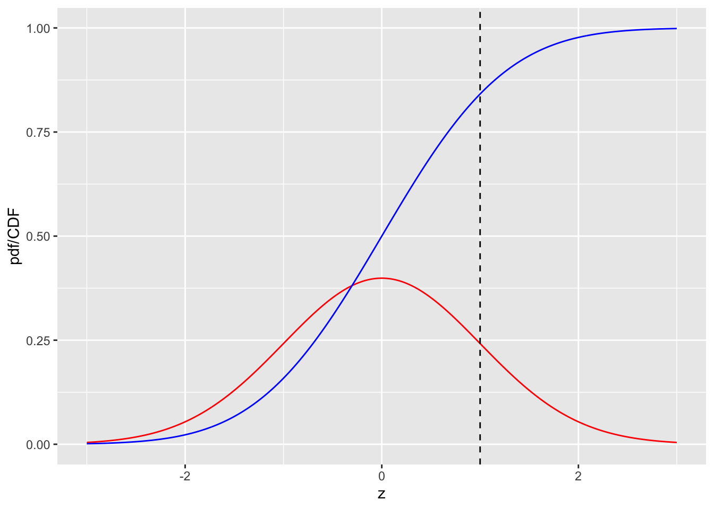
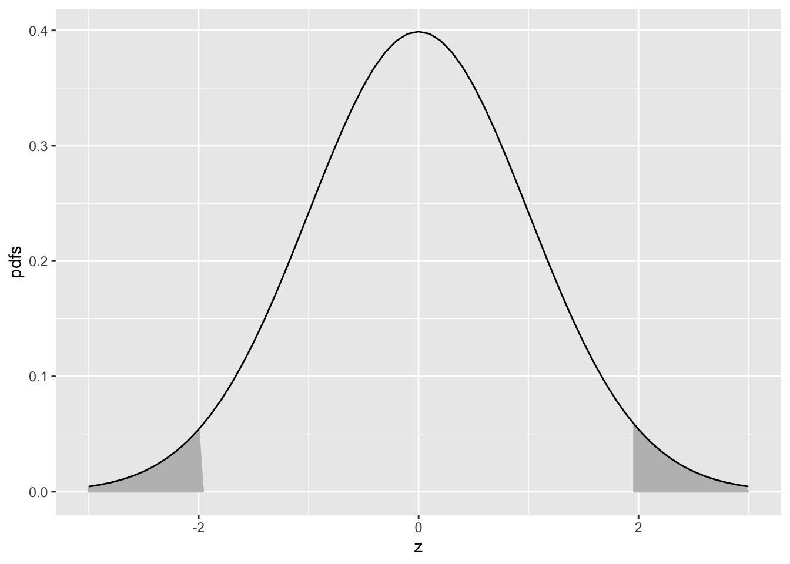
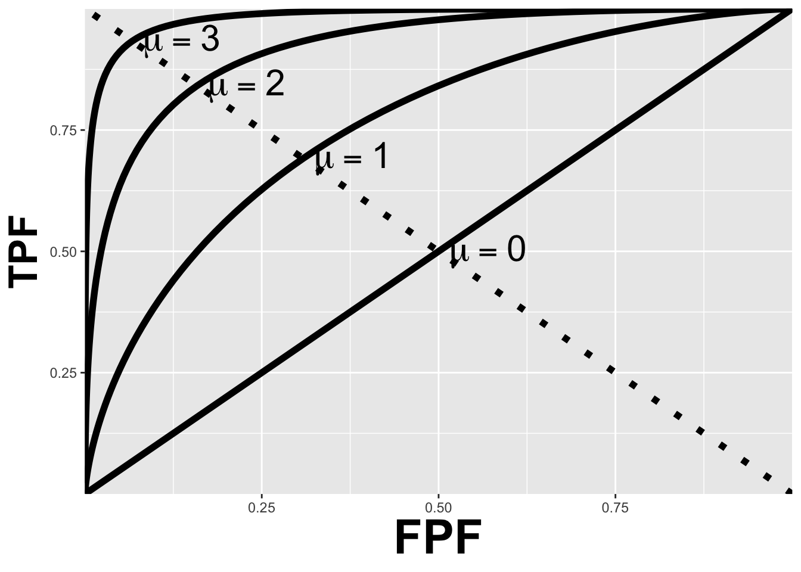
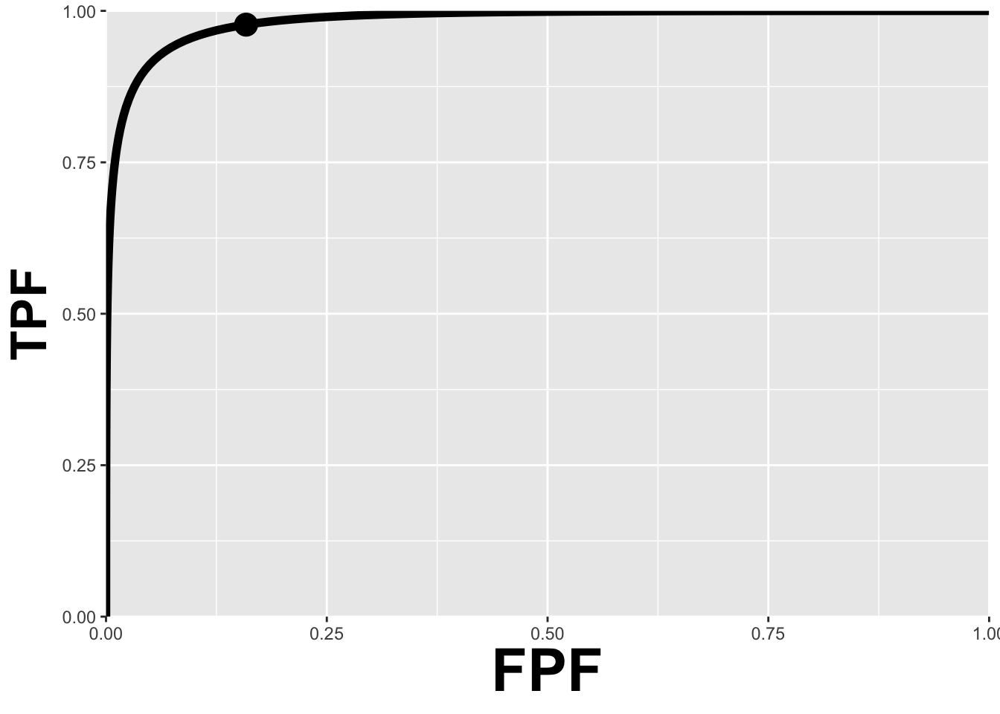
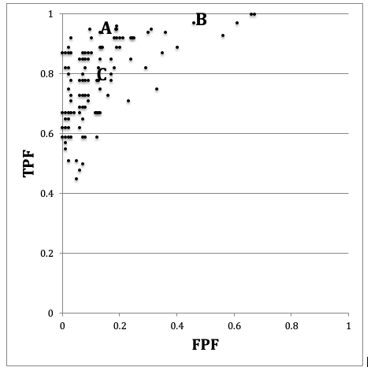

# Modeling the Binary Task {#binary-task-model}


## TBA How much finished {#binary-task-model-how-much-finished}
85%


## Introduction {#binary-task-model-intro}
Chapter \@ref(binary-task-model) introduced measures of performance associated with the binary decision task. Described in this chapter is a 2-parameter statistical model for the binary task, in other words it shows how one can predict quantities like sensitivity and specificity based on the values of the parameters of a statistical model. It introduces the fundamental concepts of a decision variable and a decision threshold (the latter is one of the parameters of the statistical model) that pervade this book, and shows how the decision threshold can be altered by varying experimental conditions. The receiver-operating characteristic (ROC) plot is introduced which shows how the dependence of sensitivity and specificity on the decision threshold is exploited by a measure of performance that is independent of decision threshold, namely the area AUC under the ROC curve. AUC turns out to be related to the other parameter of the model. 

The dependence of variability of the operating point on the numbers of cases is explored, introducing the concept of random sampling and how the results become more stable with larger numbers of cases, or larger sample sizes. These are perhaps intuitively obvious concepts but it is important to see them demonstrated, Online Appendix 3.A. Formulae for 95percent confidence intervals for estimates of sensitivity and specificity are derived and the calculations are shown explicitly,

## Decision variable and decision threshold {#binary-task-model-z-sample-model}
The model for the binary task involves three assumptions: (i) the existence of a decision variable associated with each case, (ii) the existence of a case-independent decision threshold for reporting individual cases as non-diseased or diseased and (iii) the adequacy of training session(s) in getting the observer to a steady state. In addition, common to all models is that the observer is "blinded" to the truth, while the researcher is not.

### Existence of a decision variable 
**Assumption 1:** Each case presentation is associated with the occurrence (or realization) of a specific value of a random scalar sensory variable yielding a unidirectional measure of evidence of disease. The two italicized phrases introduce important terms.

* By sensory variable one means one that is sensed internally by the observer (in the cognitive system, associated with the brain) and as such is not directly measureable in the traditional physical sense. A physical measurement, for example, might consist of measuring a voltage difference across two points with a voltmeter. The term “latent” is often used to describe the sensory variable because it turns out that transforming this variable by an arbitrary monotonic non-decreasing transformation has no effect on the ROC – this will become clearer later. Alternative terms are “psychophysical variable”, “perceived variable”, “perceptual variable” or “confidence level”. The last term is the most common. It is a subjective variable since its value is expected to depend on the observer: the same case shown to different observers could evoke different values of the sensory variable. Since one cannot measure it anyway, it would be a very strong assumption to assume that the two sensations are identical. In this book the term “latent decision variable”, or simply “decision variable” is used, which hopefully gets away from the semantics and focuses instead on what the variable is used for, namely making decisions. The symbol Z will be used for it and specific realized values are termed z-samples. It is a random in the sense that it varies randomly from case to case; unless the cases are similar in some respect, for example, two variants of the same case under different image processing conditions, or images of twins; in these instances the corresponding decision variables are expected to be correlated. In the binary paradigm model to be described, the decision variables corresponding to different cases are assumed mutually independent.
* The latent decision variable rank-orders cases with respect to evidence for presence of disease. Unlike a traditional rank-ordering scheme, where "1" is the highest rank, the scale is inverted with larger values corresponding to greater evidence of disease. Without loss of generality, one assumes that the decision variable ranges from -∞ to +∞, with large positive values indicative of strong evidence for presence of disease, and large negative values indicative of strong evidence for absence of disease. The zero value indicates no evidence for presence or absence of disease. [The -∞ to +∞ scale is not an assumption. The decision variable scale could just as well range from a to b, where a < b; with appropriate rescaling of the decision variable, there will be no changes in the rank-orderings, and the scale will extend from -∞ to +∞.] Such a decision scale, with increasing values corresponding to increasing evidence of disease, is termed positive-directed.

### Existence of a decision threshold
**Assumption 2:** In the binary decision task the radiologist adopts a single and fixed (i.e., case-independent) decision threshold and states: "case is diseased" if the decision variable is greater than or equal to $\zeta$, i.e., $Z \geq \zeta$, and "case is non-diseased" if the decision variable is smaller than $\zeta$, i.e., $Z <\zeta$. 

* The decision threshold is a fixed value used to separate cases reported as diseased from cases reported as non-diseased.
* Unlike the random Z-sample, which varies from case to case, the decision threshold is held fixed for the duration of the study. In some of the older literature2 the decision threshold is sometimes referred to as "response bias". The author hesitates to use the term "bias" which has a negative connotation, whereas, in fact, the choice of decision threshold depends on rational assessment of costs and benefits of different outcomes.
* The choice of decision threshold depends on the conditions of the study: perceived or known disease prevalence, cost-benefit considerations, instructions regarding dataset characteristics, personal interpreting style, etc. There is a transient "learning curve" during which observer is assumed to find the optimal threshold and henceforth holds it constant for the duration of the study. The learning is expected to stabilize during a sufficiently long training interval.
* Data should only be collected in the fixed threshold state, i.e., at the end of the training session.
* If a second study is conducted under different conditions, the observer will determine, after a new training session, the optimal threshold for the new conditions and henceforth hold it constant for the duration of the second study, etc.

From assumption #2, it follows that: 

\begin{equation} 
1-Sp=FPF=P(Z\ge \zeta|T=1)
(\#eq:binary-task-modelFPF)
\end{equation} 

\begin{equation} 
Se=TPF=P(Z\ge \zeta|T=2)
(\#eq:binary-task-modelTPF)
\end{equation} 

**Explanation:** $P(Z\ge \zeta|T=1)$ is the probability that the Z-sample for a non-diseased case is greater than or equal to $\zeta$. According to assumption #2 these cases are incorrectly classified as diseased, i.e., they are FP decisions and the corresponding probability is false positive fraction $FPF$, which is the complement of specificity $Sp$. Likewise,  $P(Z\ge \zeta|T=2)$ denotes the probability that the Z-sample for a diseased case is greater than or equal to $\zeta$. These cases are correctly classified as diseased, i.e., these are TP decisions and the corresponding probability is true positive fraction $TPF$, which is sensitivity $Se$.

There are several concepts implicit in Eqn. \@ref(eq:binary-task-modelFPF) and Eqn. \@ref(eq:binary-task-modelTPF). 

* The Z-samples have an associated probability distribution; this is implicit in the notation $P(Z\ge \zeta|T=2)$ and $P(Z\ge \zeta|T=1)$. Diseased-cases are not homogenous; in some, disease is easy to detect, perhaps even obvious, in others the signs of disease are subtler, and in some, the disease is almost impossible to detect. Likewise, non-diseased cases are not homogenous. 
* The probability distributions depend on the truth state $T$. The distribution of the Z-samples for non-diseased cases is in general different from that for the diseased cases. Generally, the distribution for $T = 2$ is shifted to the right of that for $T = 1$ (assuming a **positive-directed** decision variable scale). Later, specific distributional assumptions will be employed to obtain analytic expressions for the right hand sides of Eqn. \@ref(eq:binary-task-modelFPF) and Eqn. \@ref(eq:binary-task-modelTPF).
* The equations imply that via choice of the decision threshold $\zeta$, $Se$ and $Sp$ are under the control of the observer. The lower the decision threshold the higher the sensitivity and the lower the specificity, and the converses are also true. Ideally both sensitivity and specificity should be large, i.e., unity (since they are probabilities they cannot exceed unity). The tradeoff between sensitivity and specificity says, essentially, that there is no “free lunch”. In general, the price paid for increased sensitivity is decreased specificity and vice-versa. 

### Adequacy of the training session
**Assumption 3:** The observer has complete knowledge of the distributions of actually non-diseased and actually diseased cases and makes rational decision based on this knowledge. Knowledge of the probabilistic distributions is consistent with not knowing for sure which distribution a specific sample came from, i.e., the "blindedness" assumption common to all observer performance studies.

How an observer can be induced to change the decision threshold is the subject of the following two examples.

## Changing the decision threshold: Example I {#binary-task-model-example-1}
Suppose that in the first study a radiologist interprets a set of cases subject to the instructions that it is rather important to identify actually diseased cases and not to worry about misdiagnosing actually non-diseased cases. One way to do this would be to reward the radiologist with $10 for each TP decision but only $1 for each TN decision. For simplicity, assume there is no penalty imposed for incorrect decisions (FPs and FNs) and the case set contains equal numbers of non-diseased and diseased cases, and the radiologist is informed of these facts. It is also assumed that the radiologist is allowed to reach a steady state and responds rationally to the payoff arrangement. Under these circumstances, the radiologist is expected to set the decision threshold at a small value so that even slight evidence of presence of disease is enough to result in a "case is diseased" decision. The low decision threshold also implies that considerable evidence of lack of disease is needed before a "case is non-diseased" decision is rendered. The radiologist is expected to achieve relatively high sensitivity but specificity will be low. As a concrete example, if there are 100 non-diseased cases and 100 diseased cases, assume the radiologist makes 90 TP decisions; since the threshold for presence of presence of disease is small, this number is close to the maximum possible value, namely 100. Assume further that 10 TN decisions are made; since the implied threshold for evidence of absence of disease is large, this number is close to the minimum possible value, namely 0. Therefore, sensitivity is 90percent and specificity is 10percent. The radiologist earns 90 x $10 + 10 x $1 = $910 for participating in this study. 

Next, suppose the study is repeated with the same cases but this time the payoff is $1 for each TP decision and $10 for each TN decision. Suppose, further, that sufficient time has elapsed between the two study sessions that memory effects can be neglected. Now the roles of sensitivity and specificity are reversed. The radiologist's incentive is to be correct on actually non-diseased cases without worrying too much about missing actually diseased cases. The radiologist is expected to set the decision threshold at a large value so that considerable evidence of disease-presence is required to result in a "case is diseased" decision, but even slight evidence of absence of disease is enough to result in a "case is non-diseased" decision. This radiologist is expected to achieve relatively low sensitivity but specificity will be higher. Assume the radiologist makes 90 TN decisions and 10 TP decisions, earning $910 for the second study. The corresponding sensitivity is 10percent and specificity is 90percent. 

The incentives in the first study caused the radiologist to accept low specificity in order to achieve high sensitivity; the incentives in the second study caused the radiologist to accept low sensitivity in order to achieve high specificity. 

## Changing the decision threshold: Example II  {#binary-task-model-example-2}
Suppose one asks the same radiologist to interpret a set of cases, but this time the reward for a correct decision is always $1, regardless of the truth state of the case, and as before, there are is no penalty for incorrect decisions. However, the radiologist is told that disease prevalence is only 0.005 and that this is the actual prevalence, i.e., the experimenter is not deceiving the radiologist in this regard. [Even if the experimenter attempts to deceive the radiologist, by claiming for example that there are roughly equal numbers of non-diseased and diseased cases, after interpreting a few tens of cases the radiologist will know that a deception is involved. Deception in such studies is generally not a good idea, as the observer’s performance is not being measured in a “steady state condition” – the observer’s performance will change as the observer “learns” the true disease prevalence.] In other words, only five out of every 1000 cases are actually diseased. This information will cause the radiologist to adopt a high threshold for diagnosing disease-present thereby becoming more reluctant to state: “case is diseased”. By simply diagnosing all cases as non-diseased, without using any case information, the radiologist will be correct on every disease absent case and earn $995, which is very close to the maximum $1000 the radiologist can earn by using case information to the full and being correct on disease-present and disease-absent cases. 

The example is not as contrived as might appear at first sight. However, in screening mammography, the cost of missing a breast cancer, both in terms of loss of life and a possible malpractice suite, is usually perceived to be higher than the cost of a false positive. This can result in a shift towards higher sensitivity at the expense of lower specificity. 

If a new study were conducted with a highly enriched set of cases, where the disease prevalence is 0.995 (i.e., only 5 out of every 1000 cases are actually non-diseased), then the radiologist would adopt a low threshold. By simply calling every case “non-diseased”, the radiologist earns $995. 

These examples show that by manipulating the relative costs of correct vs. incorrect decisions and / or by varying disease prevalence one can influence the radiologist’s decision threshold. These examples apply to laboratory studies. Clinical interpretations are subject to different cost-benefit considerations that are generally not under the researcher's control: actual (population) disease prevalence, the reputation of the radiologist, malpractice, etc.


## The equal-variance binormal model {#binary-task-model-equal-variance-binormal-model}
Here is the model for the Z-samples. Using the notation $N(\mu,\sigma^2)$  for the normal (or "Gaussian") distribution with mean $\mu$ and variance $\sigma^2$, it is assumed: 
1.	The Z-samples for non-diseased cases are distributed  $N(0,1)$. 
2.	The Z-samples for diseased cases are distributed $N(\mu,1)$ with $\mu>0$. 
3.	A case is diagnosed as diseased if its Z-sample $\geq$ a constant threshold $\zeta$, and non-diseased otherwise.

The constraint $\mu>0$  is needed so that the observer's performance is at least as good as chance. A large negative value for this parameter would imply an observer so predictably bad that the observer is good; one simply reverses the observer's decision ("diseased" to "non-diseased" and vice versa) to get near-perfect performance . 

The model described above is termed the equal-variance binormal model. [If the common variance is not unity, one can re-scale the decision axis to achieve unit-variance without changing the predictions of the model.] A more general model termed the unequal-variance binormal model is generally used for modeling human observer data, discussed later, but for the moment, one does not need that complication. The equal-variance binormal model is defined by:

\begin{equation} 
\left.\begin{matrix}
Z_{k_tt} \sim N(\mu_t,1) \\ 
\mu_1=0\\ 
\mu_2=\mu
\end{matrix}\right\}
(\#eq:binary-task-modeleq-variance-binormal-model)
\end{equation} 

In Eqn. \@ref(eq:binary-task-modeleq-variance-binormal-model) the subscript $t$ denotes the truth, sometimes referred to as the "gold standard", with $t = 1$ denoting a non-diseased case and $t = 2$ denoting a diseased case. The variable $Z_{k_tt}$ denotes the random Z-sample for case $k_tt$, where $k_t$ is the index for cases with truth state $t$; for example $k_11=21$  denotes the 21st non-diseased case and  $k_22=3$ denotes the 3rd diseased case. To explicate $k_11=21$ further, the label $k_1$  indexes the case while the label $1$  indicates the truth of the case. The label $k_t$  ranges from $1,2,...,K_t$ , where $K_t$$  is the total number of cases with disease state $t$. 

The author departs from usual convention, see for example paper by Hillis, which labels the cases with a single index $k$, which ranges from 1 to $K_1+K_2$, and one is left guessing as to the truth-state of each case. Also, the proposed notation extends readily to the FROC paradigm where two states of truth have to be distinguished, one at the case level and one at the location level.

The first line in Eqn. \@ref(eq:binary-task-modeleq-variance-binormal-model) states that $Z_{k_tt}$ is a random sample from the  $N(\mu_t,1)$ distribution, which has unit variance regardless of the value of $t$ (this is the reason for naming it the equal-variance binormal model). The remaining lines in Eqn. \@ref(eq:binary-task-modeleq-variance-binormal-model) defines $\mu_1$ as zero and $\mu_2$ as $\mu$. Taken together, these equations state that non-diseased case Z-samples are distributed $N(0,1)$  and diseased case Z-samples are distributed $N(\mu,1)$. The name binormal arises from the two normal distributions underlying this model. It should not be confused with bivariate, which identifies a single distribution yielding two values per sample, where the two values could be correlated. In the binormal model, the samples from the two distributions are assumed independent of each other. 

A few facts concerning the normal (or Gaussian) distribution are summarized next.

## The normal distribution {#binary-task-model-normal-distribution}
In probability theory, a probability density function (pdf), or density of a continuous random variable, is a function giving the relative chance that the random variable takes on a given value. For a continuous distribution, the probability of the random variable being exactly equal to a given value is zero. The probability of the random variable falling in a range of values is given by the integral of this variable’s pdf function over that range. For the normal distribution $N(\mu,\sigma^2)$  the pdf is denoted $\phi(z|\mu,\sigma)$.

By definition, 

\begin{equation} 
\phi\left ( z|\mu,\sigma \right )=P(z<Z<z+dz|Z \sim N(\mu,\sigma^2))
(\#eq:binary-task-model-phi-def)
\end{equation}

The right hand side of Eqn. \@ref(eq:binary-task-model-phi-def) is the probability that the random variable $Z$, sampled from $N(\mu,\sigma^2)$, is between the fixed limits z and z + dz. For this reason $\phi(z|\mu,\sigma)$  is termed the probability density function. The special case  $\phi(z|0,1)$ is referred to as the **unit normal distribution**; it has zero mean and unit variance and the corresponding pdf is denoted $\phi(z)$. The defining equation for the pdf of this distribution is:

\begin{equation} 
\phi\left ( z \right )=\frac{1}{\sqrt{2\pi}}\exp\left ( -\frac{z^2}{2} \right )
(\#eq:binary-task-model-phi)
\end{equation}

The integral of $\phi(t)$ from $-\infty$ to $z$, as in Eqn. \@ref(eq:binary-task-model-Phi), is the probability that a sample from the unit normal distribution is less than $z$. Regarded as a function of $z$, this is termed the cumulative distribution function (CDF) and is denoted, in this book, by the symbol $\Phi$ (sometimes the term probability distribution function is used for what we are terming the CDF). The function $\Phi(z)$, specific to the unit normal distribution, is defined by:

\begin{equation} 
\Phi\left ( z \right )=\int_{-\infty }^{z}\phi(t)dt
(\#eq:binary-task-model-Phi)
\end{equation}

Fig. \@ref(fig:binary-task-model-plots1) shows plots, as functions of z, of the CDF and the pdf for the unit normal distribution. Since z-samples outside ±3 are unlikely, the plotted range, from -3 to +3 includes most of the distribution. The pdf is the familiar bell-shaped curve, centered at zero; the corresponding R function is `dnorm()`, i.e., density of the normal distribution. The CDF $\Phi(z)$ increases monotonically from 0 to unity as z increases from $-\infty$ to $+\infty$. It is the sigmoid (S-shaped) shaped curve in Fig. \@ref(fig:binary-task-model-plots1); the corresponding `R` function is `pnorm()`. 

The sigmoid shaped curve is the CDF, or cumulative distribution function, of the N(0,1) distribution, while the bell-shaped curve is the corresponding pdf, or probability density function. The dashed line corresponds to the reporting threshold $\zeta$. The area under the pdf to the left of $\zeta$ equals the value of CDF at the selected  $\zeta$, i.e., 0.841 (`pnorm(1)` = 0.841). 


```r
x <- seq(-3,3,0.01)
pdfData <- data.frame(z = x, pdfcdf = dnorm(x))
cdfData <- data.frame(z = x, pdfcdf = pnorm(x))
pdfcdfPlot <- ggplot(
  mapping = aes(x = z, y = pdfcdf)) + 
  geom_line(data = pdfData) + 
  geom_line(data = cdfData) +
  geom_vline(xintercept = 1, linetype = 2) + 
  xlab(label = "z") + ylab(label = "pdf/CDF")
print(pdfcdfPlot)
```

<div class="figure">

<p class="caption">(\#fig:binary-task-model-plots1)pdf-CDF plots for unit normal.</p>
</div>

A related function is the inverse of Eqn. \@ref(eq:binary-task-model-Phi). Suppose the left hand side of Eqn. \@ref(eq:binary-task-model-Phi) is denoted $p$, which is a probability in the range 0 to 1. 

\begin{equation} 
p=\Phi\left ( z \right )=\int_{-\infty }^{z}\phi(t)dt
(\#eq:binary-task-model-Phi2)
\end{equation}

The inverse of $\Phi(z)$ is that function which when applied to $p$ yields the upper limit $z$ in Eqn. \@ref(eq:binary-task-model-Phi), i.e.,

\begin{equation} 
\Phi^{-1}(p) = z
(\#eq:binary-task-model-PhiInvDef)
\end{equation}

Since $p=\Phi(z)$ it follows that

\begin{equation} 
\Phi(\Phi^{-1}(z))=z
(\#eq:binary-task-model-PhiInvDef2)
\end{equation}

This nicely satisfies the property of an inverse function. The inverse function is known in statistical terminology as the quantile function, implemented in `R` as the `qnorm()` function. Think of `pnorm()` as a probability and `qnorm()` as value on the z-axis. 

To summarize, `norm` implies the unit normal distribution, `p` denotes a probability distribution function or CDF, `q` denotes a quantile function and `d` denotes a density function; this convention is used with all distributions in `R`.


```r
qnorm(0.025)
#> [1] -1.959964
qnorm(1-0.025)
#> [1] 1.959964
pnorm(qnorm(0.025))
#> [1] 0.025
qnorm(pnorm(-1.96))
#> [1] -1.96
```

The first command `qnorm(0.025)` demonstrates the identity:

\begin{equation} 
\Phi^{-1}(0.025)=-1.959964
(\#eq:binary-task-model-Phi-Inv-alpha-by2)
\end{equation}

The next command `qnorm(1-0.025)` demonstrates the identity:

\begin{equation} 
\Phi^{-1}(1-0.025)=+1.959964
(\#eq:binary-task-model-PhiInv-One-Minus-alphaby2)
\end{equation}

The last two commands demonstrate that `pnorm` and `qnorm`, applied in either order, are inverses of each other. 

Eqn. \@ref(eq:binary-task-model-Phi-Inv-alpha-by2) means that the (rounded) value -1.96 is such that the area under the pdf to the left of this value is 0.025. Similarly, Eqn. \@ref(eq:binary-task-model-PhiInv-One-Minus-alphaby2) means that the (rounded) value +1.96 is such that the area under the pdf to the left of this value is 1-0.025 = 0.975. In other words, -1.96 captures, to its left, the 2.5th percentile of the unit-normal distribution, and 1.96 captures, to its left, the 97.5th percentile of the unit-normal distribution, Fig. \@ref(fig:binary-task-model-shaded-tails). Since between them they capture 95percent of the unit-normal pdf, these two values can be used to estimate 95percent confidence intervals. 


```r
mu <- 0;sigma <- 1
zeta <- -qnorm(0.025)
step <- 0.1

LL<- -3
UL <- mu + 3*sigma

x.values <- seq(zeta,UL,step)
cord.x <- c(zeta, x.values,UL) 
cord.y <- c(0,dnorm(x.values),0) 

z <- seq(LL, UL, by = step)
curveData <- data.frame(z = z, pdfs = dnorm(z))
shadeData <- data.frame(z = cord.x, pdfs = cord.y)
shadedTails <- ggplot(mapping = aes(x = z, y = pdfs))  + 
  geom_polygon(data = shadeData, color = "grey", fill = "grey")

zeta <- qnorm(0.025)
x.values <- seq(LL, zeta,step)
cord.x <- c(LL, x.values,zeta) 
cord.y <- c(0,dnorm(x.values),0) 
shadeData <- data.frame(z = cord.x, pdfs = cord.y)
shadedTails <- shadedTails + 
  geom_polygon(
    data = shadeData, color = "grey", fill = "grey") + 
  xlab(label = "z") 
shadedTails <- shadedTails + 
  geom_line(data = curveData, color = "black")
print(shadedTails)
```

<div class="figure">

<p class="caption">(\#fig:binary-task-model-shaded-tails)Illustrating that 95percent of the total area under the unit normal pdf is contained in the range |Z| < 1.96, which can be used to construct a 95percent confidence interval for an estimate of a suitably normalized statistic. The area contained in each shaded tail is 2.5percent.</p>
</div>

**If one knows that a variable is distributed as a unit-normal random variable, then the observed value minus 1.96 defines the lower limit of its 95percent confidence interval, and the observed value plus 1.96 defines the upper limit of its 95percent confidence interval.**

## Analytic expressions for specificity and sensitivity {#binary-task-model-sensitivity-specificity}
Specificity corresponding to threshold $\zeta$ is the probability that a Z-sample from a non-diseased case is smaller than $\zeta$. By definition, this is the CDF corresponding to the threshold $\zeta$. In other words:

\begin{equation} 
Sp\left ( \zeta \right )=P\left ( Z_{k_11} < \zeta\mid Z_{k_11} \sim N\left ( 0,1 \right )\right ) = \Phi\left ( \zeta \right )
(\#eq:binary-task-model-Specificity)
\end{equation}

The expression for sensitivity can be derived tediously by starting with the fact that $Z_{k_22}$ and then using calculus to obtain the probability that a z-sample for a disease-present case exceeds $\zeta$. A quicker way is to consider the random variable obtaining by shifting the origin to  $\mu$. A little thought should convince the reader that $Z_{k_22}-\mu$  must be distributed as $N(0,1)$. Therefore, the desired probability is (the last step follows from the identity in Eqn. (3.7), with z replaced by $\zeta-\mu$ :

\begin{equation}
\begin{aligned} 
Se\left ( \zeta \right )\\
=P\left ( Z_{k_22} \geq \zeta\right ) \\
=P\left (\left ( Z_{k_22} -\mu  \right ) \geq\left ( \zeta -\mu  \right )\right ) \\
=1-P\left (\left ( Z_{k_22} -\mu  \right ) < \left ( \zeta -\mu  \right )\right ) \\
= 1-\Phi\left ( \zeta -\mu \right )
\end{aligned}
(\#eq:binary-task-model-Sensitivity1)
\end{equation}

A little thought (based on the definition of the CDF function and the symmetry of the unit-normal pdf function) should convince the reader that:

\begin{equation} 
1-\Phi(\zeta)=-\Phi(\zeta)\\
1-\Phi(\zeta-\mu)=\Phi(\mu-\zeta)
(\#eq:binary-task-model-Sensitivity2)
\end{equation}

Instead of carrying the "1 minus " around, one can use the more compact notation. Summarizing, the analytical formulae for the specificity and sensitivity for the equal-variance binormal model are: 

\begin{equation} 
Sp\left ( \zeta \right ) = \Phi(\zeta)\\
Se\left ( \zeta \right ) = \Phi(\mu-\zeta)
(\#eq:binary-task-model-Sensitivity-Specificity)
\end{equation}

In these equations, the threshold $\zeta$ appears with different signs because specificity is the area under a pdf to the **left** of a threshold, while sensitivity is the area to the **right**.

**As probabilities, both sensitivity and specificity are restricted to the range 0 to 1. The observer’s performance could be characterized by specifying sensitivity and specificity, i.e., a pair of numbers. If both sensitivity and specificity of an imaging system are greater than the corresponding values for another system, then the 1st system is unambiguously better than the 2nd. But what if sensitivity is greater for the 1st but specificity is greater for the 2nd? Now the comparison is ambiguous. It is difficult to unambiguously compare two pairs of performance indices. Clearly, a scalar measure is desirable that combines sensitivity and specificity into a single measure of diagnostic performance.**

The parameter $\mu$  satisfies the requirements of a scalar figure of merit (FOM). Eqn. \@ref(eq:binary-task-model-Sensitivity-Specificity) can be solved for $\mu$  as follows. Inverting the equations yields: 

\begin{equation} 
\zeta =\Phi^{-1} \left (Sp\left ( \zeta \right )  \right )\\
\mu - \zeta = \Phi^{-1} \left (Se\left ( \zeta \right )  \right )
(\#eq:binary-task-model-solve-mu-zeta)
\end{equation}

Eliminating $\zeta$ yields:

\begin{equation} 
\mu = \Phi^{-1} \left (Sp\left ( \zeta \right )  \right ) + \Phi^{-1} \left (Se\left ( \zeta \right )  \right )
(\#eq:binary-task-model-solve-mu)
\end{equation}

This is a useful relation, as it converts a *pair* of numbers that is hard to compare between two modalities, in the sense described above, into a *single* FOM. Now it is almost trivial to compare two modalities: the one with the higher $\mu$  wins. In reality, the comparison is not trivial since like sensitivity and specificity, $\mu$ has to be estimated from a finite dataset and is therefore subject to sampling variability.


```r
options(digits=3)
mu <- 3;sigma <- 1
zeta <- 1
step <- 0.1

lowerLimit<- -1 # lower limit
upperLimit <- mu + 3*sigma # upper limit

z <- seq(lowerLimit, upperLimit, by = step)
pdfs <- dnorm(z)
seqNor <- seq(zeta,upperLimit,step)
cord.x <- c(zeta, seqNor,upperLimit) 
# need two y-coords at each end point of range; 
# one at zero and one at value of function
cord.y <- c(0,dnorm(seqNor),0) 
curveData <- data.frame(z = z, pdfs = pdfs)
shadeData <- data.frame(z = cord.x, pdfs = cord.y)
shadedPlots <- ggplot(mapping = aes(x = z, y = pdfs)) + 
  geom_line(data = curveData, color = "blue") + 
  geom_polygon(data = shadeData, color = "blue", fill = "blue")

crossing <- uniroot(function(x) dnorm(x) - dnorm(x,mu,sigma), 
                    lower = 0, upper = 3)$root
crossing <- max(c(zeta, crossing))
seqAbn <- seq(crossing,upperLimit,step)
cord.x <- c(seqAbn, rev(seqAbn))
# reason for reverse 
# we want to explicitly define the polygon
# we dont want R to close it 

cord.y <- c()
for (i in seq(1,length(cord.x)/2)) {
  cord.y <- c(cord.y,dnorm(cord.x[i],mu, sigma))
}
for (i in seq(1,length(cord.x)/2)) {
  cord.y <- c(cord.y,dnorm(cord.x[length(cord.x)/2+i]))
}
pdfs <- dnorm(z, mu, sigma)
curveData <- data.frame(z = z, pdfs = pdfs)
shadeData <- data.frame(z = cord.x, pdfs = cord.y)
shadedPlots <- shadedPlots + 
  geom_line(data = curveData, color = "red") + 
  geom_polygon(data = shadeData, color = "red", fill = "red")
seqAbn <- seq(zeta,upperLimit,step)
for (i in seqAbn) {
  # define xs and ys of two points, separated only along y-axis
  vlineData <- data.frame(x1 = i, 
                          x2 = i, 
                          y1 = 0, 
                          y2 = dnorm(i, mu, sigma))
  # draw vertical line between them
  shadedPlots <- shadedPlots + 
    geom_segment(aes(x = x1, xend = x2, y = y1, yend = y2), 
                 data = vlineData, color = "red")
}
shadedPlots <- shadedPlots + xlab(label = "z-sample")
print(shadedPlots)
```

<div class="figure">

<p class="caption">(\#fig:binary-task-model-shaded-plots)The equal-variance binormal model for mu = 3  and  zeta = 1; the blue curve, centered at zero, corresponds to the pdf of non-diseased cases and the red one, centered at mu = 3, corresponds to the pdf of diseased cases. The left edge of the blue shaded region represents the threshold zeta, currently set at unity. The red shaded area, including the common portion with the vertical red lines, is sensitivity. The blue shaded area including the common portion with the vertical red lines is 1-specificity.</p>
</div>

Fig. \@ref(fig:binary-task-model-shaded-plots) shows the equal-variance binormal model for $\mu = 3$  and $\zeta = 1$. The blue-shaded area, including the "common" portion with the vertical red lines, is the probability that a z-sample from a non-diseased case exceeds $\zeta = 1$, which is the complement of specificity, i.e., it is false positive fraction, which is 1 - `pnorm(1)` = 0.159. The red shaded area, including the "common" portion with the vertical red lines, is the probability that a z-sample from a diseased case exceeds $\zeta = 1$, which is sensitivity or true positive fraction, which is `pnorm(3-1)`= 0.977.

Demonstrated next are these concepts using R examples.

## Demonstration of the concepts of sensitivity and specificity {#binary-task-model-sensitivity-specificity-demo}

### Estimating mu from a finite sample
The following code simulates 9 non-diseased and 11 diseased cases. The $\mu$ parameter is 1.5 and $\zeta$ is $\mu/2$. Shown are the calculations of sensitivity and specificity and the value of estimated $\mu$. 


```r
mu <- 1.5
zeta <- mu/2
seed <- 100 # line 4
K1 <- 9
K2 <- 11
ds <- simulateDataset(K1, K2, mu, zeta, seed)

cat("seed = ", seed, 
    "\nK1 = ", K1, 
    "\nK2 = ", K2, 
    "\nSpecificity = ", ds$Sp, 
    "\nSensitivity = ", ds$Se, 
    "\nEst. of mu = ", ds$mu, "\n")
#> seed =  100 
#> K1 =  9 
#> K2 =  11 
#> Specificity =  0.889 
#> Sensitivity =  0.909 
#> Est. of mu =  2.56
```

Since this is a finite sample, the estimate of $\mu$ is not exactly equal to the true value. In fact, all of the estimates, sensitivity, specificity and $\mu$ are subject to sampling variability.

### Changing the seed variable: case-sampling variability
No matter how many times one runs the above code, one always sees the same output shown above. This is because at line 4 one sets the `seed` of the random number generator to a fixed value, namely 100. This is like having a perfectly reproducible reader repeatedly interpreting the same cases – one always gets the same results. Change the `seed` to 101. One should see:


```r
seed <- 101 # change
ds <- simulateDataset(K1, K2, mu, zeta, seed)

cat("seed = ", seed, 
    "\nK1 = ", K1, 
    "\nK2 = ", K2, 
    "\nSpecificity = ", ds$Sp, 
    "\nSensitivity = ", ds$Se, 
    "\nEst. of mu = ", ds$mu, "\n")
#> seed =  101 
#> K1 =  9 
#> K2 =  11 
#> Specificity =  0.778 
#> Sensitivity =  0.545 
#> Est. of mu =  0.879
```

Changing `seed` is equivalent to sampling a completely new set of patients. This is an example of case sampling variability. The effect is quite large (`Se` fell from 0.909 to 0.545 and estimated `mu` fell from 2.56 to 0.879!) because the size of the relevant case set, $K_2=11$ for sensitivity, is rather small, leading to large variability. 

### Increasing the numbers of cases
Here we increase $K_1$ and $K_2$, by a factor of 10 each, and return the `seed` to 100. 


```r
K1 <- 90 # change
K2 <- 110 # change
seed <- 100 # change
ds <- simulateDataset(K1, K2, mu, zeta, seed)

cat("seed = ", seed, 
    "\nK1 = ", K1, 
    "\nK2 = ", K2, 
    "\nSpecificity = ", ds$Sp, 
    "\nSensitivity = ", ds$Se, 
    "\nEst. of mu = ", ds$mu, "\n")
#> seed =  100 
#> K1 =  90 
#> K2 =  110 
#> Specificity =  0.778 
#> Sensitivity =  0.836 
#> Est. of mu =  1.74
```

Next we change `seed` to 101.


```r
seed <- 101 # change
ds <- simulateDataset(K1, K2, mu, zeta, seed)

cat("seed = ", seed, 
    "\nK1 = ", K1, 
    "\nK2 = ", K2, 
    "\nSpecificity = ", ds$Sp, 
    "\nSensitivity = ", ds$Se, 
    "\nEst. of mu = ", ds$mu, "\n")
#> seed =  101 
#> K1 =  90 
#> K2 =  110 
#> Specificity =  0.811 
#> Sensitivity =  0.755 
#> Est. of mu =  1.57
```

Notice that now the values are less sensitive to seed. Table \@ref(tab:binary-task-modelSeSpMuvsCaseSizeSeed) illustrates this trend with ever increasing sample sizes (the reader should confirm the listed values).


```r
results <- array(dim = c(9,6))
mu <- 1.5
zeta <- mu/2
results[9,] <- c(Inf, Inf, NA, pnorm(zeta), pnorm(mu-zeta), mu)
K1_arr <- c(9, 9, 90, 90, 900, 900, 9000, 9000, NA)
K2_arr <- c(11, 11, 110, 110, 1100, 1100, 11000, 11000, NA)
seed_arr <- c(100,101,100,101,100,101,100,101,NA)
for (i in 1:8) {
  ds <- simulateDataset(K1_arr[i], K2_arr[i], mu, zeta, seed_arr[i])
  results[i,] <- c(K1_arr[i], K2_arr[i], seed_arr[i], ds$Sp, ds$Se, ds$mu)
}
df <- as.data.frame(results)
colnames(df) <- c("K1","K2","seed","Se","Sp","mu")
```

<table>
<caption>(\#tab:binary-task-modelSeSpMuvsCaseSizeSeed)Effect of sample size and seed on estimates of sensitivity, specificity and the mu-parameter.</caption>
 <thead>
  <tr>
   <th style="text-align:right;"> K1 </th>
   <th style="text-align:right;"> K2 </th>
   <th style="text-align:right;"> seed </th>
   <th style="text-align:right;"> Se </th>
   <th style="text-align:right;"> Sp </th>
   <th style="text-align:right;"> mu </th>
  </tr>
 </thead>
<tbody>
  <tr>
   <td style="text-align:right;"> 9 </td>
   <td style="text-align:right;"> 11 </td>
   <td style="text-align:right;"> 100 </td>
   <td style="text-align:right;"> 0.889 </td>
   <td style="text-align:right;"> 0.909 </td>
   <td style="text-align:right;"> 2.556 </td>
  </tr>
  <tr>
   <td style="text-align:right;"> 9 </td>
   <td style="text-align:right;"> 11 </td>
   <td style="text-align:right;"> 101 </td>
   <td style="text-align:right;"> 0.778 </td>
   <td style="text-align:right;"> 0.545 </td>
   <td style="text-align:right;"> 0.879 </td>
  </tr>
  <tr>
   <td style="text-align:right;"> 90 </td>
   <td style="text-align:right;"> 110 </td>
   <td style="text-align:right;"> 100 </td>
   <td style="text-align:right;"> 0.778 </td>
   <td style="text-align:right;"> 0.836 </td>
   <td style="text-align:right;"> 1.744 </td>
  </tr>
  <tr>
   <td style="text-align:right;"> 90 </td>
   <td style="text-align:right;"> 110 </td>
   <td style="text-align:right;"> 101 </td>
   <td style="text-align:right;"> 0.811 </td>
   <td style="text-align:right;"> 0.755 </td>
   <td style="text-align:right;"> 1.571 </td>
  </tr>
  <tr>
   <td style="text-align:right;"> 900 </td>
   <td style="text-align:right;"> 1100 </td>
   <td style="text-align:right;"> 100 </td>
   <td style="text-align:right;"> 0.764 </td>
   <td style="text-align:right;"> 0.761 </td>
   <td style="text-align:right;"> 1.430 </td>
  </tr>
  <tr>
   <td style="text-align:right;"> 900 </td>
   <td style="text-align:right;"> 1100 </td>
   <td style="text-align:right;"> 101 </td>
   <td style="text-align:right;"> 0.807 </td>
   <td style="text-align:right;"> 0.759 </td>
   <td style="text-align:right;"> 1.569 </td>
  </tr>
  <tr>
   <td style="text-align:right;"> 9000 </td>
   <td style="text-align:right;"> 11000 </td>
   <td style="text-align:right;"> 100 </td>
   <td style="text-align:right;"> 0.774 </td>
   <td style="text-align:right;"> 0.772 </td>
   <td style="text-align:right;"> 1.496 </td>
  </tr>
  <tr>
   <td style="text-align:right;"> 9000 </td>
   <td style="text-align:right;"> 11000 </td>
   <td style="text-align:right;"> 101 </td>
   <td style="text-align:right;"> 0.771 </td>
   <td style="text-align:right;"> 0.775 </td>
   <td style="text-align:right;"> 1.498 </td>
  </tr>
  <tr>
   <td style="text-align:right;"> Inf </td>
   <td style="text-align:right;"> Inf </td>
   <td style="text-align:right;"> NA </td>
   <td style="text-align:right;"> 0.773 </td>
   <td style="text-align:right;"> 0.773 </td>
   <td style="text-align:right;"> 1.500 </td>
  </tr>
</tbody>
</table>

As the numbers of cases increase, the sensitivity and specificity converge to a common value, around 0.773 and the estimate of the separation parameter converges to the known value.


```r
pnorm(0.75) # example 1
#> [1] 0.773
2*qnorm(pnorm(zeta)) # example 2
#> [1] 1.5
```

Because the threshold is halfway between the two distributions, as in this example, sensitivity and specificity are identical. In words, with two unit variance distributions separated by 1.5, the area under the diseased distribution (centered at 1.5) above 0.75, namely sensitivity, equals the area under the non-diseased distribution  (centered at zero) below 0.75, namely specificity, and the common value is $\Phi(0.75)= 0.773$, yielding the last row of Table \@ref(tab:binary-task-modelSeSpMuvsCaseSizeSeed), and example 1 in the above code snippet. Example 2 in the above code snippet illustrates Eqn. \@ref(eq:binary-task-model-solve-mu). The factor of two arises since in this example sensitivity and specificity are identical.

From Table \@ref(tab:binary-task-modelSeSpMuvsCaseSizeSeed), for the same numbers of cases but different seeds, comparing pairs of sensitivity and specificity values is more difficult as two pairs of numbers (i.e., four numbers) are involved. Comparing a single pair of $\mu$ values is easier as only two numbers are involved. The tendency of the pairs to become independent of case sample is discernible with fewer cases with  $\mu$, around 90/110 cases, than with sensitivity and specificity pairs. The numbers in the table might appear disheartening in terms of the implied numbers of cases needed to detect a difference in specificity. Even with 200 cases, the difference in specificity for two seed values is 0.081, which is actually a large effect considering that the scale extends from 0 to 1.0. A similar comment applies to differences in sensitivity. The situation is not quite that bad. One uses an area measure that combines sensitivity and specificity yielding less variability in the combined measure. One uses the ratings paradigm, which is more efficient than the binary one used in this chapter. Finally, one takes advantage of correlations that exist between the interpretations in matched-case matched-reader interpretations in two modalities that tend to decrease variability in the AUC-difference even further (most applications of ROC methods involved detecting differences in AUCs not absolute values).

## Inverse variation of sensitivity and specificity and the need for a single FOM {#binary-task-model-sensitivity-specificity-inverse-variation}
The variation of sensitivity and specificity is modeled in the binormal model by the threshold parameter $\zeta$. From Eqn. \@ref(eq:binary-task-model-Specificity), specificity at threshold $\zeta$ is $\Phi(\zeta)$ and the corresponding expression for sensitivity is $\Phi(\mu-\zeta)$. Since the threshold  $\zeta$ appears with a minus sign, the dependence of sensitivity on $\zeta$ will be the opposite of the corresponding dependence of specificity on $\zeta$. In Fig. \@ref(fig:binary-task-model-shaded-plots), the left edge of the blue shaded region represents the threshold $\zeta = 1$. As $\zeta = 1$ is moved towards the left, specificity decreases but sensitivity increases. Specificity decreases because less of the non-diseased distribution lies to the left of the new threshold, in other words fewer non-diseased cases are correctly diagnosed as non-diseased. Sensitivity increases because more of the diseased distribution lies to the right of the new threshold, in other words more diseased cases are correctly diagnosed as diseased. If an observer has higher sensitivity than another observer, but lower specificity, it is difficult to unambiguously compare them. It is not impossible [@RN2637]. The unambiguous comparison is difficult for the following reason. Assuming the second observer can be coaxed into adopting a lower threshold, thereby decreasing specificity to match that of the first observer, then it is possible that the second observer's sensitivity, formerly smaller, could now be greater than that of the first observer. A single figure of merit is desirable to the sensitivity - specificity analysis. It is possible to leverage the inverse variation of sensitivity and specificity by combing them into a single scalar measure, as was done with the $\mu$ parameter in the previous section, Eqn. \@ref(eq:binary-task-model-solve-mu). An equivalent way is by using the area under the ROC plot, discussed next.

## The ROC curve {#binary-task-model-roc-curve}
The receiver operating characteristic (ROC) is defined as the plot of sensitivity (y-axis) vs. 1-specificity (x-axis). Equivalently, it is the plot of TPF (y-axis) vs. FPF (x-axis). From Eqn. \@ref(eq:binary-task-model-Sensitivity-Specificity) it follows that:

\begin{equation} 
\begin{aligned} 
FPF\left ( \zeta \right ) &= 1 - Sp\left ( \zeta \right ) \\
&=\Phi\left ( -\zeta \right )\\
\\
TPF\left ( \zeta \right ) &= Se\left ( \zeta \right ) \\
&=\Phi\left (\mu -\zeta \right )\\ 
\end{aligned} 
(\#eq:binary-task-model-op-pt)
\end{equation}

Specifying  $\zeta$ selects a particular operating point on this plot and varying $\zeta$ from $+\infty$ to $-\infty$ causes the operating point to trace out the ROC curve from the origin (0,0) to (1,1). Specifically, as $\zeta$  is decreased from $+\infty$ to $-\infty$, the operating point rises from the origin (0,0) to the end-point (1,1). In general, as  $\zeta$ increases, the operating point moves down the curve, and conversely, as $\zeta$ decreases the operating point moves up the curve. The operating point $O(\zeta|\mu)$ for the equal variance binormal model is (the notation assumes the $\mu$ parameter is fixed and $\zeta$ is varied by the observer in response to interpretation conditions): 

\begin{equation} 
O\left ( \zeta \mid \mu \right ) = \left ( \Phi(-\zeta), \Phi(\mu-\zeta) \right ) \\
(\#eq:binary-task-model-OpPt)
\end{equation}

The operating point predicted by the above equation lies exactly on the theoretical ROC curve. This condition can only be achieved with very large numbers of cases, so that sampling variability is very small. In practice, with finite datasets, the operating point will almost never be exactly on the theoretical curve.

**The ROC curve is the locus of the operating point for fixed $\mu$ and variable  $\zeta$. Fig. \@ref(fig:binary-task-model-RocCurvesEqVarModel) shows examples of equal-variance binormal model ROC curves for different values of $\mu$. Each curve is labeled with the corresponding value of $\mu$. Each has the property that TPF is a monotonically increasing function of FPF and the slope decreases monotonically as the operating point moves up the curve. As $\mu$ increases the curves get progressively upward-left shifted, approaching the top-left corner of the ROC plot. In the limit $\mu = \infty$  the curve degenerates into two line segments, a vertical one connecting the origin to (0,1) and a horizontal one connecting (0,1) to (1,1) – the ROC plot for a perfect observer.**


```r
mu <- 0;zeta <- seq(-5, mu + 5, 0.05)
FPF <- pnorm(-zeta)
rocPlot <- ggplot(mapping = aes(x = FPF, y = TPF))
for (mu in 0:3){
  TPF <- pnorm(mu-zeta)
  curveData <- data.frame(FPF = FPF, TPF = TPF)
  rocPlot <- rocPlot + 
    geom_line(data = curveData, size = 2) + 
    xlab("FPF")+ ylab("TPF" ) + 
    theme(axis.title.y = element_text(size = 25,face="bold"),
          axis.title.x = element_text(size = 30,face="bold"))  +
    annotate("text", 
             x = pnorm(-mu/2) + 0.07, 
             y = pnorm(mu/2), 
             label = paste0("mu == ", mu), 
             parse = TRUE, size = 8)
  next
}
rocPlot <- rocPlot +
  scale_x_continuous(expand = c(0, 0)) + 
  scale_y_continuous(expand = c(0, 0))     

rocPlot <- rocPlot + 
  geom_abline(slope = -1, 
              intercept = 1, 
              linetype = 3,
              size = 2)
print(rocPlot)
```

<div class="figure">

<p class="caption">(\#fig:binary-task-model-RocCurvesEqVarModel)ROC plots predicted by the equal variance binormal model for different values of mu. As mu increases the intersection of the curve with the negative diagonal moves closer to the ideal operating point, (0,1) at which sensitivity and specificity are both equal to unity.</p>
</div>

### The chance diagonal  {#binary-task-model-chance-diagonal}
In Fig. \@ref(fig:binary-task-model-RocCurvesEqVarModel) the ROC curve for $\mu=0$  is the positive diagonal of the ROC plot, termed the chance diagonal. Along this curve $TPF = FPF$ and the observer’s performance is at chance level. In the equal variance binormal model, for $\mu=0$, the pdf of the diseased distribution is identical to that of the non-diseased distribution: both are centered at the origin. Therefore, no matter the choice of threshold  $\zeta$, $TPF = FPF$. Setting $\mu=0$ in Eqn. \@ref(eq:binary-task-model-op-pt) yields:

$$TPF\left ( \zeta \right )=FPF\left ( \zeta \right )=\Phi\left ( -\zeta \right )$$
In this special case, the red and blue curves in Fig. \@ref(fig:binary-task-model-shaded-plots) coincide. The observer is unable to find any difference between the two distributions. This can happen if the cancers are of such low visibility so that diseased cases are indistinguishable from non-diseased ones, or the observer’s skill level is so poor that the observer is unable to make use of distinguishing characteristics between diseased and non-diseased cases that do exist, and which experts exploit. 

### The guessing observer {#binary-task-model-guessing-observer}
If the cases are indeed impossibly difficult and/or the observer has zero skill at discriminating between them, the observer has no option but to guess. This rarely happens in the clinic, as too much is at stake and this paragraph is intended to make a pedagogical point that the observer can move the operating point along the change diagonal. If there is no special incentive, the observer tosses a coin and if the coin lands head up, the observer states: “case is diseased” and otherwise states: “case is non-diseased”. When this procedure is averaged over many non-diseased and diseased cases, it will result in the operating point (0.5, 0.5). [Many cases are assumed as otherwise, due to sampling variability, the operating point will not be on the theoretical ROC curve.] To move the operating point downward, e.g., to (0.1, 0.1) the observer randomly selects an integer number between 1 and 10, equivalent to a 10-sided "coin". Whenever a one "shows up", the observer states “case is diseased” and otherwise the observer states “case is non-diseased”. To move the operating point to (0.2, 0.2) whenever a one or two "shows up", the observer states “case is diseased” and otherwise the observer states “case is non-diseased”. One can appreciate that simply by changing the probability of stating “case is diseased” the observer can place the operating point anywhere on the chance diagonal, but wherever the operating point is placed, it will satisfy TPF = FPF. 

### Symmetry with respect to negative diagonal {#binary-task-model-symmetry-wrt-negative-diagonal}
A characteristic of the ROC curves shown in Fig. \@ref(fig:binary-task-model-RocCurvesEqVarModel) is that they are symmetric with respect to the negative diagonal, defined as the straight line joining (0,1) and (1,0) which is shown as the dotted straight line in Fig. \@ref(fig:binary-task-model-RocCurvesEqVarModel). The symmetry property is due to the equal variance nature of the binormal model and is not true for models considered in later chapters. The intersection between the ROC curve and the negative diagonal corresponds to  $\zeta = \mu/2$, in which case the operating point is:

\begin{equation} 
\begin{aligned} 
FPF\left ( \zeta \right ) &=\Phi\left ( -\mu/2 \right )\\
\\
TPF\left ( \zeta \right ) &=\Phi\left (\mu/2 \right )\\ 
\end{aligned} 
(\#eq:binary-task-model-NegDiagIntersection)
\end{equation}

The first equation implies:

$$1-FPF\left ( \zeta \right ) =1-\Phi\left ( -\mu/2 \right )= \Phi\left ( \mu/2 \right )$$
Therefore, 

\begin{equation} 
TPF\left ( \zeta \right ) = 1-FPF\left ( \zeta \right )
(\#eq:binary-task-model-NegDiagIntersection2)
\end{equation}

This equation describes a straight line with unit intercept and slope equal to minus 1, which is the negative diagonal. Since TPF = sensitivity and FPF = 1- specificity, another way of stating this is that at the intersection with the negative diagonal, sensitivity equals specificity. 

### Area under the ROC curve {#binary-task-model-auc-roc-important}
**The area AUC (abbreviation for area under curve) under the ROC curve suggests itself as a measure of performance that is independent of threshold and therefore circumvents the ambiguity issue of comparing sensitivity/specificity pairs, and has other advantages.** It is defined by the following integrals:

\begin{equation} 
\begin{aligned}
A_{z;\sigma = 1} &= \int_{0}^{1}TPF(\zeta)d(FPF(\zeta))\\
&=\int_{0}^{1}FPF(\zeta)d(TPF(\zeta))\\
\end{aligned}
(\#eq:binary-task-model-Az-EqVarModel)
\end{equation}

Eqn. \@ref(eq:binary-task-model-Az-EqVarModel) has the following equivalent interpretations: 

* The first form performs the integration using thin vertical strips, e.g., extending from x to x + dx, where for convenience x is a temporary symbol for FPF. The area can be interpreted as the average TPF over all possible values of FPF.
* The second form performs the integration using thin horizontal strips, e.g., extending from y to y + dy, where for convenience y is a temporary symbol for TPF. The area can be interpreted as the average FPF over all possible values of TPF.

By convention, the symbol $A_z$ is used for the area under the binormal model predicted ROC curve. In Eqn. \@ref(eq:binary-task-model-Az-EqVarModel), the extra subscript $\sigma = 1$ is necessary to distinguish it from another one corresponding to the unequal variance binormal model to be derived later. It can be shown that: 

\begin{equation} 
A_{z;\sigma = 1} = \Phi\left ( \frac{\mu} {\sqrt{2}} \right )
(\#eq:binary-task-model-az-var)
\end{equation}

Since the ROC curve is bounded by the unit square, AUC must be between zero and one. If $\mu$ is non-negative, the area under the ROC curve must be between 0.5 and 1. The chance diagonal, corresponding to  $\mu = 0$, yields $A_{z;\sigma = 1} = 0.5$, while the perfect ROC curve, corresponding to infinite yields unit area. Since it is a scalar quantity, AUC can be used to less-ambiguously quantify performance in the ROC task than is possible using sensitivity - specificity pairs. 

### Properties of the equal-variance binormal model ROC curve {#binary-task-model-properties-roc}

a. The ROC curve is completely contained within the unit square. This follows from the fact that both axes of the plot are probabilities.
b. The operating point rises monotonically from (0,0) to (1,1). 
c. Since $\mu$ is positive, the slope of the equal-variance binormal model curve at the origin (0,0) is infinite and the slope at (1,1) is zero, and the slope along the curve is always non-negative and decreases monotonically as the operating point moves up the curve.
d. AUC is a monotone increasing function of  $\mu$. It varies from 0.5 to 1 as  $\mu$  varies from zero to infinity. 

### Comments {#binary-task-model-comments}
Property (b): since the operating point coordinates can both be expressed in terms of $\Phi$  functions, which are monotone in their arguments, and in each case the argument   appears with a negative sign, it follows that as $\zeta$ is lowered both TPF and FPF increase. In other words, the operating point corresponding to $\zeta - d\zeta$  is to the upper right of that corresponding $\zeta$ to (assuming $d\zeta > 0$).  

Property (c): The slope of the ROC curve can be derived by differentiation ($\mu$ is constant):

\begin{equation} 
\left.
\begin{aligned}
\frac{d(TPF)}{d(FPF)}&=\frac{d(\Phi(\mu-\zeta))}{d(\Phi(-\zeta))}\\
&=\frac{\phi(\mu-\zeta)}{\phi(-\zeta)}\\
&=exp(\mu(\zeta-\mu/2)) \propto exp(\mu \zeta)\\
\end{aligned}
\right \}
(\#eq:binary-task-model-slopeROC1)
\end{equation}

The above derivation uses the fact that the differential of the CDF function yields the pdf function, i.e., 

$$d\Phi(\zeta)=P\left ( \zeta < Z < \zeta + d \zeta \right ) = \phi(\zeta)d\zeta$$

Since the slope of the ROC curve can be expressed as a power of $e$, it is always non-negative. Provided $\mu > 0$, then, in the limit $\zeta\rightarrow \infty$, the slope at the origin approaches $\infty$. Eqn. \@ref(eq:binary-task-model-slopeROC1) also implies that in the limit $\zeta\rightarrow -\infty$  the slope of the ROC curve at the end-point (1,1) approaches zero, i.e., the slope is a monotone increasing function of  $\zeta$. As $\zeta$  decrease from $+\infty$ to $-\infty$, the slope decreases monotonically from $+\infty$ to 0.

Fig. \@ref(fig:binary-task-model-MainAnalyticalROC) is the ROC curve for the equal-variance binormal model for  . The entire curve is defined by  . Specifying a particular value of corresponds to specifying a particular point on the ROC curve. In Fig. 3.5 the open circle corresponds to the operating point (0.159, 0.977) defined by   = 1; pnorm(-1) = 0.159; pnorm(3-1) = 0.977. The operating point lies exactly on the curve, as this is a predicted operating point. 


```r
mu <- 3;zeta <- seq(-4,mu+3,0.05)
FPF <- pnorm(-zeta)
TPF <- pnorm(mu -zeta) 
FPF <- c(1, FPF, 0);TPF <- c(1, TPF, 0)
curveData <- data.frame(FPF = FPF, TPF = TPF)
OpX <- pnorm(-1)
OpY <- pnorm(mu-1)
pointData <- data.frame(FPF = OpX, TPF = OpY)
rocPlot <- ggplot(
  mapping = aes(x = FPF, y = TPF)) + 
  xlab("FPF")+ ylab("TPF" ) + 
  geom_line(data = curveData, size = 2) + 
  geom_point(data = pointData, size = 5) +
  theme(axis.title.y = element_text(size = 25,face="bold"),
        axis.title.x = element_text(size = 30,face="bold"))  +
  scale_x_continuous(expand = c(0, 0)) + 
  scale_y_continuous(expand = c(0, 0)) 
print(rocPlot)
```

<div class="figure">

<p class="caption">(\#fig:binary-task-model-MainAnalyticalROC)ROC curve predicted by equal variance binormal model for mu = 3. The circled operating point corresponds to zeta = 1. The operating point falls exactly on the curve, as these are analytical results. Due to sampling variability, with finite numbers of cases, this is not observed in practice.</p>
</div>


### Physical interpretation of the mu-parameter {#binary-task-model-mu-parameter-intepretation}
As a historical note, $\mu$ is equivalent [@RN1318] to a signal detection theory variable denoted $d'$  in the literature (pronounced “dee-prime”). It can be thought of as the *perceptual signal to noise ratio* (pSNR) of diseased cases relative to non-diseased ones. It is a measure of reader expertise and / or ease of detectability of the disease. SNR is a term widely used in engineering, specifically in signal detection theory [@RN298; @RN346], it dates to the early 1940s when one had the problem [@USAirForce1947] of detecting faint radar reflections from a plane against a background of noise. The reader may be aware of the "rule-of-thumb" that if SNR exceeds three the target is likely to be detected. It will be shown later that the area under the ROC curve is the probability that a diseased case Z-sample is greater than that of a non-diseased one. The following code snippet shows that for $\mu = 3$, the probability of detection is 98.3 percent.


```r
pnorm(3/sqrt(2))
#> [1] 0.983
```

For electrical signals, SNR can be measured with instruments but, in the context of decisions, measured is the perceptual SNR. Physical characteristics that differentiate non-diseased from diseased cases, and how well they are displayed will affect it; in addition the eye-sight of the observer is an obvious factor; not so obvious is how information is processed by the cognitive system, and the role of the observer’s experience in making similar decisions (i.e., expertise). 

## Assigning confidence intervals to an operating point {#binary-task-model-confidence-intervals}
* The notation in the following equations follows that introduced in Chapter 02.
* A $(1-\alpha)$  confidence interval (CI) of a statistic is the range that is expected to contain the true value of the statistic with probability $(1-\alpha)$. 
* It should be clear that a 99 percent CI is wider than a 95 percent CI, and a 90percentCI is narrower; in general, the higher the confidence that the interval contains the true value, the wider the range of the CI. 
* Calculation of a parametric confidence interval requires a distributional assumption (non-parametric estimation methods, which use resampling methods, are described later). With a distributional assumption, the method being described now, the parameters of the distribution can be estimated, and since the distribution accounts for variability, the needed confidence interval estimate follows. 
* With TPF and FPF, each of which involves a ratio of two integers, it is convenient to assume a *binomial* distribution for the following reason: 
+ The diagnosis "non-diseased" vs. "diseased" is a Bernoulli trial, i.e., one whose outcome is binary. 
+ A Bernoulli trial is like a coin-toss, a special coin whose probability of landing "diseased" face up is $p$, which is not necessarily 0.5 as with a real coin. 
+ It is a theorem in statistics that the total number of Bernoulli outcomes of one type, e.g., $n(FP)$, is a binomial-distributed random variable, with success probability $\widehat{FPF}$ and trial size  $K_1$. The circumflex denotes an estimate.

\begin{equation} 
n(FP) \sim B\left ( K_1, \widehat{FPF} \right )
(\#eq:binary-task-model-BinDistrFPF)
\end{equation}

In Eqn. \@ref(eq:binary-task-model-BinDistrFPF), $B(n,p)$ denotes the binomial distribution with success probability $p$ and trial size $n$: 

\begin{equation} 
\left.\begin{matrix}
k \sim B\left ( n, p \right )\\
k=0,1,2,...,n\\
\end{matrix}\right\}
(\#eq:binary-task-model-BinDistrDef)
\end{equation}

Eqn. \@ref(eq:binary-task-model-BinDistrDef) states that $k$ is a random sample from the binomial distribution $B(n,p)$. For reference, the probability mass function $\text{pmf}$ of $B(n,p)$ is defined by (the subscript $Bin$ denotes a binomial distribution):

\begin{equation} 
\text{pmf}_{Bin}\left ( k;n,p \right )=\binom{n}{k}p^k(1-p)^{n-k}
(\#eq:binary-task-model-BinDistrDef2)
\end{equation}

For a discrete distribution, one has probability *mass* function; in contrast, for a continuous distribution one has a probability *density* function.

The binomial coefficient $\binom{n}{k}$ appearing in Eqn. \@ref(eq:binary-task-model-BinDistrDef2), to be read as "$n$ pick $k$", is defined by:

\begin{equation} 
\binom{n}{k}=\frac{n!}{k!(n-k)!}
(\#eq:binary-task-model-BinCoeff)
\end{equation}

From the properties of the binomial distribution the variance of n(FP) is given by:

\begin{equation} 
\sigma_{n(FP)}^2=K_1\widehat{FPF}\left ( 1 - \widehat{FPF} \right )
(\#eq:binary-task-model-Var-n-FP)
\end{equation}

It follows that $FPF$ has mean $\widehat{FPF}$ and variance $\sigma_{FPF}^2$ given by (using theorem $Var(aX) = a^2 Var(X)$, where $a$ is a constant, equal to $1/K_1$ in this case):

\begin{equation} 
\sigma_{FPF}^2 = \frac{\widehat{FPF}\left ( 1 - \widehat{FPF} \right )}{K_1}
(\#eq:binary-task-model-Var-FPF)
\end{equation}

For large $K_1$ the distribution of $FPF$ approaches a normal distribution as follows:

$$FPF \sim N\left ( \widehat{FPF}, \sigma_{FPF}^2 \right )$$

This immediately allows us to write down the confidence interval for $\widehat{FPF}$, i.e., $\pm z_{\alpha/2}$ around $\widehat{FPF}$. 

\begin{equation} 
CI_{1-\alpha}^{FPF}=\left ( \widehat{FPF} - z_{\alpha/2} \sigma_{FPF}, \widehat{FPF} + z_{\alpha/2} \sigma_{FPF} \right )
(\#eq:binary-task-model-ci-fpf)
\end{equation}

In Eqn. \@ref(eq:binary-task-model-ci-fpf), $z_{\alpha/2}$ is the upper $\alpha/2$ quantile of the unit normal distribution, i.e., the area to the *right* under the unit normal distribution pdf from $z_{\alpha/2}$ to $\infty$ equals $\alpha/2$.  It is the complement (i.e., plus goes to minus) of $\Phi^{-1}(\alpha/2)$ introduced earlier; the difference is that the latter uses the area to the *left*. The following code might help. 


```r
alpha <- 0.05
# this is z_{\alpha/2}, the upper \alpha/2 quantile
qnorm(1-alpha/2) 
#> [1] 1.96
# this is \Phi^{-1}(\alpha/2), the lower \alpha/2 quantile
qnorm(alpha/2)   
#> [1] -1.96
```
Here is the definition of $z_{\alpha/2}$: 

\begin{equation} 
\left.
\begin{aligned} 
z_{\alpha/2} &=\Phi^{-1}\left ( 1-\alpha/2 \right )\\
\alpha/2&=\int_{z_{\alpha/2}}^{\infty}\phi(z)dz\\ 
&= 1-\Phi(z_{\alpha/2})\\
\\
\end{aligned}
\right \} 
(\#eq:binary-task-model-def-z-alpha2)
\end{equation} 

The normal approximation is adequate if both of the following two conditions are both met: $K_1\widehat{FPF} > 10$ and $K_1(1-\widehat{FPF}) > 10$. This means, essentially, that $\widehat{FPF}$ is not too close to zero or 1.  

Similarly, an approximate symmetric $(1-\alpha)$  confidence interval for TPF is:

\begin{equation} 
CI_{1-\alpha}^{TPF}=\left ( \widehat{TPF} - z_{\alpha/2} \sigma_{TPF}, \widehat{TPF} + z_{\alpha/2} \sigma_{TPF} \right )
(\#eq:binary-task-model-ci-tpf)
\end{equation}

In Eqn. \@ref(eq:binary-task-model-ci-tpf), 

\begin{equation} 
\sigma_{TPF}^2 = \frac{\widehat{TPF}\left ( 1 - \widehat{TPF} \right )}{K_2}
(\#eq:binary-task-model-Var-TPF)
\end{equation}

The confidence intervals are largest when the probabilities (FPF or TPF) are close to 0.5 and decrease inversely as the square root of the relevant number of cases. The symmetric binomial distribution based estimates can stray outside the allowed range (0 to 1). Exact confidence intervals9 that are asymmetric around the central value and which are guaranteed to be in the allowed range can be calculated: it is implemented in `R` in function `binom.test() `and used below (The approximate confidence intervals can exceed the allowed ranges, but the exact confidence intervals do not):


```r
options(digits=3)
seed <- 100;set.seed(seed)
alpha <- 0.05;K1 <- 99;K2 <- 111;mu <- 5;zeta <- mu/2
cat("alpha = ", alpha, 
    "\nK1 = ", K1, 
    "\nK2 = ", K2, 
    "\nmu = ", mu, 
    "\nzeta = ", zeta, "\n")
#> alpha =  0.05 
#> K1 =  99 
#> K2 =  111 
#> mu =  5 
#> zeta =  2.5
z1 <- rnorm(K1)
z2 <- rnorm(K2) + mu
nTN <- length(z1[z1 < zeta])
nTP <- length(z2[z2 >= zeta])
Sp <- nTN/K1;Se <- nTP/K2
cat("Specificity = ", Sp, 
    "\nSensitivity = ", Se, "\n")
#> Specificity =  0.99 
#> Sensitivity =  0.991

# Approx binomial tests
cat("approx 95percent CI on Specificity = ", 
    -abs(qnorm(alpha/2))*sqrt(Sp*(1-Sp)/K1)+Sp, 
    +abs(qnorm(alpha/2))*sqrt(Sp*(1-Sp)/K1)+Sp,"\n")
#> approx 95percent CI on Specificity =  0.97 1.01

# Exact binomial test
ret <- binom.test(nTN, K1, p = nTN/K1)
cat("Exact 95percent CI on Specificity = ", 
    as.numeric(ret$conf.int),"\n")
#> Exact 95percent CI on Specificity =  0.945 1

# Approx binomial tests
cat("approx 95percent CI on Sensitivity = ", 
    -abs(qnorm(alpha/2))*sqrt(Se*(1-Se)/K2)+Se, 
    +abs(qnorm(alpha/2))*sqrt(Se*(1-Se)/K2)+Se,"\n")
#> approx 95percent CI on Sensitivity =  0.973 1.01

# Exact binomial test
ret <- binom.test(nTP, K2, p = nTP/K2)
cat("Exact 95percent CI on Sensitivity = ", 
    as.numeric(ret$conf.int),"\n")
#> Exact 95percent CI on Sensitivity =  0.951 1
```

Note the usage of the *absolute* value of the `qnorm()` function; `qnorm` is the lower quantile function for the unit normal distribution, identical to $\Phi^{-1}(0.025)$, i.e., about -1.96, and $z_{\alpha/2}$ is the upper quantile. 

## Variability in sensitivity and specificity: the Beam et al study {#binary-task-model-beam-study}
In this study [@RN1087] fifty accredited mammography centers were randomly sampled in the United States. “Accredited” is a legal/regulatory term implying, among other things, that the radiologists interpreting the breast cases were “board certified” by the American Board of Radiology. One hundred eight (108) certified radiologists from these centers gave blinded interpretation to a common set of 79 randomly selected enriched screening cases containing 45 cases with cancer and the rest normal or with benign lesions. Ground truth for these women had been established either by biopsy or by 2-year follow-up (establishing truth is often the most time consuming part of conducting an ROC study). The observed range of sensitivity (TPF) was 53percent and the range of FPF was 63percent; the corresponding range for AUC was 21percent, Table \@ref(tab:binary-task-model-table-beam-study). 


```r
results <- array(dim = c(3,3))
results[1,] <- c(46.7, 100, 53.3)
results[2,] <- c(36.3, 99.3, 63.0)
results[3,] <- c(0.74, 0.95, 0.21)
df <- as.data.frame(results)
rownames(df) <- c("Sensiivity","Specificity","AUC")
colnames(df) <- c("Min","Max","Range")
```

<table>
<caption>(\#tab:binary-task-model-table-beam-study)The variability of 108 radiologists on a common dataset of screening mammograms. Note the reduced variability when one uses AUC, which accounts for variations in reporting thresholds (AUC variability range is 21percent compared to 53percent for sensitivity and 63percent for specificity).</caption>
 <thead>
  <tr>
   <th style="text-align:left;">   </th>
   <th style="text-align:right;"> Min </th>
   <th style="text-align:right;"> Max </th>
   <th style="text-align:right;"> Range </th>
  </tr>
 </thead>
<tbody>
  <tr>
   <td style="text-align:left;"> Sensiivity </td>
   <td style="text-align:right;"> 46.70 </td>
   <td style="text-align:right;"> 100.00 </td>
   <td style="text-align:right;"> 53.30 </td>
  </tr>
  <tr>
   <td style="text-align:left;"> Specificity </td>
   <td style="text-align:right;"> 36.30 </td>
   <td style="text-align:right;"> 99.30 </td>
   <td style="text-align:right;"> 63.00 </td>
  </tr>
  <tr>
   <td style="text-align:left;"> AUC </td>
   <td style="text-align:right;"> 0.74 </td>
   <td style="text-align:right;"> 0.95 </td>
   <td style="text-align:right;"> 0.21 </td>
  </tr>
</tbody>
</table>

<div class="figure">

<p class="caption">(\#fig:beam-study-fig)Schematic, patterned from the Beam et al study, showing the ROC operating points of 108 mammographers. Wide variability in sensitivity (40percent) and specificity (45percent) are evident. Radiologists (B) and (C) appear to be trading sensitivity for specificity and vice versa, while radiologist A's performance is intrinsically superior. See summary of important principles below.</p>
</div>

In Fig. \@ref(fig:beam-study-fig), a schematic of the data, if one looks at the points labeled (B) and (C) one can mentally construct a smooth ROC curve that starts at (0,0), passes roughly through these points and ends at (1,1). In this sense, the intrinsic performances (i.e., AUCs or equivalently the   parameter) of the two radiologists are similar. The only difference between them is that radiologist (B) is using lower threshold relative to the radiologist (C). Radiologist (C) is more concerned with minimizing FPs while radiologist (B) is more concerned with maximizing sensitivity. By appropriate feedback radiologist (C) can perhaps be induced to change the threshold to that of radiologist (B), or they both could be induced to achieve a happy compromise. An example of feedback might be: “you are missing too many cancers and this could get us all into trouble; worry less about reduced specificity and more about increasing your sensitivity”. In contrast, radiologist (A) has intrinsically greater performance (B) or (C). No change in threshold is going to get the other two to a similar level of performance as radiologist A. Extensive training will be needed to bring the under-performing radiologists to the expert level represented by radiologist A. 

Fig. \@ref(fig:beam-study-fig) and Table \@ref(tab:binary-task-model-table-beam-study) illustrate several important principles.
1.	Since an operating point is characterized by two values, unless both numbers are higher (e.g., radiologist A vs. B or C), it is difficult to unambiguously compare them. 
2.	While sensitivity and specificity depend on the reporting threshold, the area under the ROC plot is independent of it. Using the area under the ROC curve one can unambiguously compare two readers. 
3.	Combining sensitivity and the complement of specificity into a single AUC measure yields the additional benefit of lower variability. In Fig. \@ref(fig:beam-study-fig), the range for sensitivity is 53 percent while that for specificity is 63 percent. In contrast, the range for AUC is only 21 percent. This means that much of the observed variations in sensitivity and specificity are due to variations in thresholds, and using AUC eliminates this source of variability. Decreased variability of a measure is a highly desirable characteristic as it implies the measurement is more precise, making it easier to detect genuine changes between readers and / or modalities.


## Summary{#binary-task-model-summary}
TBA
## Discussion{#binary-task-model-discussion}
The concepts of sensitivity and specificity are of fundamental importance and are widely used in the medical imaging literature. However, it is important to realize that sensitivity and specificity do not provide a complete picture of diagnostic performance, since they represent performance at a particular threshold. As demonstrated in Fig. 3.6, expert observers can and do operate at different points, and the reporting threshold depends on cost-benefit considerations, disease prevalence and personal reporting styles. If using sensitivity and specificity the dependence on reporting threshold often makes it difficult to unambiguously compare observers. Even if one does compare them, there is loss of statistical power (equivalent to loss of precision of the measurement) due to the additional source of variability introduced by the varying thresholds.

The ROC curve is the locus of operating points as the threshold is varied. It and AUC are completely defined by the   parameter of the equal variance binormal model. Since both are independent of reporting threshold  , they overcome the ambiguity inherent in comparing sensitivity/specificity pairs. Both are scalar measures of performance. AUC is widely used in assessing imaging systems. It should impress the reader that a subjective internal sensory perception of disease presence and an equally subjective internal threshold can be translated into an objective performance measure, such as the area under an ROC curve or equivalently, the   parameter. The latter has the physical meaning of a perceptual signal to noise ratio. 

The ROC curve predicted by the equal variance binormal model has a useful property, namely, as the threshold is lowered, its slope decreases monotonically. The predicted curve never crosses the chance diagonal, i.e., the predicted ROC curve is "proper". Unfortunately, as one will see later, most ROC datasets are inconsistent with this model: rather, they are more consistent with a model where the diseased distribution has variance greater than unity. The consequence of this is an "improper" ROC curve, where in a certain range, which may be difficult to see when the data is plotted on a linear scale, the predicted curve actually crosses the chance diagonal and then its slope increases as it hooks up to reach (1,1). The predicted worse than chance performance is unreasonable. Models of ROC curves have been developed that do not have this unreasonable behavior: Chapter 17, Chapter 18 and Chapter 20.

The properties of the unit normal distribution and the binomial distribution were used to derive parametric confidence intervals for sensitivity and specificity. These were compared to exact confidence intervals. An important study was reviewed showing wide variability in sensitivity and specificity for radiologists interpreting a common set of cases in screening mammography, but smaller variability in areas under the ROC curve. This is because much of the variability in sensitivity and specificity is due to variation of the reporting threshold, which does not affect the area under the ROC curve. This is an important reason for preferring comparisons based on area under the ROC curve to those based on comparing sensitivity/specificity pairs.

This chapter has been demonstrated the equal variance binormal model with R examples. These were used to illustrate important concepts of case-sampling variability and its dependence on the numbers of cases. Again, while relegated for organizational reasons to online appendices, these appendices are essential components of the book. Most of the techniques demonstrated there will be reused in the remaining chapters. The motivated reader can learn much from studying the online material and running the different main-level functions contained in the software-directory corresponding to this chapter.

## References {#binary-task-model-references}

