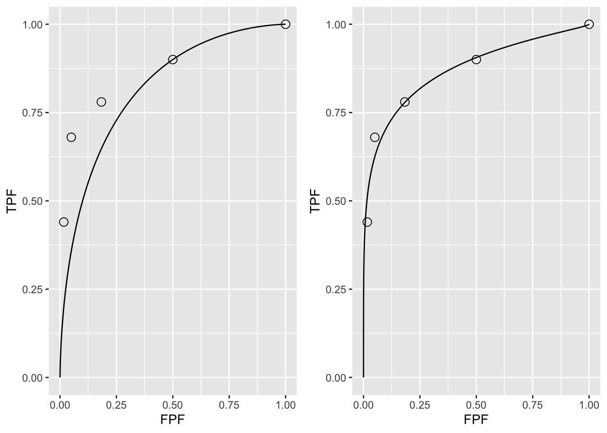

# Ratings Paradigm {#ratings-paradigm}


## TBA How much finished {#ratings-paradigm-how-much-finished}
80%


## Introduction {#ratings-paradigm-introduction}
In Chapter \@ref(binary-task) the binary paradigm and associated concepts (e.g., sensitivity, specificity) were introduced. Chapter \@ref(binary-task) introduced the concepts of a random scalar decision variable, or z-sample for each case, which is compared, by the observer to a fixed reporting threshold $\zeta$, resulting in two types of decisions. It described a statistical model, characterized by two unit-variance normal distributions separated by $\mu$, for the binary task. The concept of an underlying receiver operating characteristic (ROC) curve with the reporting threshold defining an operating point on the curve was introduced and the advisability of using the area under the curve as a measure of performance, which is independent of reporting threshold, was stressed. 

In this chapter the more commonly used ratings method will be described, which yields greater definition to the underlying ROC curve than just one operating point obtained in the binary task, and moreover, is more efficient. In this method, the observer assigns a rating to each case. Described first is a typical ROC counts table and how operating points (i.e., pairs of FPF and TPF values) are calculated from the counts data. A labeling convention for the operating points is introduced. Notation is introduced for the observed integers in the counts table and the rules for calculating operating points are expressed as formulae and implemented in R. The ratings method is contrasted to the binary method, in terms of efficiency and practicality. A theme occurring repeatedly in this book, that the ratings are not numerical values but rather they are ordered labels is illustrated with an example. A method of collecting ROC data on a 6-point scale is described that has the advantage of yielding an unambiguous single operating point. The forced choice paradigm is described. Two controversies are described: one on the utility of discrete (e.g., 1 to 6) vs. quasi-continuous  (e.g., 0 to 100) ratings and the other on the applicability of a clinical screening mammography-reporting scale for ROC analyses. Both of these are important issues and it would be a disservice to the readers of the book if I did not express my position on them.

## The ROC counts table {#binary-task-roc-counts-table}
In a positive-directed rating scale with five discrete levels, the ratings could be the ordered labels: 

* “1”: definitely non-diseased, 
* “2”: probably non-diseased, 
* “3”: could be non-diseased or diseased, 
* “4”: probably diseased, 
* “5”: definitely diseased. 

At the conclusion of the ROC study an ROC counts table is constructed. This is the generalization to rating studies of the 2 x 2 decision vs. truth table introduced in Chapter \@ref(binary-task), Table \@ref(tab:binary-tasktruthTable). This type of data representation is sometimes called a frequency table, but frequency usually means a rate of number of events per some unit, so I prefer the clearer term “counts”. 

Table \@ref(tab:ratings-paradigmExampleTable) is a representative counts table for a 5-rating study that summarizes the collected data. It is the starting point for analysis. It lists the number of counts in each ratings bin, listed separately for non-diseased and diseased cases, respectively. The data is from an actual clinical study [@RN4343]. 

<table>
<caption>(\#tab:ratings-paradigmExampleTable)Representative counts table.</caption>
 <thead>
  <tr>
   <th style="text-align:left;">   </th>
   <th style="text-align:right;"> $r = 5$ </th>
   <th style="text-align:right;"> $r = 4$ </th>
   <th style="text-align:right;"> $r = 3$ </th>
   <th style="text-align:right;"> $r = 2$ </th>
   <th style="text-align:right;"> $r = 1$ </th>
  </tr>
 </thead>
<tbody>
  <tr>
   <td style="text-align:left;"> non-diseased </td>
   <td style="text-align:right;"> 1 </td>
   <td style="text-align:right;"> 2 </td>
   <td style="text-align:right;"> 8 </td>
   <td style="text-align:right;"> 19 </td>
   <td style="text-align:right;"> 30 </td>
  </tr>
  <tr>
   <td style="text-align:left;"> diseased </td>
   <td style="text-align:right;"> 22 </td>
   <td style="text-align:right;"> 12 </td>
   <td style="text-align:right;"> 5 </td>
   <td style="text-align:right;"> 6 </td>
   <td style="text-align:right;"> 5 </td>
  </tr>
</tbody>
</table>

In this table:

* $r = 5$ means "rating equal to 5" 
* $r = 4$ means "rating equal to 4" 
* Etc.

There are $K_1 = 60$ non-diseased cases and $K_2 = 50$ diseased cases. Of the 60 non-diseased cases: 

* one received the "5" rating, 
* two the "4" rating, 
* eight the "3" rating, 
* 19 the "2" rating and 
* 30 the "1" rating. 

The distribution of counts is tilted towards the "1" rating end. In contrast, the distribution of the diseased cases is tilted towards the "5" rating end. Of the 50 diseased cases: 

* 22 received the "5" rating, 
* 12 the "4" rating, 
* five the "3" rating, 
* six the "2" rating and 
* five the "1" rating. 

A little thought should convince one that the observed tilting of the counts, towards the "1" end for actually non-diseased cases, and towards the "5" end for actually diseased cases, is reasonable. 

The spread appears to be more pronounced for the diseased cases, e.g., five of the 50 cases appeared to be definitely non-diseased to the observer. However, one is forewarned not to jump to conclusions about the spread of the data being larger for diseased than for non-diseased cases based on observed rating alone. While it turns out to be true as will be shown later, the **ratings are merely ordered labels**, and modeling is required, see Chapter \@ref(binormal-model), that uses only the *ordering information* implicit in the labels, not the *actual values*, to reach quantitative conclusions.

## Operating points from counts table {#binary-task-operating-points-from-counts-table}
Table \@ref(tab:ratings-paradigmTable2) illustrates how ROC operating points are calculated from the cell counts. In this table:

* $r\geq 5$ means "counting ratings greater than or equal to 5" 
* $r\geq 4$ means "counting ratings greater than or equal to 4" 
* Etc.

<table>
<caption>(\#tab:ratings-paradigmTable2)Computation of operating points from cell counts.</caption>
 <thead>
  <tr>
   <th style="text-align:left;">   </th>
   <th style="text-align:right;"> $r\geq 5$ </th>
   <th style="text-align:right;"> $r\geq 4$ </th>
   <th style="text-align:right;"> $r\geq 3$ </th>
   <th style="text-align:right;"> $r\geq 2$ </th>
   <th style="text-align:right;"> $r\geq 1$ </th>
  </tr>
 </thead>
<tbody>
  <tr>
   <td style="text-align:left;"> FPF </td>
   <td style="text-align:right;"> 0.0167 </td>
   <td style="text-align:right;"> 0.05 </td>
   <td style="text-align:right;"> 0.1833 </td>
   <td style="text-align:right;"> 0.5 </td>
   <td style="text-align:right;"> 1 </td>
  </tr>
  <tr>
   <td style="text-align:left;"> TPF </td>
   <td style="text-align:right;"> 0.4400 </td>
   <td style="text-align:right;"> 0.68 </td>
   <td style="text-align:right;"> 0.7800 </td>
   <td style="text-align:right;"> 0.9 </td>
   <td style="text-align:right;"> 1 </td>
  </tr>
</tbody>
</table>

One starts with non-diseased cases that were rated five or more (in this example, since 5 is the highest allowed rating, the “or more” clause is inconsequential) and divides by the total number of non-diseased cases, $K_1 = 60$. This yields the abscissa of the lowest non-trivial operating point, namely  $FPF_{\ge5}$ = 1/60 = 0.017. The subscript on FPF is intended to make explicit which ratings are being cumulated. The corresponding ordinate is obtained by dividing the number of diseased cases rated "5" or more and dividing by the total number of diseased cases, $K_2 = 50$, yielding $TPF_{\ge5}$ = 22/50 = 0.440. Therefore, the coordinates of the lowest operating point are (0.017, 0.44). The abscissa of the next higher operating point is obtained by dividing the number of non-diseased cases that were rated "4" or more and dividing by the total number of non-diseased cases, i.e., $TPF_{\ge4}$ = 3/60 = 0.05. Similarly the ordinate of this operating point is obtained by dividing the number of diseased cases that were rated "4" or more and dividing by the total number of diseased cases, i.e., $FPF_{\ge4}$ = 34/50 = 0.680. The procedure, which at each stage cumulates the number of cases equal to or greater (in the sense of increased confidence level for disease presence) than a specified ordered label, is repeated to yield the rest of the operating points listed in Table \@ref(tab:ratings-paradigmTable2). Since they are computed directly from the data, without any assumption, they are called empirical or observed operating points. 

After doing this once, it would be nice to have a formula implementing the process, one use of which would be to code the procedure. But first one needs appropriate notation for the bin counts.

Let $K_{1r}$ denote the number of non-diseased cases rated $r$, and $K_{2r}$ denote the number of diseased cases rated $r$. For convenience, define dummy counts  $K_{1{(R+1)}}$ = $K_{2{(R+1)}}$ = 0, where R is the number of ROC bins, $R = 5$ in the current example. This construct allows inclusion of the origin (0,0) in the formulae. The range of $r$ is $r = 1,2,...,(R+1)$. Within each truth-state, the individual bin counts sum to the total number of non-diseased and diseased cases, respectively. The following equations summarize all this:

\begin{equation*} 
K_1=\sum_{r=1}^{R+1}K_{1r}
\end{equation*}

\begin{equation*} 
K_2=\sum_{r=1}^{R+1}K_{2r}
\end{equation*}

\begin{equation*} 
K_{1{(R+1)}} = K_{2{(R+1)}} = 0
\end{equation*}

\begin{equation*} 
r = 1,2,...,(R+1)
\end{equation*}

The operating points are defined by:

\begin{equation}
\left. 
\begin{aligned}
FPF_r=& \frac {1} {K_1} \sum_{s=r}^{R+1}K_{1s}\\
TPF_r=& \frac {1} {K_2} \sum_{s=r}^{R+1}K_{2s}
\end{aligned}
\right \}
(\#eq:ratings-paradigm-FPF-TPF-from-counts)
\end{equation}

### Labeling the points
The labeling $O_n$ of the points follows the following convention: From Eqn. \@ref(eq:ratings-paradigm-FPF-TPF-from-counts), the point corresponding to $r=1$ would correspond to the upper right corner (1,1) of the ROC plot, a trivial operating point since it is common to all datasets, and is therefore not shown. The labeling starts with the next lower-left point, labeled $O_1$, which corresponds to $r=2$; the next lower-left point is labeled $O_2$, corresponding to $r=3$, etc., and the point labeled $O_4$ is the lowest non-trivial operating point corresponding to $r=R=5$ and finally $O_R$ corresponding to $r=R+1$ is the origin (0,0) of the ROC plot, which is also a trivial operating point, because it is common to all datasets, and is therefore not shown. **To summarize, the operating points are labeled starting with the upper right corner, labeled $O_1$, and working down the curve, each time increasing the number by one. The total number of points is $R-1$.**  The relation between $n$ in the label and $r$ in Eqn. \@ref(eq:ratings-paradigm-FPF-TPF-from-counts) is $n=r-1$. An example of the labeling is shown in the next chapter, Fig. \@ref(fig:empirical-auc-EmpiricalPlot).
 
### Examples {#binary-task-examples}
In the following examples $R = 5$ is the number of ROC bins and $K_{1(R+1)}$ = $K_{2(R+1)}$ = 0. If $r = 1$ one gets the uppermost "trivial" operating point (1,1):

\begin{equation*} 
FPF_1=\frac {1} {K_1} \sum_{s=1}^{R+1}K_{1s} = \frac{60}{60} = 1\\
TPF_1=\frac {1} {K_2} \sum_{s=1}^{R+1}K_{2s} = \frac{50}{50} = 1
\end{equation*}

The uppermost non-trivial operating point is obtained for $r = 2$, when:
	
\begin{equation*} 
FPF_2=\frac {1} {K_1} \sum_{s=2}^{R+1}K_{1s} = \frac{30}{60} = 0.5\\
TPF_2=\frac {1} {K_2} \sum_{s=2}^{R+1}K_{2s} = \frac{45}{50} = 0.9
\end{equation*}


The next lower operating point is obtained for $r = 3$:

\begin{equation*} 
FPF_3=\frac {1} {K_1} \sum_{s=3}^{R+1}K_{1s} = \frac{11}{60} = 0.183\\
TPF_3=\frac {1} {K_2} \sum_{s=3}^{R+1}K_{2s} = \frac{39}{50} = 0.780
\end{equation*}

The next lower operating point is obtained for $r = 4$:

\begin{equation*} 
FPF_4=\frac {1} {K_1} \sum_{s=4}^{R+1}K_{1s} = \frac{3}{60} = 0.05\\
TPF_4=\frac {1} {K_2} \sum_{s=4}^{R+1}K_{2s} = \frac{34}{50} = 0.680
\end{equation*}

The lowest non-trivial operating point is obtained for $r = 5$:

\begin{equation*} 
FPF_5=\frac {1} {K_1} \sum_{s=5}^{R+1}K_{1s} = \frac{1}{60} = 0.017\\
TPF_5=\frac {1} {K_2} \sum_{s=5}^{R+1}K_{2s} = \frac{22}{50} = 0.440
\end{equation*}

The next value $r = 6$  yields the trivial operating point (0,0): 

\begin{equation*} 
FPF_6=\frac {1} {K_1} \sum_{s=6}^{R+1}K_{1s} = \frac{0}{60} = 0\\
TPF_6=\frac {1} {K_2} \sum_{s=6}^{R+1}K_{2s} = \frac{0}{50} = 0
\end{equation*}

This exercise shows explicitly that an R-rating ROC study can yield, at most, $R + 1$ distinct non-trivial operating points; i.e., those corresponding to $r=2,3,...,R$.
 
The modifier “at most” is needed, because if both counts (i.e., non-diseased and diseased) for bin $r'$ are zeroes, then that operating point merges with the one immediately below-left of it:
	
\begin{equation*} 
FPF_{r'}=\frac {1} {K_1} \sum_{s={r'}}^{R+1}K_{1s} = \frac {1} {K_1} \sum_{s={r'+1}}^{R+1}K_{1s} = FPF_{r'+1}\\
\\
TPF_{r'}=\frac {1} {K_2} \sum_{s={r'}}^{R+1}K_{2s} = \frac {1} {K_2} \sum_{s={r'+1}}^{R+1}K_{2s} = TPF_{r'+1}
\end{equation*}

Since bin $r'$ is unpopulated, one can re-label the bins to exclude the unpopulated bin, and now the total number of bins is effectively $R-1$. 

Since one is cumulating counts, which cannot be negative, the highest non-trivial operating point resulting from cumulating the 2 through 5 ratings has to be to the upper-right of the next adjacent operating point resulting from cumulating the 3 through 5 ratings. This in turn has to be to the upper-right of the operating point resulting from cumulating the 4 through 5 ratings. This in turn has to be to the upper right of the operating point resulting from the 5 ratings. In other words, as one cumulates ratings bins, the operating point must move monotonically up and to the right, or more accurately, the point cannot move down or to the left. If a particular bin has zero counts for non-diseased cases, and non-zero counts for diseased cases, the operating point moves vertically up when this bin is cumulated; if it has zero counts for diseased cases, and non-zero counts for non-diseased cases, the operating point moves horizontally to the right when this bin is cumulated.

## Automating all this {#binary-task-automating}
It is useful to replace the preceding detailed explanation with a simple algorithm, as in the following code (see first seven lines): 


```r
options(digits = 3)
FPF <- OpPts[1,]
TPF <- OpPts[2,]
df <- data.frame(FPF = FPF, TPF = TPF)
df <- t(df)
print(df)
#>       [,1] [,2]  [,3] [,4] [,5]
#> FPF 0.0167 0.05 0.183  0.5    1
#> TPF 0.4400 0.68 0.780  0.9    1
mu <- qnorm(.5)+qnorm(.9);sigma <- 1
Az <- pnorm(mu/sqrt(2))
cat("uppermost point based estimate of mu = ", mu, "\n")
#> uppermost point based estimate of mu =  1.28
cat("corresponding estimate of Az = ", Az, "\n")
#> corresponding estimate of Az =  0.818
```

Notice that the values of the arrays `FPF` and `TPF` are identical to those listed in Table \@ref(tab:ratings-paradigmTable2). Regarding the last four lines of code, it was shown in Chapter \@ref(binary-task) that in the equal variance binormal model the operating point determines the parameters $\mu$ = 1.282, Eqn. \@ref(eq:binary-task-model-solve-mu), or equivalently $A_{z;\sigma = 1}$ = 0.818, Eqn. \@ref(eq:binary-task-model-az-var). The last four lines illustrate the application of these formulae using the coordinates (0.5, 0.9) of the uppermost non-trivial operating point, i.e., one is fitting the equal variance model to the uppermost operating point.

Shown next is the equal-variance model fit to the uppermost non-trivial operating point, left plot, and for comparison, the right plot is the unequal variance model fit to all operating points. The unequal variance model is the subject of an upcoming chapter.


```r
# equal variance fit to uppermost operating point
p1 <- plotROC (mu, sigma, FPF, TPF)
# the following values are from unequal-variance model fitting
# to be discussed later
mu <- 2.17;sigma <- 1.65
# this formula to be discussed later
Az <- pnorm(mu/sqrt(1+sigma^2))
cat("binormal unequal variance model estimate of Az = ", Az, "\n")
#> binormal unequal variance model estimate of Az =  0.87
# unequal variance fit to all operating points
p2 <- plotROC (mu, sigma, FPF, TPF)
```


```r
grid.arrange(p1,p2,ncol=2)
```

<div class="figure">

<p class="caption">(\#fig:ratings-paradigm-eq-var-fit-a)(A): The left figure is the predicted ROC curve for $\mu=1.282$ superposed on the operating points. (B): The right figure is the same data fitted with a two-parameter model described later.</p>
</div>

It should come as no surprise that the uppermost operating point is *exactly* on the predicted curve: after all, this point was used to calculate $\mu$ = 2.17. The corresponding value of $\zeta$ can be calculated from Eqn. (3.17), namely:

\begin{equation*} 
\zeta = \Phi^{-1}\left ( Sp \right )
(\#eq:ratings-paradigm-Zeta)
\end{equation*}

\begin{equation*} 
\mu = \zeta + \Phi^{-1}\left ( Se \right )
(\#eq:ratings-paradigm-Mu)
\end{equation*}

These are coded below:


```r
qnorm(1-0.5)
#> [1] 0
mu-qnorm(0.9)
#> [1] 0.888
```

Either way, one gets the same result: $\zeta$ = 0. It should be clear that this makes sense: FPF = 0.5 is consistent with half of the (symmetrical) unit-normal non-diseased distribution being above $\zeta$ = 0. The transformed value $\zeta$ (zero in this example) is a genuine numerical value. *To reiterate, ratings cannot be treated as genuine numerical values, but thresholds, estimated from an appropriate model, can be treated as genuine numerical values.* 

Exercise: calculate $\zeta$ for each of the remaining operating points. *Notice that $\zeta$ increases as one moves down the curve.*

* In Fig. \@ref(fig:ratings-paradigm-eq-var-fit-a) (A), the ROC curve, as determined by the uppermost operating point, passes exactly through this point but misses the others. If a different operating point were used to estimate $\mu$ and $A_{z;\sigma = 1}$, the estimated values would have been different and the new curve would pass exactly through the *new* selected point. No single-point based choice of $\mu$ would yield a satisfactory visual fit to all the observed operating points. __This is the reason one needs a modified model, with an extra parameter, namely the unequal variance binormal model, to fit radiologist data__ (the extra parameter is the ratio of the standard deviations of the two distributions). 

* Fig. \@ref(fig:ratings-paradigm-eq-var-fit-a) (B) shows the predicted ROC curve by the unequal variance binormal model, to be introduced in Chapter 06. The corresponding parameter values are $\mu$ = 2.17and $\sigma$ = 1.65. 

* Notice the improved visual quality of the fit. Each observed point is "not engraved in stone", rather both FPF and TPF are subject to sampling variability. Estimation of confidence intervals for FPF and TPF was addressed, see \@ref(eq:binary-task-model-ci-fpf) and \@ref(eq:binary-task-model-ci-tpf). [A detail: the estimated confidence interval in the preceding chapter was for a single operating point; since the multiple operating points are correlated – some of the counts used to calculate them are common to two or more operating points – the method tends to overestimate the confidence interval. A modeling approach to estimating confidence intervals accounts for these correlations and yields tighter confidence intervals.]

## Relation between ratings paradigm and the binary paradigm {#binary-task-relation-to-rating}
Table \@ref(tab:ratings-paradigmExampleTable) and Table \@ref(tab:ratings-paradigmTable2) correspond to $R = 5$. In Chapter \@ref(binary-task) it was shown that the binary task requires a single fixed threshold parameter $\zeta$ and a decision or binning rule Eqn. \@ref(eq:ratings-paradigm-binningRule): assign the case a diseased rating of 2 if $Z > \zeta$ and a rating of 1 otherwise. 

**The R-rating task can be viewed as $R-1$ simultaneously conducted binary tasks each with its own fixed threshold $\zeta_r$, where r = 1, 2, ..., R-1. It is efficient compared to $R-1$ sequentially conducted binary tasks; however, the onus is on the observer to maintain fixed-multiple thresholds through the duration of the study.**

The rating method is a more efficient way of collecting the data compared to running the study repeatedly with appropriate instructions to cause the observer to adopt different fixed thresholds specific to each replication. In the clinical context such repeated studies would be impractical because it would introduce memory effects, wherein the diagnosis of a case would depend on how many times the case had been seen, along with other cases, in previous sessions. A second reason is that it is difficult for a radiologist to change the operating threshold in response to instructions. To my knowledge, repeated use of the binary paradigm has not been used in any clinical ROC study

In order to model the binning, one defines dummy thresholds $\zeta_0 = - \infty$ and $\zeta_R = + \infty$, in which case the thresholds satisfy the ordering requirement $\zeta_{r-1} \le  \zeta_r$ , r = 1, 2, ..., R. The rating or binning rule is:	

\begin{equation}
\left.
\begin{aligned}  
if \left (\zeta_{r-1} \le z < \zeta_r  \right )\Rightarrow \text rating = r\\
r = 1, 2, ..., R
\end{aligned}
\right \}
(\#eq:ratings-paradigm-binningRule)
\end{equation}

For Table \@ref(tab:ratings-paradigmTable2), the **empirical** thresholds are as follows:

\begin{equation} 
\left.
\begin{aligned}
\zeta_r &= r + 1 \\
r & = 1, 2, ..., R-1\\
\zeta_0 &= -\infty\\
\zeta_R &= \infty\\
\end{aligned}
\right \}
(\#eq:ratings-paradigm-EmpZeta)
\end{equation}

The empirical thresholds are integers, as distinct from the floating point values predicted by Eqn. \@ref(eq:ratings-paradigm-Zeta). **Either way one gets the same operating points.** This is a subtle and important distinction, which is related to the next section: one has enormous flexibility in the choice of the scale adopted for the decision variable axis. 

In Table \@ref(tab:ratings-paradigmExampleTable) the number of bins is $R = 5$. The "simultaneously conducted binary tasks" nature of the rating task can be appreciated from the following examples. Suppose one selects the threshold for the first binary task to be $\zeta_4 = 5$. By definition, $\zeta_5 = \infty$; therefore a case rated 5 satisfies the binning rule $\zeta_4 \leq 5 < \zeta_5$, i.e., Eqn. \@ref(eq:ratings-paradigm-binningRule). The operating point corresponding to $\zeta_4 = 5$, obtained by cumulating all cases rated five, yields $(0.017, 0.440)$. In the second binary-task, one selects as threshold $\zeta_3 = 4$. Therefore, a case rated four satisfies the binning rule $\zeta_3 \leq 4 < \zeta_4$. The operating point corresponding to $\zeta_3 = 4$, obtained by cumulating all cases rated four or five, yields $(0.05, 0.680)$. Similarly, for $\zeta_2 = 3$, $\zeta_1 = 2$ and $\zeta_0 = -\infty$, which yield counts in bins 3, 2 and 1, respectively. The last is a trivial operating point. The non-trivial operating points are generated by thresholds $\zeta_r$, where $r$ = 1, 2, 3 and 4. A five-rating study has four associated thresholds and a corresponding number of equivalent binary studies. In general, an $R$ rating study has $R-1$ associated thresholds.

## Ratings are not numerical values {#binary-task-ratings-not-numerical-values}
The ratings are to be thought of as ordered labels, not as numeric values. Arithmetic operations that are allowed on numeric values, such as averaging, are not allowed on ratings. One could have relabeled the ratings in Table 4.2 as A, B, C, D and E, where A < B etc. As long as the counts in the body of the table are unaltered, such relabeling would have no effect on the observed operating points and the fitted curve. Of course one cannot average the labels A, B, etc. of different cases. The issue with numeric labels is not fundamentally different. At the root is that the difference in thresholds corresponding to the different operating points are not in relation to the difference between their numeric values. There is a way to estimate the underlying thresholds, if one assumes a specific model, for example the unequal-variance binormal model to be described in Chapter 06. The thresholds so obtained are genuine numeric values and can be averaged. [Not to hold the reader in suspense, the four thresholds corresponding to the data in Table 4.1 are   0.007676989,   0.8962713,   1.515645 and   2.396711; see §6.4.1; these values would be unchanged if, for example, the labels were doubled, with allowed values 2, 4, 6, 8 and 10, or any of an infinite number of rearrangements that preserves their ordering.]

The temptation to regard confidence levels / ratings as numeric values can be particularly strong when one uses a large number of bins to collect the data. One could use of quasi-continuous ratings scale, implemented for example, by having a slider-bar user interface for selecting the rating. The slider bar typically extends from 0 to 100, and the rating could be recorded as a floating-point number, e.g., 63.45. Here too one cannot assume that the difference between a zero-rated case and a 10 rated case is a tenth of the difference between a zero-rated case and a 100 rated case. So averaging the ratings is not allowed. Additionally, one cannot assume that different observers use the labels in the same way. One observer's 4-rating is not equivalent to another observers 4-rating. Working directly with the ratings is a bad idea: valid analytical methods use the rankings of the ratings, not their actual values. The reason for the emphasis is that there are serious misconceptions about ratings. I am aware of a publication stating, to the effect, that a modality resulted in an increase in average confidence level for diseased cases. Another publication used a specific numerical value of a rating to calculate the operating point for each observer – this assumes all observers use the rating scale in the same way. 

## A single "clinical" operating point from ratings data {#binary-task-clinical-operating-point}
The reason for the quotes in the title to this section is that a single operating point on a laboratory ROC plot, no matter how obtained, has little relevance to how radiologists operate in the clinic. However, some consider it useful to quote an operating point from an ROC study. For a 5-rating ROC study, Table \@ref(tab:ratings-paradigmExampleTable), it is not possible to unambiguously calculate the operating point of the observer in the binary task of discriminating between non-diseased and diseased cases. One possibility would be to use the "three and above" ratings to define the operating point, but one might jus have well have chosen "two and above". A second possibility is to instruct the radiologist that a "four and above" rating, for example, implies the case would be reported “clinically” as diseased. However, the radiologist can only pretend so far that this study, which has no clinical consequences, is somehow a “clinical” study. 

If a single laboratory study based operating point is desired [@RN2660], the best strategy, in my opinion, is to obtain the rating via two questions. This method is also illustrated in Table 3.1 of a book on detection theory [@RN1318]. The first question is "is the case diseased?" The binary (Yes/No) response to this question allows unambiguous calculation of the operating point, as in Chapter \@ref(binary-task). The second question is: "what is your confidence in your previous decision?" and allow three responses, namely Low, Medium and High. The dual-question approach is equivalent to a 6-point rating scale, Fig. \@ref(fig:SixPointScale). The answer to the first question, is the patient diseased, allows unambiguous construction of a single "clinical" operating point for disease presence. The answer to the second question, what is your confidence level in that decision, yields multiple operating points. 

<div class="figure">

<p class="caption">(\#fig:SixPointScale)A method for acquiring ROC data on an effectively 6-point scale that also yields an unambiguous single operating point for declaring patients diseased. Note the reversal of the final ratings in the last "column" in the lower half of the figure.</p>
</div>

The ordering of the ratings can be understood as follows. The four, five and six ratings are as expected. If the radiologist states the patient is diseased and the confidence level is high that is clearly the highest end of the scale, i.e., six, and the lower confidence levels, five and four, follow, as shown. If, on the other hand, the radiologist states the patient is non-diseased, and the confidence level is high, then that must be the lowest end of the scale, i.e., "1". The lower confidence levels in a negative decision must be higher than "1", namely "2" and "3", as shown. As expected, the low confidence ratings, namely "3" (non-diseased, low confidence) and "4"  (diseased, low confidence) are adjacent to each other. With this method of data-collection, there is no confusion as to what rating defines the single desired operating point as this is determined by the binary response to the first question. The 6-point rating scale is also sufficiently fine to not smooth out the ability of the radiologist to maintain distinct different levels. In my experience, using this scale one expects rating noise of about $\pm\frac{1}{2}$ a rating bin, i.e., the same difficult case, shown on different occasions to the same radiologist (with sufficient time lapse or other intervening cases to minimize memory effects) is expected to elicit a "3" or "4", with roughly equal probability. 

## The forced choice paradigm {#binary-task-2afc}
In each of the four paradigms (ROC, FROC, LROC and ROI) described in TBA Chapter 01, patient images are displayed one patient at a time. A fifth paradigm involves presentation of multiple images to the observer, where one image (or set of images from one patient, i.e., a case) is from a diseased patient, and the rest are from non-diseased patients. The observer's task is to pick the image, or the case, that is most likely to be from the diseased patient. If the observer is correct, the event is scored as a "one" and otherwise it is scored as a "zero". The process is repeated with other sets of independent patient images, each time satisfying the condition that one patient is diseased and the rest are non-diseased. The sum of the scores divided by the total number of scores is the probability of a correct choice, denoted $P(C)$. If the total number of cases presented at the same time is denoted $n$, then the task is termed n-alternative forced choice or nAFC [@RN298]. If only two cases are presented, one diseased and the other non-diseased, then n = 2 and the task is 2AFC. In Fig. \@ref(fig:2AFC), in the left image a Gaussian nodule is superposed on a square region extracted from a non-diseased mammogram. The right image is a region extracted from a different non-diseased mammogram (one should not use the same background in the two images – the analysis assumes that different, i.e., independent images, are shown). If the observer clicks on the left image, a correct choice is recorded. [In some 2AFC-studies, the backgrounds are simulated non-diseased images. They resemble mammograms; the resemblance depends on the expertise of the observer: expert radiologists can tell that they are not true mammograms. They are actually created by filtering the random white noise with a 1/f3 spatial filter [@burgess2011visual].] 

The 2AFC paradigm is popular, because its analysis is straightforward, and there exists a theorem4 that $P(C)$, the probability of a correct choice in the 2AFC task, equals, to within sampling variability, the *true* area under the true (not fitted, not empirical) ROC curve. Another reason for its popularity is possibly the speed at which data can be collected, sometimes only limited by the speed at which disk stored images can be displayed on the monitor. While useful for studies into human visual perception on relatively simple images, and the model observer community has performed many studies using this paradigm [@RN1067], I cannot recommend it for clinical studies because *it does not resemble any clinical task*. In the clinic, radiologists never have to choose the diseased patient out of a pair consisting of one diseased and one non-diseased. Additionally, the forced-choice paradigm is wasteful of known-truth images, often a difficult/expensive resource to come by, because better statistics21 (tighter confidence intervals) are obtained by the ratings ROC method or by utilizing location specific extensions of the ROC paradigm. [I am not aware of the 2AFC method being actually used to assess imaging systems using radiologists to perform real clinical tasks on real images.] 

<div class="figure">

<p class="caption">(\#fig:2AFC)Example of image presentation in a 2AFC study.</p>
</div>

Fig. \@ref(fig:2AFC): Example of image presentation in a 2AFC study. The left image contains, at its center, a positive contrast Gaussian shape disk superposed on a non-diseased mammogram. The right image does not contain a lesion at its center and the background is from a different non-diseased patient. If the observer clicks on the left image it is recorded as a correct choice, otherwise it is recorded as an incorrect choice. The number of correct choices divided by the number of paired presentations is an estimate of the probability of a correct choice, which can be shown to be identical, apart from sampling variability, to the true area under the ROC curve. This is an example of a signal known exactly location known exactly (SKE-LKE) task widely used by the model observer community. 

## Observer performance studies as laboratory simulations of clinical tasks {#binary-task-observer-studies-as-simulations}
* Observer performance paradigms (ROC, FROC, LROC and ROI) should be regarded as experiments conducted in a laboratory (i.e., controlled) setting that are intended to be representative of the actual clinical task. They should not to be confused with performance in a real "live" clinical setting: there is a known "laboratory effect" [@RN2026]. For example, in the just cited study radiologists performed better during live clinical interpretations than they did later, on the same cases, in a laboratory ROC study. This is to be expected because there is more at stake during live interpretations: e.g., the patient's health and the radiologist's reputation, than during laboratory ROC studies. The claimed "laboratory effect" has caused some minor controversy. A paper [@RN2373] titled "Screening mammography: test set data can reasonably describe actual clinical reporting" argues against the laboratory effect. 

* Real clinical interpretations happen every day in radiology departments all over the world. On the other hand, in the laboratory, the radiologist is asked to interpret the images "as if in a clinical setting" and render a "diagnosis". The laboratory decisions have no clinical consequences, e.g., the radiologist will not be sued for mistakes and their laboratory study decisions will have no impact on the clinical management of the patients. [Usually laboratory ROC studies are conducted on retrospectively acquired images. Patients, whose images were used in an ROC study, have already been imaged in the clinic and decisions have already been made on how to manage them.] 

* There is no guarantee that results of the laboratory study are directly applicable to clinical practice. Indeed there is an assumption that the laboratory study correlates with clinical performance. Strict equality is not required, simply that the performance in the laboratory is related monotonically to actual clinical performance. Monotonicity assures preservation of performance orderings, e.g., a radiologist has greater performance than another does or one modality is superior to another, regardless of how they are measured, in the laboratory or in the clinic. The correlation is taken to be an axiomatic truth by researchers, when in fact it is an assumption. To the extent that the participating radiologist brings his/her full clinical expertise to bear on each laboratory image interpretation, i.e., takes the laboratory study seriously, this assumption is likely to be valid.

* This title of this section provoked a strong response from a collaborator. To paraphrase him, "... *I think it is a pity in this book chapter you argue that these studies are simulations. I mean, the reason people perform these studies is because they believe in the results"*. 

* I also believe in observer performance studies. Distrust of the word "simulation" seems to be peculiar to this field. Simulations are widely used in "hard" sciences, e.g., they are used in astrophysics to determine conditions dating to $10^{-31}$ seconds after the big bang. Simulations are not to be taken lightly. Conducting clinical studies is very difficult as there are many factors not under the researcher's control. Observer performance studies of the type described in this book are the closest that one can come to the "real thing" as they include key elements of the actual clinical task: the entire imaging system, radiologists (assuming the radiologist take these studies seriously in the sense of bringing their full expertise to bear on each image interpretation) and real clinical images. As such are expected to correlate with real "live" interpretations.  


## Discrete vs. continuous ratings: the Miller study {#binary-task-discrete-vs-continuous-ratings}
* There is controversy about the merits of discrete vs. continuous ratings [@RN99; @RN2179]. Since the late Prof. Charles E. Metz and the late Dr. Robert F. Wagner have both backed the latter (i.e., continuous or quasi-continuous ratings) new ROC study designs sometimes tend to follow their advice. I recommend a 6-point rating scale as outlined in Fig. \@ref(fig:SixPointScale). This section provides the background for the recommendation.

* A widely cited (22,909 citations at the time of writing) 1954 paper by Miller [@RN930] titled "The Magical Number Seven, Plus or Minus Two: Some Limits on Our Capacity for Processing Information" is relevant. It is a readable paper, freely downloadable in several languages (www.musanim.com/miller1956/). In my judgment, this paper has not received the attention it should have in the ROC community, and for this reason portions from it are reproduced below. [George Armitage Miller, February 3, 1920 – July 22, 2012, was one of the founders of the field of cognitive psychology.]

* Miller’s first objective was to comment on absolute judgments of unidimensional stimuli. Since all (univariate, i.e., single decision per case) ROC models assume a unidimensional decision variable, Miller's work is highly relevant. He comments on two papers by Pollack [@RN2476; @RN2474]. Pollack asked listeners to identify tones by assigning numerals to them, analogous to a rating task described above. The tones differed in frequency, covering the range 100 to 8000 Hz in equal logarithmic steps. A tone was sounded and the listener responded by giving a numeral (i.e., a rating, with higher values corresponding to higher frequencies). After the listener had made his response, he was told the correct identification of the tone. When only two or three tones were used, the listeners never confused them. With four different tones, confusions were quite rare, but with five or more tones, confusions were frequent. With fourteen different tones, the listeners made many mistakes. Since it is so succinct, the entire content of the first (1952) paper by Pollack is reproduced below:

* “In contrast to the extremely acute sensitivity of a human listener to discriminate small differences in the frequency or intensity between two sounds is his relative inability to identify (and name) sounds presented individually. When the frequency of a single tone is varied in equal‐logarithmic steps in the range between 100 cps and 8000 cps (and when the level of the tone is randomly adjusted to reduce loudness cues), the amount of information transferred is about 2.3 bits per stimulus presentation. This is equivalent to perfect identification among only 5 tones. The information transferred, under the conditions of measurement employed, is reasonably invariant under wide variations in stimulus conditions.”

* By “information” is meant (essentially) the number of levels, measured in bits (binary digits), thereby making it independent of the unit of measurement: 1 bit corresponds to a binary rating scale, 2 bits to a four-point rating scale and 2.3 bits to $2^{2.3}$ = 4.9, i.e., about 5 ratings bins. Based on Pollack’s’ original unpublished data, Miller put an upper limit of 2.5 bits (corresponding to about 6 ratings bins) on the amount of information that is transmitted by listeners who make absolute judgments of auditory pitch. The second paper [@@RN2474] by Pollack was related to: (1) the frequency range of tones; (2) the utilization of objective reference tones presented with the unknown tone; and (3) the “dimensionality”—the number of independently varying stimulus aspects. Little additional gain in information transmission was associated with the first factor; a moderate gain was associated with the second; and a relatively substantial gain was associated with the third (we return to the dimensionality issue below).

* As an interesting side-note, Miller states: 

>“Most people are surprised that the number is as small as six. Of course, there is evidence that a musically sophisticated person with absolute pitch can identify accurately any one of 50 or 60 different pitches. Fortunately, I do not have time to discuss these remarkable exceptions. I say it is fortunate because I do not know how to explain their superior performance. So I shall stick to the more pedestrian fact that most of us can identify about one out of only five or six pitches before we begin to get confused.

It is interesting to consider that psychologists have been using seven-point rating scales for a long time, on the intuitive basis that trying to rate into finer categories does not really add much to the usefulness of the ratings. Pollack's results indicate that, at least for pitches, this intuition is fairly sound.

>Next you can ask how reproducible this result is. Does it depend on the spacing of the tones or the various conditions of judgment? Pollack varied these conditions in a number of ways. The range of frequencies can be changed by a factor of about 20 without changing the amount of information transmitted more than a small percentage. Different groupings of the pitches decreased the transmission, but the loss was small. For example, if you can discriminate five high-pitched tones in one series and five low-pitched tones in another series, it is reasonable to expect that you could combine all ten into a single series and still tell them all apart without error. When you try it, however, it does not work. The channel capacity for pitch seems to be about six and that is the best you can do.”

* In contrast to the careful experiments conducted in the psychophysical context to elucidate this issue, I was unable to find a single study, in the medical imaging field, of the number of discrete rating levels that an observer can support. Instead, a recommendation has been made to acquire data on a quasi-continuous scale [@RN2179].

* There is no question that for multidimensional data, as observed in the second study by Pollack [@RN2474], the observer can support more than 7 ratings bins. To quote Miller:

>“You may have noticed that I have been careful to say that this magical number seven applies to one- dimensional judgments. Everyday experience teaches us that we can identify accurately any one of several hundred faces, any one of several thousand words, any one of several thousand objects, etc. The story certainly would not be complete if we stopped at this point. We must have some understanding of why the one-dimensional variables we judge in the laboratory give results so far out of line with what we do constantly in our behavior outside the laboratory. A possible explanation lies in the number of independently variable attributes of the stimuli that are being judged. Objects, faces, words, and the like differ from one another in many ways, whereas the simple stimuli we have considered thus far differ from one another in only one respect.”

* In the medical imaging context, a trivial way to increase the number of ratings would be to color-code the images: red, green and blue; now one can assign a red image rated 3, a green image rated 2, etc., which would be meaningless unless the color encoded relevant diagnostic information. Another ability, quoted in the publication [@RN2179] advocating continuous ratings is the ability to recognize faces, again a multidimensional categorization task, as noted by Miller. Also quoted as an argument for continuous ratings is the ability of computer aided detection schemes that calculate many features for each perceived lesion and combine them into a single probability of malignancy, which is on a highly precise floating point 0 to 1 scale, which can be countered by the fact that radiologists are not computers. Other arguments for greater number of bins: it cannot hurt and one should acquire the rating data at greater precision than the noise, especially if the radiologist is able to maintain the finer distinctions. I worry that radiologists who are willing to go along with greater precision are over-anxious to co-operate with the experimentalist. Expert radiologists will not modify their reading style and one should be suspicious when overzealous radiologists accede to an investigators request to interpret images in a style that does not resemble the clinic. Radiologists, especially experts, do not like more than about four ratings. I once worked closely with a famous chest radiologist (the late Dr. Robert Fraser) who refused to use more than four ratings. 

* Another reason given for using continuous ratings is it reduces instances of data degeneracy. Data is sometimes said to be degenerate if the curve-fitting algorithm, the binormal model and the proper binormal model, cannot fit it (in simple terms, the program crashes). This occurs, for example, if there are no interior points on the ROC plot. Modifying radiologist behavior to accommodate the limitations of analytical methods seems to be inherently dubious. One could simply randomly add or subtract half an integer from the observed ratings, thereby making the rating scale more granular and reduce instances of degeneracy (this is actually done in some ROC software to overcome degeneracy issues). Another possibility is to use the empirical (trapezoidal) area under the ROC curve, which can always be calculated; there are no degeneracy problems with it. Actually, fitting methods now exist that are robust to data degeneracy, such as discussed in TBA Chapter 18 and Chapter 20, so this reason for acquiring continuous data no longer applies.

* The rating task involves a unidimensional scale and I see no way of getting around the basic channel-limitation noted by Miller and for this reason I recommend a 6 point scale, as in Fig. \@ref(fig:SixPointScale).

* On the other side of the controversy [@RN2145], a position that I agree with, it has been argued that given a large number of allowed ratings levels the cooperating observer essentially bins the data into a much smaller number of bins (e.g., 0, 20, 40, 60, 80, 100) and then adds a zero-mean noise term to appear to be "spreading out the ratings". This ensures that the binormal model does not crash. However, if the intent is to get the observer to spread the ratings, so that the binormal model does not crash, a better approach is to use alternate models that do not crash and are, in fact, very robust with respect to degneracy of the data. More on this later (see Chapters TBA CBM and RSM).

## The BI-RADS ratings scale and ROC studies {#binary-task-birads-rating-scale}
It is desirable that the rating scale be relevant to the radiologists’ daily practice. This assures greater consistency – the fitting algorithms assume that the thresholds are held constant for the duration of the ROC study. Depending on the clinical task, a natural rating scale may already exist. For example, in 1992 the American College of Radiology developed the Breast Imaging Reporting and Data System (BI-RADS) to standardize mammography reporting36. There are six assessment categories: category 0 indicates need for additional imaging; category 1 is a negative (clearly non-diseased) interpretation; category 2 is a benign finding; category 3 is probably benign, with short-interval follow-up suggested; category 4 is a suspicious abnormality for which biopsy should be considered; category 5 is highly suggestive of malignancy and appropriate action should be taken. The 4th edition of the BI-RADS manual37 divides category 4 into three subcategories 4A, 4B and 4C and adds category 6 for a proven malignancy. The 3-category may be further subdivided into “probably benign with a recommendation for normal or short-term follow-up” and a 3+ category, “probably benign with a recommendation for immediate follow-up”. Apart from categories 0 and 2, the categories form an ordered set with higher categories representing greater confidence in presence of cancer. How to handle the 0s and the 2s is the subject of some controversy, described next. 

## The controversy {#binary-task-birads-rating-scale-controversy}
Two large clinical studies have been reported in which BI-RADS category data were acquired for > 400,00 screening mammograms interpreted by many (124 in the 1st study) radiologists [@RN2168; @RN1902]. The purpose of the first study was to relate radiologist characteristics to actual performance (e.g., does performance depend on reading volume – the number of cases interpreted per year), so it could be regarded as a more elaborate version of [@RN1087], described in Chapter \@ref(binary-task). The purpose of the second study was to determine the effectiveness of computer-aided detection (CAD) in screening mammography. 

The reported ROC analyses used the BIRADS assessments labels ordered as follows: $1 < 2 < 3 < 3+ < 0 < 4 < 5$. The last column of Table \@ref(tab:BIRADS-study) shows that with this ordering the numbers of cancer per 1000 patients increases monotonically. The CAD study is discussed later, for now the focus is on the adopted BIRADS scale ordering that is common to both studies and which has raised controversy (the controversy appears to be limited to observer performance study analysts).

<table class="table" style="margin-left: auto; margin-right: auto;">
<caption>(\#tab:BIRADS-study)The Barlow et al study: the ordering of the BI-RADS ratings in the first column correlates with cancer-rate in the last column.</caption>
 <thead>
  <tr>
   <th style="text-align:left;">   </th>
   <th style="text-align:left;"> Total number 
of mammograms </th>
   <th style="text-align:left;"> Mammograms without 
breast cancer (percent) </th>
   <th style="text-align:left;"> Mammograms with 
breast cancer  (percent) </th>
   <th style="text-align:left;"> Cancers per 1000 
screening mammograms </th>
  </tr>
 </thead>
<tbody>
  <tr>
   <td style="text-align:left;width: 11em; "> 1: Normal </td>
   <td style="text-align:left;width: 8em; "> 356,030 </td>
   <td style="text-align:left;width: 8em; "> 355,734 (76.2) </td>
   <td style="text-align:left;width: 8em; "> 296 (12.3) </td>
   <td style="text-align:left;width: 8em; "> 0.83 </td>
  </tr>
  <tr>
   <td style="text-align:left;width: 11em; "> 2: Benign finding </td>
   <td style="text-align:left;width: 8em; "> 56,614 </td>
   <td style="text-align:left;width: 8em; "> 56,533 (12.1) </td>
   <td style="text-align:left;width: 8em; "> 81 (3.4) </td>
   <td style="text-align:left;width: 8em; "> 1.43 </td>
  </tr>
  <tr>
   <td style="text-align:left;width: 11em; "> 3: Probably benign, 
recommend normal or short term follow up </td>
   <td style="text-align:left;width: 8em; "> 8,692 </td>
   <td style="text-align:left;width: 8em; "> 8,627 (1.8) </td>
   <td style="text-align:left;width: 8em; "> 65 (2.7) </td>
   <td style="text-align:left;width: 8em; "> 7.48 </td>
  </tr>
  <tr>
   <td style="text-align:left;width: 11em; "> 3+: Probably benign, 
recommend immediate follow up </td>
   <td style="text-align:left;width: 8em; "> 3,094 </td>
   <td style="text-align:left;width: 8em; "> 3,049 (0.7) </td>
   <td style="text-align:left;width: 8em; "> 45 (1.9) </td>
   <td style="text-align:left;width: 8em; "> 14.54 </td>
  </tr>
  <tr>
   <td style="text-align:left;width: 11em; "> 0: Need additional 
imaging evaluation </td>
   <td style="text-align:left;width: 8em; "> 42,823 </td>
   <td style="text-align:left;width: 8em; "> 41,442 (8.9) </td>
   <td style="text-align:left;width: 8em; "> 1,381 (57.5) </td>
   <td style="text-align:left;width: 8em; "> 32.25 </td>
  </tr>
  <tr>
   <td style="text-align:left;width: 11em; "> 4: Suspicious finding, 
biopsy should be considered </td>
   <td style="text-align:left;width: 8em; "> 2,022 </td>
   <td style="text-align:left;width: 8em; "> 1,687 (0.4) </td>
   <td style="text-align:left;width: 8em; "> 335 (13.9) </td>
   <td style="text-align:left;width: 8em; "> 165.68 </td>
  </tr>
  <tr>
   <td style="text-align:left;width: 11em; "> 5: Highly suggestive 
of malignancy </td>
   <td style="text-align:left;width: 8em; "> 237 </td>
   <td style="text-align:left;width: 8em; "> 38 (0.0) </td>
   <td style="text-align:left;width: 8em; "> 199 (8.3) </td>
   <td style="text-align:left;width: 8em; "> 839.66 </td>
  </tr>
</tbody>
</table>

The use of the BI-RADS ratings shown in Table \@ref(tab:BIRADS-study) has been criticized [@RN2166] in an editorial titled: 

>BI-RADS Data Should Not Be Used to Estimate ROC Curves 

Since BI-RADS is a clinical rating scheme widely used in mammography, the editorial, if correct, implies that ROC analysis of clinical mammography data is not possible. Since the BI-RADS scale was arrived at after considerable deliberation, inability to perform ROC analysis with it would strike at the root of clinical utility of the ROC method. The purpose of this section is to express the reasons why I have a different take on this controversy.

It is claimed in the editorial that the Barlow et al. study confuses cancer yield with confidence level and that BI-RADS categories 1 and 2 should not be separate entries of the confidence scale, because both indicate no suspicion for cancer. 

I agree with the Barlow et al. suggested ordering of the "2s" as more likely to have cancer than the "1s". A category-2 means the radiologist found something to report, and the location of the finding is part of the clinical report. Even if the radiologist believes the finding is definitely benign, there is a finite probability that a category-2 finding is cancer, as evident in the last column of Table \@ref(tab:BIRADS-study) ($1.43 > 0.83$). In contrast, there are no findings associated with a category-1 report. A paper [@hartmann2005benign] titled: 

>Benign breast disease and the risk of breast cancer 

should convince any doubters that benign lesions do have a finite chance of cancer.

The problem with “where to put the 0s” arises only when one tries to analyze clinical BI-RADS data. In a laboratory study, the radiologist would not be given the category-0 option. In analyzing a clinical study it is incumbent on the study designer to justify the choice of the rating scale adopted. Showing that the proposed ordering agrees with the probability of cancer is justification – and in my opinion, given the very large sample size this was accomplished convincingly in the Barlow et al. study. 

**Moreover, the last column of Table \@ref(tab:BIRADS-study) suggests that any other ordering would violate an important principle, namely, optimal ordering is achieved when each case is rated according to it's likelihood ratio (defined as the probability of the case being diseased divided by the probability of the case being non-diseased). The likelihood ratio is the "betting odds" of the case being diseased, which is expected to be monotonic with the empirical probability of the case being diseased, i.e., the last column of Table \@ref(tab:BIRADS-study). Therefore, the ordering adopted in Table \@ref(tab:BIRADS-study) is equivalent to adopting a likelihood ratio scale and any other ordering would not be monotonic with likelihood ratio.**

The likelihood ratio is described in more detail in the TBA Chapter 20, which describes ROC fitting methods that yield "proper" ROC curves, i.e., ones that have monotonically decreasing slope as the operating point moves up the curve from (0,0) to (1,1) and therefore do not (inappropriately) cross the chance diagonal. Key to these fitting methods is adoption of a likelihood ratio scale to rank-order cases, instead of the ratings assumed by the unequal variance binormal model. The proper ROC fitting algorithm implemented in PROPROC software reorders confidence levels assumed by the binormal model, TBA Chapter 20, paragraph following Fig. 20.4. This is analogous to the reordering of the clinical ratings based on cancer rates assumed in Table \@ref(tab:BIRADS-study). It is illogical to allow reordering of ratings in "blind" software but question the same when done in a principled way by a researcher. As expected, the modeled ROC curves in the Barlow publication, their Fig. 4, show no evidence of improper behavior. This is in contrast to a clinical study (about fifty thousands patients spread over 33 hospitals with each mammogram interpreted by two radiologists) using a non-BIRADS 7-point rating scale which yielded markedly improper ROC curves [@RN1784] for the film modality when using ROC ratings (not BIRADS). This suggests that use of a non-clinical ratings scale for clinical studies, without independent confirmation of the ordering implied by the scale, is problematical.

The reader might be interested as to reason for the 0-ratings being more predictive of cancer than a 3+ rating, Table \@ref(tab:BIRADS-study). In the clinic the zero rating implies, in effect, "defer decision, incomplete information, additional imaging necessary". A zero rating could be due to technical problems with the images: e.g., improper positioning (e.g., missing breast tissue close to the chest wall) or incorrect imaging technique (improper selection of kilovoltage and/or tube charge), making it impossible to properly interpret the images. Since the images are part of the permanent patient record, there are both healthcare and legal reasons why the images need to be optimal. Incorrect technical factors are expected to occur randomly and therefore not predictive of cancer. However, if there is a suspicious finding and the image quality is sub-optimal, the radiologist may be unable to commit to a decision, they may seek additional imaging, perhaps better compression or a slightly different view angle to resolve the ambiguity. Such zero ratings are expected with suspicious findings, and therefore are expected to be predictive of cancer.

As an aside, the second paper [@RN1902] using the ordering shown in Table \@ref(tab:BIRADS-study) questioned the utility of CAD for breast cancer screening (this was ca. 2007). This paper was met with flurry of correspondence disputing the methodology (summarized above). The finding regarding utility of CAD has been validated by more recent studies, again with very large case and reader samples, showing that usage of CAD can actually be detrimental to patient outcome [@RN2321] and a call [@RN2404] for ending insurance reimbursement for CAD.


## Discussion {#ratings-paradigm-discussion}
In this chapter the widely used ratings paradigm was described and illustrated with a sample dataset. The calculation of ROC operating points from this table was detailed. A formal notation was introduced to describe the counts in this table and the construction of operating points and an R example was given. I do not wish to leave the impression that the ratings paradigm is used only in medical imaging. In fact the historical reference [@RN1318] to the two-question six-point scale in Fig. \@ref(fig:SixPointScale), namely Table 3.1 in the book by MacMillan and Creelman, was for a rating study on performance in recognizing odors. The early users of the ROC ratings paradigm were mostly experimental psychologists and psychophysicists interested in studying perception of signals, some in the auditory domain, and some in other sensory domains. 

While it is possible to use the equal variance binormal model to obtain a measure of performance, the results depend upon the choice of operating point, and evidence was presented for the generally observed fact that most ROC ratings datasets are inconsistent with the equal variance binormal model. This indicates the need for an extended model, to be discussed in TBA Chapter 06. 

The rating paradigm is a more efficient way of collecting the data compared to repeating the binary paradigm with instructions to cause the observer to adopt different fixed thresholds specific to each repetition. The rating paradigm is also more efficient than the 2AFC paradigm; more importantly, it is more clinically realistic. 

Two controversial but important issues were addressed: the reason for my recommendation for adopting a discrete 6-point rating scale, and correct usage of clinical BIRADS ratings in ROC studies. When a clinical scale exists, the empirical disease occurrence rate associated with each rating should be used to order the ratings. Ignoring an existing clinical scale would be a disservice to the radiology community.

The next step is to describe a model for ratings data. Before doing that, it is necessary to introduce an empirical performance measure, namely the area under the empirical or trapezoidal ROC, which does not require any modeling.


## References  {#ratings-paradigm-references} 

