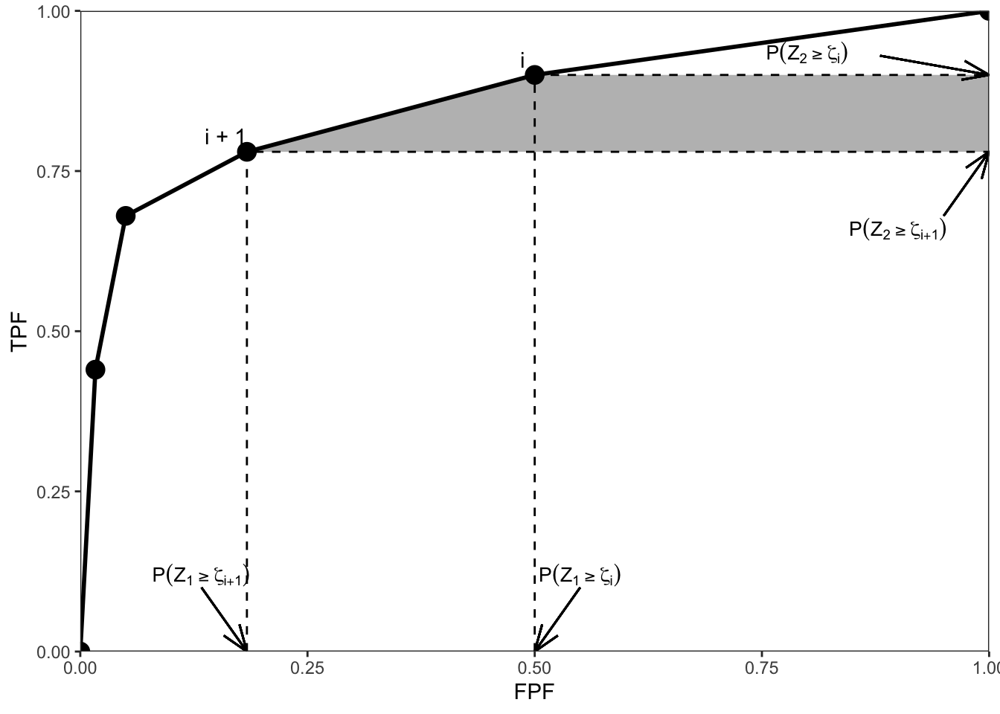

# Empirical AUC {#empirical-auc}


## How much finished 90% {#empirical-auc-how-much-finished}


## Introduction {#empirical-auc-introduction}

The ROC plot is defined as the plot of sensitivity (y-axis) vs. 1-specificity (x-axis). Equivalently, it is the plot of $\text{TPF}$ vs. $\text{FPF}$. An equal variance binormal model was introduced in an earlier chapter which allows an ROC plot to be fitted to a single observed operating point. The more commonly used ratings paradigm was introduced in the previous chapter. 

It was shown, Fig. \@ref(fig:ratings-paradigm-eq-var-fit), that the equal variance binormal model did not fit a clinical dataset and that an unequal variance binormal model yielded a better visual fit. This turns out to be a general finding. Before getting into the complexity of the unequal variance binormal model curve fitting, see next chapter, it is appropriate to introduce a simpler **empirical** approach which is very popular with some researchers. 

The New Oxford American Dictionary definition of "empirical" is: 

> "based on, concerned with, or verifiable by observation or experience rather than theory or pure logic". 

The empirical method is also termed "non-parametric" as it does not involve parametric assumptions (specifically normality assumptions are not needed). Notation is introduced for labeling individual cases. The empirical area under the ROC (AUC) under the empirical plot is defined. An important theorem relating AUC to the Wilcoxon statistic is stated. 


## The empirical ROC plot {#empirical-roc-plot}

> The empirical ROC plot is constructed by connecting adjacent observed operating points, including the trivial ones at (0,0) and (1,1), with straight lines. The trapezoidal area under this plot is a non-parametric figure of merit that is threshold independent. Since no parametric assumptions are involved some prefer it to parametric methods such as the one to be described in the next chapter.^ [In the context of AUC, the terms empirical, trapezoidal, or non-parametric all mean the same thing.] 


### Notation for cases

Cases are indexed by $k_tt$  where $t$ indicates the truth-status at the case (i.e., patient) level, with $t=1$ for non diseased cases and $t=2$ for diseased cases. Index $k_1$ ranges from one to $K_1$ for non-diseased cases and $k_2$ ranges from one to $K_2$ for diseased cases where $K_1$ and $K_2$ are the total number of non-diseased and diseased cases respectively. In Table \@ref(tab:empirical-ROC-2index-notation) each case is represented as a shaded box using lighter shading for non-diseased cases and darker shading for diseased cases. There are 11 non-diseased cases, labeled N1 – N11, in the upper row of boxes and there are seven diseased cases, labeled D1 – D7, in the lower row.


Table: (\#tab:empirical-ROC-2index-notation)On the need for two indices to label cases in an ROC study.

|   |   |   |   |   |   |   |   |   |    |    |
|:--|:--|:--|:--|:--|:--|:--|:--|:--|:---|:---|
|N1 |N2 |N3 |N4 |N5 |N6 |N7 |N8 |N9 |N10 |N11 |
|D1 |D2 |D3 |D4 |D5 |D6 |D7 |   |   |    |    |


To address any cell (i.e., case) in Table \@ref(tab:empirical-ROC-2index-notation) one needs two indices: the row number $t$ and the column number $k_tt$. Since the column number depends on the value of $t$ one needs two indices to specify it: specifically, $k_tt$ denotes the column number $k_t$ of a case with truth index $t$. My notation may appear to be unnecessarily liberal in its usage of the $t$ subscript. Alternative notation commonly uses a single index $k$ to label the cases. It reserves the first $K_1$ positions for non-diseased cases and the rest for diseased cases: e.g., $k = 3$ corresponds to the third non-diseased case, $k = K_1+5$ corresponds to the fifth diseased case, etc. Because it extends easily to more complex data structures, e.g., FROC, I prefer the two-index notation.


### An empirical operating point

Let $z_{k_tt}$ represent the z-sample of case $k_tt$. For a given reporting threshold $\zeta$, and assuming a positive-directed rating scale (i.e., higher values correspond to greater confidence in presence of disease), empirical false positive fraction $\text{FPF}(\zeta)$ and empirical true positive fraction $\text{TPF}(\zeta)$ are defined by: 
	
\begin{equation}
\left.
\begin{aligned}
\text{FPF}\left ( \zeta \right ) &= \frac{1}{K_1}\sum_{k_1=1}^{K_1}I\left ( z_{k_11} \geq \zeta \right ) \\
\text{TPF}\left ( \zeta \right ) &= \frac{1}{K_2}\sum_{k_2=1}^{K_2}I\left ( z_{k_22} \geq \zeta \right )
\end{aligned}
\right \}
(\#eq:empirical-auc-op-pt)
\end{equation}

Here $I(x)$ is the indicator function which equals one if $x$ is true and is zero otherwise.

In Eqn. \@ref(eq:empirical-auc-op-pt) the indicator functions act as counters effectively counting instances where the z-sample of a case equals or exceeds $\zeta$, and division by the appropriate denominator yields the desired left hand sides of these equations. The operating point $O(\zeta)$ corresponding to threshold $\zeta$ is defined by:

\begin{equation}
O\left ( \zeta \right ) = \left ( \text{FPF}\left ( \zeta \right ), TPF\left ( \zeta \right ) \right )
(\#eq:empirical-operating-point)
\end{equation}

The difference between Eqn. \@ref(eq:empirical-auc-op-pt) and Eqn. \@ref(eq:binary-task-model-fpf-tpf) is that the former is non-parametric while the latter is parametric.  


## Empirical operating points from ratings data {#empirical-auc-operating-points}

Consider a ratings ROC study with $R$ bins. Describing an R-rating empirical ROC plot requires $R-1$ ordered empirical thresholds, see Eqn. \@ref(eq:ratings-paradigm-empirical-zeta).

The operating point $O(\zeta_r)$ is given by:

\begin{equation}
O\left ( \zeta_r \right ) = \left ( \text{FPF}\left ( \zeta_r \right ), TPF\left ( \zeta_r \right ) \right )
(\#eq:empirical-operating-point-zeta-r)
\end{equation}

Its coordinates are defined by:

\begin{equation} 
\left.
\begin{aligned}
\text{FPF}_r \equiv \text{FPF}\left ( \zeta_r \right )=&\frac {1} {K_1} \sum_{k_1=1}^{K_1}I \left ( z_{k_11} \geq  \zeta_r\right ) \\
\text{TPF}_r \equiv \text{TPF}\left ( \zeta_r \right )=&\frac {1} {K_2} \sum_{k_2=1}^{K_2} I\left ( z_{k_22} \geq  \zeta_r\right )
\end{aligned}
\right \}
(\#eq:empirical-operating-point-fpf-tpf)
\end{equation}

For example, 

\begin{equation} 
\left.
\begin{aligned}
\text{FPF}_4 \equiv \text{FPF}\left ( \zeta_4 \right )=&\frac {1} {K_1} \sum_{k_1=1}^{K_1}I \left ( z_{k_11} \geq  \zeta_4\right ) \\
\text{TPF}_4 \equiv \text{TPF}\left ( \zeta_4 \right )=&\frac {1} {K_2} \sum_{k_2=1}^{K_2} I\left ( z_{k_22} \geq  \zeta_4\right ) \\
O_4 \equiv \left ( \text{FPF}_4, \text{TPF}_4 \right ) =& \left ( 0.017, 0.44 \right )\\
\end{aligned}
\right \}
(\#eq:empirical-operating-point-fpf-tpf-4)
\end{equation}


Fig. \@ref(fig:ratings-paradigm-labeling-points-figure) is the empirical ROC plot. It illustrates the convention used to label the operating points introduced earlier is, i.e., $O_2$ is the uppermost non-trivial point, and the subscripts increment by unity as one moves down the plot. By convention, not shown are the trivial operating points $O_0 \equiv (\text{FPF}_0, \text{TPF}_0) = (1,1)$ and $O_R \equiv (\text{FPF}_R, \text{TPF}_R) = (0,0)$, where $R = 5$. 
 
   
## AUC under the empirical ROC plot {#empirical-auc-area-under}

Fig. \@ref(fig:empirical-auc-empirical-auc) shows the empirical plot for the data in Table 4.1. The area under the curve (AUC) is the shaded area. By dropping imaginary vertical lines from the non-trivial operating points onto the x-axis, the shaded area is seen to be the sum of one triangular shaped area and four trapezoids. One can write equations to calculate the total area but there is a theorem (see below) that the empirical area is equal to a statistic known as the Mann-Whitney-Wilcoxon statistic [@RN2191; @RN2197], which, in this book, is abbreviated to the **Wilcoxon statistic**. Calculating this statistic is much simpler than summing the areas of the triangle and trapezoids or performing planimetry. 


<div class="figure">

<p class="caption">(\#fig:empirical-auc-empirical-auc)The empirical ROC plot corresponding to Table 4.1; the shaded area is the empirical AUC.</p>
</div>
  
## The Wilcoxon statistic {#empirical-auc-wilcoxon}

A statistic is any value calculated from observed data. The Wilcoxon statistic is defined by:

\begin{equation}
\text{W}=\frac{1}{K_1K_2} \sum_{k_1=1}^{K_1} \sum_{k_2=1}^{K_2} \psi\left ( z_{k_11} ,  z_{k_22} \right )
(\#eq:empirical-auc-wilcoxon)
\end{equation}

The kernel function $\psi\left ( x,  y \right )$ is defined by:

\begin{equation}
\left.
\begin{aligned}
\psi(x,y)&=1  \qquad & x<y \\
\psi(x,y)&=0.5  & x=y \\
\psi(x,y)&=0  & x>y
\end{aligned}
\right \}
(\#eq:empirical-auc-psi)
\end{equation}

The function $\psi\left ( x,  y \right )$ is unity if the diseased case is rated higher, 0.5 if the two are rated the same and zero otherwise. Each evaluation of the kernel function results from a comparison of a case from the non-diseased set with one from the diseased set. In Eqn. \@ref(eq:empirical-auc-wilcoxon) the two summations and division by the total number of comparisons yields the observed, i.e., empirical, probability that diseased cases are rated higher than non-diseased ones. Since it is a probability, it can range from zero to one. However, if the observer has any discrimination ability at all, one expects diseased cases to be rated equal or greater than non-diseased ones, so in practice one expects $0.5 \leq \text{W} \leq 1$. The limit 0.5 corresponds to a guessing observer whose operating point lies on the chance diagonal of the ROC plot. 

## Bamber’s Equivalence theorem {#empirical-auc-wilcoxon-bamber-theorem}

It is shown in the Appendix \@ref(empirical-auc-bamber-theorem-proof) that the Wilcoxon statistic $\text{W}$ equals the area $\text{AUC}$ under the empirical ROC plot: 

\begin{equation}
\text{W} = \text{AUC}
(\#eq:empirical-auc-bamber-theorem)
\end{equation}

Numerical illustration: as an illustration of the theorem it is helpful to calculate the sum on the right hand side of Eqn. \@ref(eq:empirical-auc-wilcoxon) and compare it to direct integration of the area under the empirical ROC curve (i.e., adding the area of a triangle and several trapezoids). The function is called `trapz(x,y)`, see below. It takes two array arguments, $x$ and $y$, where $x \equiv \text{FPF}$ and $y \equiv \text{TPF}$. 


```r
trapz = function(x, y)
{ ### computes the integral of y with respect to x using trapezoidal integration.
  idx = 2:length(x)
  return (as.double( (x[idx] - x[idx-1]) %*% (y[idx] + y[idx-1])) / 2)
}


Wilcoxon <- function (zk1, zk2)
{
  K1 = length(zk1)
  K2 = length(zk2)
  W <- 0
  for (k1 in 1:K1) {
    W <- W + sum(zk1[k1] < zk2)
    W <- W + 0.5 * sum(zk1[k1] == zk2)
  }
  W <- W/K1/K2
  return (W)
}


RocOperatingPoints <- function( K1, K2 ) {
  nOpPts <- length(K1) - 1 # number of op points
  FPF <- array(0,dim = nOpPts)
  TPF <- array(0,dim = nOpPts)
   
  for (r in (nOpPts+1):2) {
    FPF[r-1] <- sum(K1[r:(nOpPts+1)])/sum(K1)
    TPF[r-1] <- sum(K2[r:(nOpPts+1)])/sum(K2)    
  }
  FPF <- rev(FPF)
  TPF <- rev(TPF)
  
  return( list(
    FPF = FPF,
    TPF = TPF
  ) )
}
```


The following code reintroduces the dataset used earlier in Table \@ref(tab:ratings-paradigm-example-table).


```r
RocCountsTable = array(dim = c(2,5))
RocCountsTable[1,]  <- c(30,19,8,2,1)
RocCountsTable[2,]  <- c(5,6,5,12,22)

zk1  <- rep(1:length(RocCountsTable[1,]),RocCountsTable[1,])#convert frequency table to array
zk2  <- rep(1:length(RocCountsTable[2,]),RocCountsTable[2,])#do:

w  <- Wilcoxon (zk1, zk2)
cat("The Wilcoxon statistic is = ", w, "\n")
#> The Wilcoxon statistic is =  0.8606667
ret <- RocOperatingPoints(RocCountsTable[1,], RocCountsTable[2,])
FPF <- ret$FPF;FPF <- c(0,FPF,1)
TPF <- ret$TPF;TPF <- c(0,TPF,1)
AUC <- trapz(FPF,TPF) # trapezoidal integration
cat("direct integration yields AUC = ", AUC, "\n")
#> direct integration yields AUC =  0.8606667
```

Note the equality of the two estimates.

## Importance of Bamber’s theorem {#empirical-auc-wilcoxon-bamber-theorem-importance}

The equivalence theorem is the starting point for all non-parametric methods of analyzing ROC plots, e.g., [@hanley1997sampling; @delong1988comparing]. Prior to Bamber’s work one knew how to plot an empirical operating characteristic and how to calculate the Wilcoxon statistic, but their equality had not been shown. This was Bamber’s essential contribution. In the absence of this theorem, the Wilcoxon statistic would be “just another statistic”, at least in the context of ROC analysis. The theorem is so important that a paper appeared in Radiology [@hanley1982meaning] devoted to the equivalence. The title of this paper was "The meaning and use of the area under a receiver operating characteristic (ROC) curve”. The equivalence theorem literally gives meaning to the empirical area under the ROC.


## Discussion / Summary {#empirical-auc-discussion-summary}

In this chapter, a simple method for estimating the empirical area under the ROC plot has been described. Its simplicity and clear physical interpretation as the AUC under the empirical ROC (not fitted, not true) has spurred much theoretical development. Since the empirical AUC always yields a number the researcher could be unaware about unusual behavior of the empirical ROC curve, so it is a good idea to plot the data and look for any signs of large extrapolations. An example would be data points clustered at low $\text{FPF}$ values, which imply a large AUC contribution, unsupported by intermediate operating points, from the line connecting the uppermost non-trivial operating point to (1,1).

## Appendix: Bamber theorem proof {#empirical-auc-bamber-theorem-proof}

The following proof is adapted from [@bamber1975area] and while it may appear to be restricted to discrete ratings, the result is in fact quite general, i.e., it is applicable even if the ratings are acquired on a continuous scale. The reason is that in an R-rating ROC study the observed z-samples or ratings take on integer values, 1 through R. If R is large enough, ordering information present in the continuous data is not lost upon binning. In the following it is helpful to keep in mind that one is dealing with discrete distributions of the ratings, described by probability mass functions as opposed to probability density functions, e.g., $P(Z_2 = \zeta_i)$ is not zero, as would be the case for continuous ratings. The proof is illustrated with Fig. \@ref(fig:empirical-auc-bamber-theorem).


```
#> Warning in geom_segment(aes(x = zeta1_x - 0.05, y = 0.1, xend = zeta1_x, : All aesthetics have length 1, but the data has 6 rows.
#> ℹ Please consider using `annotate()` or provide this layer with data containing
#>   a single row.
#> Warning in geom_segment(aes(x = zeta2_x + 0.05, y = 0.1, xend = zeta2_x, : All aesthetics have length 1, but the data has 6 rows.
#> ℹ Please consider using `annotate()` or provide this layer with data containing
#>   a single row.
#> Warning in geom_segment(aes(x = 0.95, y = zeta1_y - 0.1, xend = 1, yend = zeta1_y), : All aesthetics have length 1, but the data has 6 rows.
#> ℹ Please consider using `annotate()` or provide this layer with data containing
#>   a single row.
#> Warning in geom_segment(aes(x = 0.88, y = zeta2_y + 0.03, xend = 1, yend = zeta2_y), : All aesthetics have length 1, but the data has 6 rows.
#> ℹ Please consider using `annotate()` or provide this layer with data containing
#>   a single row.
```

<div class="figure">

<p class="caption">(\#fig:empirical-auc-bamber-theorem):Illustration of the derivation of Bamber's equivalence theorem. Shows an empirical ROC plot for R = 5; the shaded area is due to points labeled i and i + 1.</p>
</div>
  
The abscissa of the operating point $i$ is $P(Z_1 \geq \zeta_i)$ and the corresponding ordinate is $P(Z_2 \geq \zeta_i)$. Here $Z_1$ is a random sample from a non-diseased case and $Z_2$ is a random sample from a diseased case. The shaded trapezoid defined by drawing horizontal lines from operating points $i$ (upper) and $i+1$ (lower) to the right edge of the ROC plot, Fig. \@ref(fig:empirical-auc-bamber-theorem), has height:

\begin{equation}
P\left ( Z_2 \geq \zeta_i \right ) - P\left ( Z_2 \geq \zeta_{i+1} \right ) = P\left ( Z_2 = \zeta_i \right )
(\#eq:empirical-auc-bamber-theorem-proof1)
\end{equation}

The validity of this equation can perhaps be more easily seen when the first term is written in the form:

\begin{equation}
P\left ( Z_2 \geq \zeta_i \right ) = P\left ( Z_2 = \zeta_i \right )  + P\left ( Z_2 \geq \zeta_{i+1} \right )
(\#eq:empirical-auc-bamber-theorem-proof2)
\end{equation}

The lengths of the top and bottom edges of the trapezoid are, respectively: 

\begin{equation}
1-P\left ( Z_1 \geq \zeta_i \right )=P\left ( Z_1 < \zeta_i \right )
(\#eq:empirical-auc-bamber-theorem-proof3)
\end{equation}

and 

\begin{equation}
1-P\left ( Z_1 \geq \zeta_{i+1} \right )=P\left ( Z_1 < \zeta_{i+1} \right )
(\#eq:empirical-auc-bamber-theorem-proof4)
\end{equation}

The area $A_i$ of the shaded trapezoid in Fig. \@ref(fig:empirical-auc-bamber-theorem) is (the steps are shown explicitly):

\begin{equation}
\left.
\begin{aligned}
A_i &=\frac{1}{2}P\left ( Z_2 = \zeta_i \right )\left [ P\left ( Z_1 < \zeta_i \right ) +  P\left ( Z_1 < \zeta_{i+1} \right ) \right ] \\
A_i &=P\left ( Z_2 = \zeta_i \right )\left [ \frac{1}{2}P\left ( Z_1 < \zeta_i \right ) +  \frac{1}{2} \left (P\left ( Z_1 = \zeta_i \right ) + P\left ( Z_1 < \zeta_i \right ) \right ) \right ]\\
A_i &=P\left ( Z_2 = \zeta_i \right )\left [ \frac{1}{2} P\left ( Z_1 = \zeta_i \right ) +  P\left ( Z_1 < \zeta_i \right ) \right ] \\
\end{aligned}
\right \}
(\#eq:empirical-auc-bamber-theorem-proof5)
\end{equation}

Summing over all values of $i$, one gets for the total area under the empirical ROC plot:

\begin{equation}
\left.
\begin{aligned}
AUC & = \sum_{i=0}^{R-1}A_i\\
 & = \frac{1}{2}\sum_{i=0}^{R-1}P\left ( Z_2=\zeta_i \right )P\left ( Z_1=\zeta_i \right )+\sum_{i=0}^{R-1}P\left ( Z_2=\zeta_i \right )P\left ( Z_1<\zeta_i \right )
\end{aligned}
\right \}
(\#eq:empirical-auc-bamber-theorem-proof6)
\end{equation}

It is shown in \@ref(empirical-auc-bamber-theorem-a0-term) that the term $A_0$ corresponds to the triangle at the upper right corner of Fig. \@ref(fig:empirical-auc-bamber-theorem), and the term $A_4$ corresponds to the horizontal trapezoid defined by the lowest non-trivial operating point.  

Eqn. \@ref(eq:empirical-auc-bamber-theorem-proof6) can be restated as:

\begin{equation}
AUC=\frac{1}{2}P\left ( Z_1 = Z_2 \right ) + P\left ( Z_1 < Z_2 \right )
(\#eq:empirical-auc-bamber-theorem-proof7)
\end{equation}

The Wilcoxon statistic was defined in Eqn. \@ref(eq:empirical-auc-wilcoxon). It can be seen that the comparisons implied by the summations and the weighting implied by the kernel function are estimating the two probabilities in the expression for in Eqn. \@ref(eq:empirical-auc-bamber-theorem-proof7). Therefore, $AUC = W$.

## Appendix: The $A_0$ term {#empirical-auc-bamber-theorem-a0-term}

### Upper triangle

For $i = 0$, Eqn. \@ref(eq:empirical-auc-bamber-theorem-proof5) implies (since the lowest empirical threshold is unity, the lowest allowed rating, and there are no cases rated less than one):

\begin{equation}
\left. 
\begin{aligned}
A_0 =& P\left ( Z_2 = 1 \right )\left [ \frac{1}{2} P\left ( Z_1=1 \right ) + P\left ( Z_1<1 \right )\right ] \\
A_0 =& \frac{1}{2} P\left ( Z_1=1 \right ) P\left ( Z_2=1 \right )\\
\end{aligned}
\right \}
\end{equation}

The base of the triangle is:

\begin{equation}
1 - P\left ( Z_1 \geq 2 \right )=P\left ( Z_1 < 2 \right )=P\left ( Z_1 = 1 \right )
\end{equation}

The height of the triangle is:

\begin{equation}
1 - P\left ( Z_2 \geq 2 \right )=P\left ( Z_2 < 2 \right )=P\left ( Z_2 = 1 \right )
\end{equation}

Q.E.D.

### Lowest trapezoid

For $i = 4$, Eqn. \@ref(eq:empirical-auc-bamber-theorem-proof5) implies: 

\begin{equation}
\left.
\begin{aligned}
A_4 =& P\left ( Z_2=5 \right )\left [ \frac{1}{2}P\left ( Z_1=5 \right ) + P\left ( Z_1<5 \right )\right ] \\
A_4 =& \frac{1}{2}P\left ( Z_2=5 \right )\left [ P\left ( Z_1=5 \right ) + 2P\left ( Z_1<5 \right )\right ] \\
A_4 =& \frac{1}{2}P\left ( Z_2=5 \right )\left [ P\left ( Z_1=5 \right ) +P\left ( Z_1<5 \right ) + P\left ( Z_1<5 \right )\right ] \\
A_4 =& \frac{1}{2}P\left ( Z_2=5 \right )\left [ 1 + P\left ( Z_1<5 \right )\right ] \\
\end{aligned}
\right \}
\end{equation}

The upper side of the trapezoid is 

\begin{equation}
1-P\left ( Z_1 \geq 5 \right )= P\left ( Z_1 < 5 \right )
\end{equation}

The lower side is unity. The average of the two sides is: 

\begin{equation}
\frac{1 + P\left ( Z_1 < 5 \right )}{2}
\end{equation}

The height is:

\begin{equation}
P\left ( Z_2 \geq 5 \right ) = P\left ( Z_2 = 5 \right )
\end{equation}

Multiplication of the last two expressions yields $A_4$.

## Chapter References {#empirical-auc-references} 

