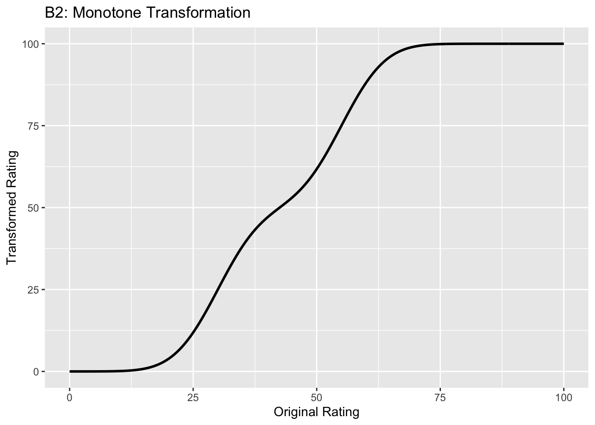
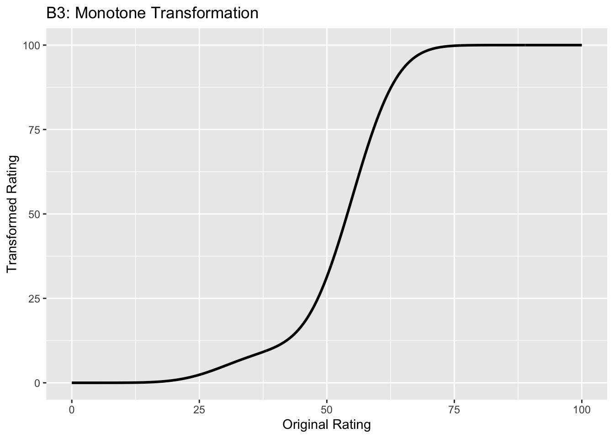
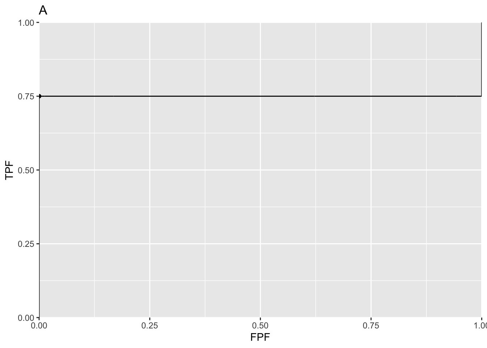

# Binormal model {#binormal-model}


## How much finished {#binormal-model-how-much-finished}

97%


## Introduction {#binormal-model-introduction}

The equal variance binormal model was described in Chapter \@ref(binary-task). The ratings method of acquiring ROC data and calculation of operating points was discussed in Chapter \@ref(ratings-paradigm). It was shown there that for a clinical dataset the unequal-variance binormal model visually fitted the data better than the equal-variance binormal model. 

This chapter deals with the unequal-variance binormal model, often abbreviated to **binormal model**. It is applicable to univariate datasets in which there is *one rating per case*, as in a single observer interpreting cases, one at a time, in a single modality. By convention the qualifier "univariate" is often omitted. In Chapter `TempComment \@ref(bivariate-binormal-model)` a bivariate model will be described where each case yields two ratings, as in a single observer interpreting cases in two modalities, or the similar problem of two observers interpreting the same cases in a single modality. 


## Binormal model {#binormal-model-definition}

The binormal model is defined by (capital letters indicate random variables lower-case are realized values and $t$ denotes the truth state):

\begin{equation} 
\left.
\begin{aligned}
Z_{k_tt} \sim &N\left ( \mu_t,\sigma_{t}^{2} \right )\\
t&=1,2
\end{aligned}
\right \}
(\#eq:binormal-model-z-samples-1)
\end{equation}

where 

\begin{equation} 
\left.
\begin{aligned}
\mu_1=&0\\
\mu_2=&\mu\\
\sigma_{1}^{2}=&1\\
\sigma_{2}^{2}=&\sigma^{2}
\end{aligned}
\right \}
(\#eq:binormal-model-z-samples-2)
\end{equation}


Eqn. \@ref(eq:binormal-model-z-samples-1) states that the z-samples for non-diseased cases ($t = 1$) are distributed as a $N(0,1)$  distribution, i.e., the unit normal distribution, while the z-samples for diseased cases ($t = 2$) are distributed as a  $N(\mu,\sigma^2)$ distribution, i.e., a normal distribution with mean $\mu$  and variance $\sigma^2$. In the unequal-variance binormal model, the variance $\sigma^2$ of the z-samples for diseased cases is allowed to be different from unity. Most ROC datasets are consistent with  $\sigma > 1$.^[A more complicated version of this model would allow the mean of the non-diseased distribution to be non-zero and its variance different from unity. The resulting 4-parameter model is no more general than the 2-parameter model. The reason is that one is free to transform the decision variable, and associated thresholds, by applying arbitrary monotonic increasing function transformation, which do not change the ordering of the ratings and hence do not change the ROC curve. So if the mean of the noise distribution were non-zero, subtracting this value from all Z-samples would shift the effective mean of the non-diseased distribution to zero (the shifted Z-values are monotonically related to the original values) and the mean of the shifted diseased distribution becomes $\mu_2-\mu_1$. Next, one scales or divides (division by a positive number is also a monotonic transformation) all the Z-samples by $\sigma_1$, resulting in the scaled non-diseased distribution having unit variance, and the scaled diseased distribution has mean $\frac{\mu_2-\mu_1}{\sigma_1}$  and variance $(\frac{\sigma_2}{\sigma_1})^2$. Therefore, if one starts with 4 parameters then one can, by simple shifting and scaling operations, reduce the model to 2 parameters, as in Eqn. \@ref(eq:binormal-model-z-samples-1).] 


### Binned data

In an R-rating ROC study the observed ratings $r$ take on integer values 1 through $R$ (it is understood that higher ratings correspond to greater confidence for presence of disease). Define $R-1$ cutoffs $\zeta_i$ where $i=1,2,...,R-1$ and two dummy cutoffs $\zeta_0 = -\infty$ and  $\zeta_R = +\infty$, the **binning rule** for a case with realized z-sample z is (Chapter \@ref(ratings-paradigm), Eqn. \@ref(eq:ratings-paradigm-binning-rule)):

\begin{equation} 
\text{if} \left (\zeta_{r-1} \le z \le \zeta_r  \right )\Rightarrow \text {rating} = r
(\#eq:binormal-model-binning)
\end{equation}


<div class="figure">

<p class="caption">(\#fig:binormal-model-pdfs)The pdfs of the two binormal model distributions for $\mu = 1.5$ and $\sigma = 1.5$. Four thresholds $\zeta_1, \zeta_2, \zeta_3, \zeta_4$ are shown corresponding to a five-rating ROC study. The rating assigned to a case is determined by its z-sample according to the binning rule.</p>
</div>


The above figure, generated with  $\mu = 1.5$, $\sigma = 1.5$, $\zeta_1 = -2$, $\zeta_2 = -0.5$, $\zeta_3 = 1$ and $\zeta_4 = 2.5$, illustrates how realized z-samples are converted to ratings, i.e., application of the binning rule \@ref(eq:binormal-model-binning). For example, a case with  z-sample equal to -2.5 would be rated "1", and one with  z-sample equal to -1 would be rated "2", cases with z-samples greater than 2.5 would be rated "5".

### Sensitivity and specificity

Let $Z_t$ denote the random z-sample for truth state $t$ ($t$ = 1 for non-diseased and $t$ = 2 for diseased cases).  Since the distribution of z-samples from disease-free cases is $N(0,1)$, the expression for specificity in Chapter \@ref(binary-task-model) applies: 

\begin{equation} 
\text{Sp}\left ( \zeta \right )=P\left ( Z_1 < \zeta \right )=\Phi\left ( \zeta \right )
(\#eq:binormal-model-specificity)
\end{equation}

To obtain an expression for sensitivity, consider that for truth state $t = 2$, the random variable $\frac{Z_2-\mu}{\sigma}$  is distributed as $N(0,1)$: 

\begin{equation*} 
\frac{Z_2-\mu}{\sigma}\sim N\left ( 0,1 \right )
\end{equation*}

Sensitivity, abbreviated to $\text{Se}$, is defined by $\text{Se} \equiv P\left ( Z_2 > \zeta \right )$. It follows, because $\sigma$ is positive, that:


\begin{equation*} 
\text{Se}\left ( \zeta | \mu, \sigma \right ) = P\left ( \frac{Z_2-\mu}{\sigma} > \frac{\zeta-\mu}{\sigma} \right )
\end{equation*}

The right-hand-side can be rewritten as follows:

\begin{equation} 
\left. 
\begin{aligned}
\text{Se}\left ( \zeta | \mu, \sigma \right )&= 1 - P\left ( \frac{Z_2-\mu}{\sigma} \leq  \frac{\zeta-\mu}{\sigma} \right )\\
&=1-\Phi\left (  \frac{\zeta-\mu}{\sigma}\right )=\Phi\left (  \frac{\mu-\zeta}{\sigma}\right )
\end{aligned}
\right \}
(\#eq:binormal-model-sensitivity2)
\end{equation}


Summarizing, the formulae for the specificity and sensitivity for the binormal model are: 

\begin{equation} 
\left. 
\begin{aligned}
\text{Sp}\left ( \zeta \right ) &= \Phi\left ( \zeta \right )\\
\text{Se}\left ( \zeta | \mu, \sigma \right ) &= \Phi\left (  \frac{\mu-\zeta}{\sigma}\right )
\end{aligned}
\right \}
(\#eq:binormal-model-se-sp)
\end{equation}


The coordinates of the operating point defined by $\zeta$ are given by:

\begin{equation} 
\left. 
\begin{aligned}
\text{FPF}\left ( \zeta \right ) &= 1 - \text{Sp}\left ( \zeta \right ) \\
&= 1 - \Phi\left ( \zeta \right ) \\
&= \Phi\left ( -\zeta \right )
\end{aligned}
\right \}
(\#eq:binormal-model-fpf)
\end{equation}


\begin{equation} 
\text{TPF}\left ( \zeta | \mu, \sigma \right ) = \Phi\left ( \frac{\mu-\zeta}{\sigma} \right )
(\#eq:binormal-model-tpf)
\end{equation}

An equation for a curve is usually expressed as $y=f(x)$. An expression of this form for the ROC curve, i.e., the y-coordinate (TPF) expressed as a function of the x-coordinate (FPF), follows upon inversion of the expression for FPF, Eqn.  \@ref(eq:binormal-model-fpf):

\begin{equation} 
\zeta = -\Phi^{-1}\left ( \text{FPF} \right )
(\#eq:binormal-model-zeta)
\end{equation}

Substitution of Eqn. \@ref(eq:binormal-model-zeta) in Eqn. \@ref(eq:binormal-model-tpf) yields:

\begin{equation} 
\text{TPF} = \Phi\left ( \frac{\mu + \Phi^{-1}\left (\text{FPF}  \right )}{\sigma} \right )
(\#eq:binormal-model-roc-curve1)
\end{equation}

This equation will be put into conventional notation next.  


### Binormal model in conventional notation

The $(\mu,\sigma)$ notation just described makes sense when extending the binormal model to newer models described later (see Chapter ` TempComment \@ref(proper-roc-models)`). However, it was not the way the binormal model was originally parameterized. Instead the following notation is widely used in the literature: 

\begin{equation} 
\left. 
\begin{aligned}
a&=\frac{\mu}{\sigma}\\
b&=\frac{1}{\sigma}
\end{aligned}
\right \}
(\#eq:binormal-model-ab-parameters)
\end{equation}


>The reason for the $(a,b)$  instead of the  $(\mu,\sigma)$ notation is historical. [@dorfman1969maximum] assumed that the diseased distribution had unit variance, and the non-diseased distribution had standard deviation $b$ and their separation was $a$, see Plot A in Fig. \@ref(fig:binormal-model-ab2-mu-sigma).

By dividing the z-samples by $b$, the variance of the distribution labeled "Noise" becomes unity, its mean stays at zero, and the variance of the distribution labeled "Signal" becomes $1/b$, and its mean becomes $a/b$, see plot B. Accordingly the inverses of Eqn. \@ref(eq:binormal-model-ab-parameters) are:

\begin{equation} 
\left. 
\begin{aligned}
\mu&=\frac{a}{b}\\
\sigma&=\frac{1}{b}
\end{aligned}
\right \}
(\#eq:binormal-model-ab-parameters-inv)
\end{equation}

Eqns. \@ref(eq:binormal-model-ab-parameters) and \@ref(eq:binormal-model-ab-parameters-inv) allow conversion from one notation to another.


<div class="figure">

<p class="caption">(\#fig:binormal-model-ab2-mu-sigma)Plot A shows the definitions of the (a,b) parameters of the binormal model. In plot B the x-axis has been rescaled so that the noise distribution has unit variance; this illustrates the difference between the (a,b) and the ($\mu,\sigma$) parameters. In this figure $\mu = 2$ and $\sigma = 1.8$ which correspond to $a = 1.11$ and $b = 0.556$.</p>
</div>


## ROC curve {#binormal-model-roc-curve}

Using the $(a,b)$ notation, Eqn. \@ref(eq:binormal-model-roc-curve1) for the ROC curve reduces to:


\begin{equation} 
\text{TPF}\left ( \text{FPF} \right ) = \Phi\left ( a+ b \Phi^{-1}\left (\text{FPF}  \right ) \right )
(\#eq:binormal-model-roc-curve-tpf-fpf)
\end{equation}


Since $\Phi^{-1}(\text{FPF})$  is an increasing function of its argument $\text{FPF}$, and $b > 0$, the argument of the  $\Phi$ function is an increasing function of $\text{FPF}$. Since $\Phi$  is a monotonically increasing function of its argument, $\text{TPF}$ is a monotonically increasing function of $\text{FPF}$. This is true regardless of the sign of $a$. If $\text{FPF} = 0$, then $\Phi^{-1}(0) = -\infty$  and $\text{TPF} = 0$. If $\text{FPF} = 1$, then $\Phi^{-1}(1) = +\infty$ and $\text{TPF} = 1$. Regardless of the value of $a$, as long as $b \ge 0$, the ROC curve starts at (0,0) and increases monotonically to (1,1).

From Eqn. \@ref(eq:binormal-model-fpf) and Eqn. \@ref(eq:binormal-model-tpf), the expressions for $\text{FPF}$ and $\text{TPF}$ in terms of model parameters $(a,b)$ are:

\begin{equation}
\left.
\begin{aligned}
\text{FPF}\left ( \zeta \right ) &= \Phi\left ( -\zeta \right )\\
\text{TPF}\left (\zeta | a,b \right ) &= \Phi\left ( a - b \zeta \right )
\end{aligned}
\right \}
(\#eq:binormal-model-op-point-ab)
\end{equation}

Solve for $\zeta$ from the equation for FPF:


\begin{equation}
\zeta = - \Phi^{-1}\left ( \text{FPF} \right )
(\#eq:binormal-model-op-point-ab1)
\end{equation}


## Density functions {#binormal-model-pdfs}

According to Eqn. \@ref(eq:binormal-model-z-samples-1) the probability that a non-diseased case z-sample is smaller than $\zeta$, i.e., the cumulative distribution function (CDF) function for non-diseased cases, is:

\begin{equation*} 
P\left ( Z \le \zeta \mid  Z\sim N\left ( 0,1 \right ) \right ) = 1-FPF\left ( \zeta \right ) = \Phi \left ( \zeta  \right )
\end{equation*}


Likewise, the CDF for diseased case z-samples is:

\begin{equation*} 
P\left ( Z \le \zeta \mid  Z\sim N\left ( \mu,\sigma^2 \right ) \right ) = 1-\text{TPF}\left ( \zeta \right ) = \Phi \left ( \frac{\zeta - \mu}{\sigma}  \right )
\end{equation*}

Since the *pdf* is the derivative of the corresponding CDF function, it follows that (the superscripts N and D denote non-diseased and diseased cases, respectively):

\begin{equation} 
\left.
\begin{aligned}
pdf_N\left ( \zeta \right ) &= \frac{\partial \Phi\left ( \zeta \right )}{\partial \zeta} \\
&= \phi\left ( \zeta \right ) \\
&\equiv \frac{1}{\sqrt{2 \pi}}\exp\left ( -\frac{\zeta^2}{2} \right )
\end{aligned}
\right \}
(\#eq:binormal-model-pdf-n)
\end{equation}


\begin{equation} 
\left.
\begin{aligned}
pdf_D\left ( \zeta \right ) &= \frac{\partial \Phi\left ( \frac{\zeta - \mu}{\sigma} \right )}{\partial \zeta} \\ &= \frac{1}{\sigma} \phi\left ( \frac{\zeta - \mu}{\sigma} \right ) \\
&\equiv \frac{1}{\sqrt{2 \pi}\sigma}\exp\left ( -\frac{\left (\zeta-\mu  \right )^2}{2\sigma} \right )
\end{aligned}
\right \}
(\#eq:binormal-model-pdf-d-mu-sigma)
\end{equation}


The second equation can be written in $(a,b)$  notation as:

\begin{equation} 
\left.
\begin{aligned}
pdf_D\left ( \zeta \right ) &= b\phi\left ( b\zeta-a \right ) \\
&= \frac{b}{\sqrt{2 \pi}}\exp\left ( -\frac{\left (b\zeta - a \right )^2}{2} \right )
\end{aligned}
\right \}
(\#eq:binormal-model-pdf-d-a-b)
\end{equation}


## Invariance property of pdfs {#binormal-model-invariance-property}

The binormal model is not as restrictive as might appear at first sight. Any monotone increasing transformation $Y=f(Z)$ applied to the observed z-samples, and the associated thresholds, will yield the same observed data, e.g., Table \@ref(tab:ratings-paradigm-example-table). This is because such a transformation leaves the ordering of the ratings unaltered and hence results in the same operating points. While the distributions for $Y$ will not be binormal (i.e., two independent normal distributions), one can safely "pretend" that one is still dealing with an underlying binormal model. An alternative way of stating this is that any pair of distributions is allowed as long as they are reducible to a binormal model form by a monotonic increasing transformation of  Y: e.g., $Z=f^{-1}$. [If $f$ is a monotone increasing function of its argument, so is  $f^{-1}$}.]  For this reason, the term “pair of latent underlying normal distributions” is sometimes used to describe the binormal model. The robustness of the binormal model has been investigated [@hanley1988robustness; @dorfman1997proper]. The referenced paper by Dorfman et al has an excellent discussion of the robustness of the binormal model.

The robustness of the binormal model, i.e., the flexibility allowed by the infinite choices of monotonic increasing functions, application of each of which leaves the ordering of the data unaltered, is widely misunderstood. The non-Gaussian appearance of histograms of ratings in ROC studies can lead one to incorrect conclusions that the binormal model is inapplicable to these datasets. To quote a reviewer of one of my recent papers:

> I have had multiple encounters with statisticians who do not understand this difference.... They show me histograms of data, and tell me that the data is obviously not normal, therefore the binormal model should not be used. 

The reviewer is correct. The misconception is illustrated next.




**This figure illustrates the invariance of ROC analysis to arbitrary monotone transformations of the ratings.** 

* Each row contains 3 plots: labeled 1, 2 and 3. Each column contains 3 plots labeled A, B and C. So, for example, plot C2 refers to the second row and third column. Each of the latent Gaussian plots C1, C2 and C3 appears to be not binormal. However, using the monotone transformations shown (B1, B2 and B3) they can be transformed to the binormal model histograms A1, A2 and A3. 

* Plot A1 shows the histogram of simulated ratings from a binormal model. Two peaks, one at 30 and the other at 55 are evident (by design, all ratings in this figure are in the range 0 to 100). Plot B1 shows the monotone transformation. Plot C1 shows the histogram of the transformed rating. The choice of $f$ leads to a transformed rating histogram that is peaked near the high end of the rating scale. For A1 and C1 the corresponding AUCs are identical. 

* Plot A2 is for a different seed value, plot B2 is the transformation and now the transformed histogram is almost flat, plot C2. For plots A2 and C2 the corresponding AUCs are identical. 

* Plot A3 is for a different seed value, B3 is the transformation and the transformed histogram C3 is peaked near the low end of the transformed rating scale. For plots A3 and (C3) the corresponding AUCs are identical.


**Visual examination of the shape of the histograms of ratings, or standard tests for normality, yield little, if any, insight into whether the underlying binormal model assumptions are being violated.**


## Az and d-prime measures {#binormal-model-full-auc}

The (full) area under the ROC, denoted $A_z$, is derived in [@thompson1989statistical]: 

\begin{equation} 
A_z=\Phi\left ( \frac{a}{\sqrt{1+b^2}} \right )=\Phi\left ( \frac{\mu}{\sqrt{1+\sigma^2}} \right )
(\#eq:binormal-model-ab-2az)
\end{equation} 

The binormal fitted AUC increases as $a$ increases or as $b$ decreases. Equivalently, it increases as $\mu$ increases or as $\sigma$ decreases. 

The reason for the name $A_z$ is that historically (prior to maximum likelihood estimation) this quantity was estimated by converting the probabilities FPF and TPF to *z-deviates* (see TBA), which of-course assumes normal distributions. The z-subscript is meant to emphasize that this is a binormal model derived estimate.

The $d'$ parameter is defined as the separation of two unit-variance normal distributions yielding the same AUC as that predicted by the $(a,b)$ parameter binormal model. It is defined by:

\begin{equation} 
d'=\sqrt{2}\Phi^{-1}\left ( A_z \right )
(\#eq:binormal-model-ab-2dprime)
\end{equation} 


The d' index can be regarded as a perceptual signal-to-noise-ratio. 


## Fitting the binormal model {#binormal-model-fitting}

[@dorfman1969maximum] were the first to fit ratings data to the binormal model. The details of the procedure are in Appendix \@ref(binormal-model-curve-fitting-appendix). While historically very important in showing how statistically valid quantitative analysis is possible using ROC ratings data, the fitting procedure suffers from what are termed "degeneracy issues" and "fitting artifacts" discussed in Appendix \@ref(binormal-model-degeneracy-artifacts). Degeneracy is when the fitting procedure yields unreasonable parameter values. Fitting artifacts occur when the fitted curve predicts worse than chance level performance in some region of the fitted ROC curve. Because of these issues usage of this method is now discouraged as it has largely been supplanted by other software such as the CBM fitting method, the proper ROC fitting method implemented in PROPROC and the RSM (radiological search model) based fitting method. These are discussed in later chapters. 


## Partial AUC measures {#binormal-model-partial-auc}

Two partial AUC measures have been defined. The idea is to have an AUC-like measure that emphasizes some region of the ROC curve, one that is argued to be clinically more significant, instead of $A_z$ which characterizes the whole curve. In the following two definitions are considered, one that emphasizes the high specificity region of the ROC curve and one which emphasizes the high sensitivity region of the curve.

Shorthand: denote $A \equiv A_z$, $x \equiv \text{FPF}$ and $y \equiv \text{TPF}$. The two partial AUC measures correspond to a partial integral along the x-axis starting from the origin (high specificity) and the other to a partial integral along the y-axis ending at (1,1) corresponding to high sensitivity. These are denoted by X and Y superscripts.


### Measure emphasizing high specificity {#binormal-model-meaning-partial-auc-definitions}

The partial area under the ROC, $A_c^{X}$, is defined as that extending from $x = 0$ to $x = c$, where $0 \le c \le 1$ (in our notation $c$ always means a cutoff on the x-axis of the ROC): 

\begin{equation} 
\left. 
\begin{aligned}
A_c^{X} &= \int_{x=0}^{x=c} y \, dx 
\\&=  \int_{x=0}^{x=c} \Phi\left ( a + b \; \Phi^{-1} \left ( x \right ) \right ) \, dx 
\end{aligned}
\right \}
(\#eq:binormal-model-partial-area-a1)
\end{equation}

The second form follows from Eqn. \@ref(eq:binormal-model-roc-curve-tpf-fpf).


[@thompson1989statistical] derive a formula for the partial-area in terms of the binormal model parameters $a$ and $b$:

\begin{equation}
A_c^{X} = \int_{z_2=-\infty}^{\Phi^{-1}\left ( c \right )}   \int_{z_1=-\infty}^{\frac{a}{\sqrt{1+b^2}}} \phi\left ( z_1,z_2;\rho \right ) dz_1dz_2
(\#eq:binormal-model-partial-area-final)
\end{equation}

On the right hand side the integrand $\phi\left ( z_1,z_2;\rho \right )$ is the standard bivariate normal density function with correlation coefficient $\rho$. It is defined by:


\begin{equation}
\left. 
\begin{aligned}
\phi\left (z_1,z_2;\rho \right ) &= \frac{1}{2 \pi \sqrt{1-\rho^2}} \exp\left ( -\frac{z_1^2 -2\rho z_1 z_2 +z_2^2}{2\left ( 1-\rho^2 \right )} \right ) \\
\rho &= - \frac{b}{\sqrt{1+b^2}}
\end{aligned}
\right \}
(\#eq:binormal-model-bivariate-density)
\end{equation}


As demonstrated later the integrals occurring on the right hand side of Eqn. \@ref(eq:binormal-model-partial-area-final) can be evaluated numerically. 


As an area measure the partial AUC $A_c^{X}$ has a simple *geometric* meaning. A *physical* meaning is as follows: 

> An ROC curve^[This curve is not binormal as the truncation destroys the normality of the two distributions] can be defined over the truncated dataset where all z-samples **smaller** than $-\Phi^{-1}(c)$ are ignored. The maximum area of this curve is that defined by the rectangle with corners at $(0,0)$ and $(c,\text{TPF}\left ( c \right ))$: $c$ is the abscissa at the upper limit of the integration interval along the x-axis and $\text{TPF}\left ( c \right )$ is the corresponding ordinate: see Eqn. \@ref(eq:binormal-model-roc-curve-tpf-fpf). Dividing $A_c^{X}$ by $\text{TPF}\left ( c \right ) \times c$ yields a normalized partial area measure, denoted $A_c^{XN}$, where $0 \le A_c^{XN} \le 1$. **This is the classification accuracy between diseased and non-diseased cases measured over the truncated dataset.** If $a \ge 0$ it is constrained to (0.5, 1).


\begin{equation}
A_c^{XN} = \frac{A_c^{X}}{\text{TPF}\left ( c \right ) \times c}
(\#eq:binormal-model-normalized-partial-auc-specificity)
\end{equation}


### Measure emphasizing high sensitivity {#binormal-model-metz-partial-auc}

Since the integral in Eqn. \@ref(eq:binormal-model-partial-area-a1) is from $x = 0$ to $x = c$ this partial AUC measure emphasizes the *high specificity* region of the ROC curve (since $x = 0$ corresponds to unit, i.e. highest, specificity).

An alternative partial AUC measure has been defined [@jiang1996receiver] that emphasizes the *high sensitivity* region of the ROC as follows:

\begin{equation} 
A_c^{Y} = \int_{y=\text{TPF}(c)}^{y=1} \left (1-x  \right ) \, dy
(\#eq:binormal-model-partial-area-ac-metz)
\end{equation}


$A_c^{Y}$ is the (un-normalized) area below the ROC extending from $y = \text{TPF}(c)$ to $y = 1$. The superscript Y denotes that the integral is over part of the y-axis. The maximum value of this integral is the area of the rectangle defined by the corner points $(c,\text{TPF}(c))$ and $(1,1)$. Therefore the normalized area is defined by (our normalization differs from that in the cited reference): 


\begin{equation}
A_c^{YN} = \frac{A_c^{Y}}{\left (1 - \text{TPF}(c)  \right ) \times \left (1-c  \right )}
(\#eq:binormal-model-normalized-partial-auc-sensitivity)
\end{equation}

A *physical* meaning is as follows: 

> An ROC curve can be defined over the truncated dataset where all z-samples **greater** than $-\Phi^{-1}(c)$ are ignored. **$A_c^{YN}$ is the classification accuracy between diseased and non-diseased cases measured over the truncated dataset.** By definition the normalized area ranges between 0 and 1.


### Numerical examples {#binormal-model-metz-partial-auc-example}

Fig. \@ref(fig:binormal-model-partial-areas) shows the two un-normalized areas.

<div class="figure">

<p class="caption">(\#fig:binormal-model-partial-areas)Un-normalized partial AUC measures: the blue shaded area is $A_c^{X}$, the partial area below the ROC; the green shaded area is $A_c^{Y}$ the partial area above the ROC. Parameters are $a = 1.8$, $b = 1$ and $c = 0.3$.</p>
</div>


The following code illustrates calculation of the partial-area measure using the function `pmvnorm` in the `R` package `mvtnorm` [@R-mvtnorm]. The parameter values were: $a = 1.8$, $b = 1$ and $c = 0.3$ (see lines 1-3 below).


```{.r .numberLines}
a <- 1.8
b <- 1
fpf_c <- 0.3 # cannot use c as variable name
tpf_c <- pnorm(a + b * qnorm(fpf_c))
A_z <- pnorm(a/sqrt(1+b^2))
rho <- -b/sqrt(1+b^2)
Lower1 <- -Inf
Upper1 <- qnorm(fpf_c)
Lower2 <- -Inf
Upper2 <- a/sqrt(1+b^2)
sigma <- rbind(c(1, rho), c(rho, 1))
A_x <- as.numeric(pmvnorm(
  c(Lower1, Lower2), 
  c(Upper1, Upper2), 
  sigma = sigma))

# divide by area of rectangle
A_xn <- A_x/fpf_c/tpf_c
```


The function `pmvnorm` is called at line 12. The un-normalized partial-area measure $A_c^{X}$ = 0.216. The corresponding full AUC measure is $A_z$ = 0.898. The normalized measure is $A_c^{XN}$ = 0.802. This is the classification accuracy between non-diseased and diseased cases in the truncated dataset defined by ignoring cases with z-samples smaller than $-\Phi^{-1}(c)$ = 0.524. This measure emphasizes specificity.


$A_c^{Y}$ can be calculated using geometry. One subtracts $A_c^{X}$ from $A_z$ to get the area under the ROC to the right of $\text{FPF}=c$. Next one subtracts from this quantity the area of the rectangle with base $(1 - c)$ and height $\text{TPF}_c$. This yields the area if the green shaded region $A_c^{Y}$. To normalize it one divides by the area of the rectangle defined by the corner points $(c,\text{TPF}_c)$ and (1,1).


```r
# implement geometrical logic
A_y <- (A_z - A_x)-(1-fpf_c)*(tpf_c)
A_yn <- A_y/(1-tpf_c)/(1-fpf_c) 
```


The un-normalized partial-area measure $A_c^{Y}$ = 0.053. The normalized measure is $A_c^{YN}$ = 0.748. This is the classification accuracy between non-diseased and diseased cases in the truncated dataset defined by ignoring cases with z-samples greater than $-\Phi^{-1}(c)$ = 0.524. This measure emphasizes sensitivity.


The variation with $a$ of the two normalized AUC measures is shown next. The function `normalizedAreas` encapsulates the above calculations and is called for different values of $a$.


```r
a_arr = seq(0,8)
A_xn_arr <- array(dim = length(a_arr))
A_yn_arr <- array(dim = length(a_arr))
for (i in 1:length(a_arr)) {
  x <- normalizedAreas(a_arr[i], 1, 0.1) # c = 0.1
  A_xn_arr[i] <- x$A_xn
  A_yn_arr[i] <- x$A_yn
}
```


<table>
<caption>(\#tab:summary-table-partial-normalized-areas)Summary of normalized $A_c^{XN}$ and $A_c^{YN}$ partial AUCs for different values of the $a$ parameter, where $b = 1$ and $c = 0.1$.</caption>
 <thead>
  <tr>
   <th style="text-align:right;"> $a$ </th>
   <th style="text-align:right;"> $A^{XN}_c$ </th>
   <th style="text-align:right;"> $A^{YN}_c$ </th>
  </tr>
 </thead>
<tbody>
  <tr>
   <td style="text-align:right;"> 0 </td>
   <td style="text-align:right;"> 0.5000 </td>
   <td style="text-align:right;"> 0.5000 </td>
  </tr>
  <tr>
   <td style="text-align:right;"> 1 </td>
   <td style="text-align:right;"> 0.6260 </td>
   <td style="text-align:right;"> 0.7015 </td>
  </tr>
  <tr>
   <td style="text-align:right;"> 2 </td>
   <td style="text-align:right;"> 0.7785 </td>
   <td style="text-align:right;"> 0.8208 </td>
  </tr>
  <tr>
   <td style="text-align:right;"> 3 </td>
   <td style="text-align:right;"> 0.9144 </td>
   <td style="text-align:right;"> 0.8842 </td>
  </tr>
  <tr>
   <td style="text-align:right;"> 4 </td>
   <td style="text-align:right;"> 0.9822 </td>
   <td style="text-align:right;"> 0.9189 </td>
  </tr>
  <tr>
   <td style="text-align:right;"> 5 </td>
   <td style="text-align:right;"> 0.9981 </td>
   <td style="text-align:right;"> 0.9393 </td>
  </tr>
  <tr>
   <td style="text-align:right;"> 6 </td>
   <td style="text-align:right;"> 0.9999 </td>
   <td style="text-align:right;"> 0.9521 </td>
  </tr>
  <tr>
   <td style="text-align:right;"> 7 </td>
   <td style="text-align:right;"> 1.0000 </td>
   <td style="text-align:right;"> 0.9608 </td>
  </tr>
  <tr>
   <td style="text-align:right;"> 8 </td>
   <td style="text-align:right;"> 1.0000 </td>
   <td style="text-align:right;"> 0.9670 </td>
  </tr>
</tbody>
</table>


Table \@ref(tab:summary-table-partial-normalized-areas) shows $A_c^{XN}$ and $A_c^{YN}$ partial AUCs for different values of the $a$ parameter for $b = 1$ and $c = 0.1$. It demonstrates that the normalized areas are constrained between 0.5 and 1 (as long as $a$ in non-negative). For numerical reasons (basically a zero-divided-by-zero condition) it is difficult to show that $A_c^{YN}$ approaches 1 in the limit of very large a-parameter (since the green shaded area shrinks to zero).


## Comments on partial AUC measures {#binormal-model-partial-auc-comments}

There are several issues with the adoption of either partial AUC measure.

1. Since a partial area measure corresponds to classification accuracy measured over a **truncated** dataset a fundamental correspondence between $A_z$ and classification accuracy measured over the **entire** dataset is lost. A basic statistical principle of the desirability of an estimate valid for the entire population is being violated. 

2. The choice of the truncation cutoff is arbitrary and subject to bias on the part of the investigator. This is similar to the type of bias that is inherent in a single point (sensitivity-specificity) based approach to analysis: this was the very reason for adoption of a measure such as $A_z$ that averages over the whole curve, as argued so eloquently in [@metz1978rocmethodology]. 

3. Then there is the issue of possible loss of statistical power. If $A_z$ is estimated from the whole dataset and either Eqn. \@ref(eq:binormal-model-normalized-partial-auc-specificity) or Eqn. \@ref(eq:binormal-model-normalized-partial-auc-sensitivity) is used to estimate partial AUC, then one expects no loss in statistical power, as these equations represent noiseless mathematical transformations using the $(a,b)$ parameters estimated over the entire dataset. However, if an empirical partial AUC measure is used there will surely be loss of statistical power resulting from ignoring some of the data. Due to degeneracy issues usage of the empirical partial AUC is often unavoidable. This is because performing significance testing requires that the dataset be re-sampled many times and the parametric fit may not work every time. 


The second point is illustrated by the study reported in [@jiang1996receiver]. The ROC curves of a developmental-stage CAD system and that of radiologists cross each other: at high specificity the radiologists were better but the reverse was true at high sensitivity. By choosing the latter region the authors demonstrated statistically significant superiority of CAD over radiologists. Analysis using $A_z$ failed to reach statistical significance. 


Two very large clinical studies [@fenton2007influence, @fenton2011effectiveness] using 222,135 and 684,956 women, respectively, showed that a commercial CAD can actually have a detrimental effect on patient outcome[@philpotts2009can]. A more recent study has confirmed the negative view of the efficacy of CAD[@lehman2015diagnostic] and there has even been a call for ending Medicare reimbursement for CAD interpretations[@fenton2015time]. I have not followed the field since ca. 2016 and it is likely that newer versions of CAD now being used in the clinic are better than those evaluated in the cited studies. But the point is that even using a ca. 1996 developmental-stage CAD the authors were able to claim, using a partial AUC measure, that CAD outperformed radiologists, a result clearly not borne out by later large clinical studies while the $A_z$ measure did not allow this conclusion. 


## Discussion{#binormal-model-discussion}

The binormal model is historically very important and the contribution by Dorfman and Alf [@dorfman1969maximum] was seminal. Prior to their work, there was no statistically valid way of estimating AUC from observed ratings counts. Their work and a key paper [@RN1487] accelerated research using ROC methods. The number of publications using their algorithm, and the more modern versions developed by Metz and colleagues, is probably well in excess of 500. Because of its key role, I have endeavored to take out some of the mystery about how the binormal model parameters are estimated. In particular, a common misunderstanding that the binormal model assumptions are violated by real datasets, when in fact it is quite robust to apparent deviations from normality, is addressed (details are in Section \@ref(binormal-model-invariance-property)). 

A good understanding of this chapter should enable the reader to better understand alternative ROC models, discussed later.

To this day the binormal model is widely used to fit ROC datasets. In spite of its limitations, the binormal model has been very useful in bringing a level of quantification to this field that did not exist prior to 1969.


## Appendix: Fitting an ROC curve {#binormal-model-curve-fitting-appendix}

One aim of this chapter is to demystify statistical curve fitting. With the passing of Profs. Donald Dorfman, Charles Metz and Richard Swensson, parametric modeling is much neglected. Researchers have instead focused on non-parametric analysis using the empirical AUC defined in Chapter \@ref(empirical-auc). A claimed advantage (overstated in my opinion, see Section \@ref(binormal-model-invariance-property)) of non-parametric analysis is the absence of distributional assumptions. Non-parametric analysis yields no insight into what is limiting performance. Binormal model based curve fitting described in this chapter will allow the reader to appreciate a later chapter (see RSM fitting chapter in `RJafrocFrocBook`) that describes a more complex fitting method which yields important insights into the factors limiting human observer (or artificial intelligence algorithm) performance. 


### JAVA fitted ROC curve

This section, described in the physical book, has been abbreviated to a [relevant website](http://www.rad.jhmi.edu/jeng/javarad/roc/JROCFITi.html).

### Simplistic straight line fit to the ROC curve

To be described next is a method for fitting data such as in Table \@ref(tab:ratings-paradigm-example-table) to the binormal model, i.e., determining the parameters $(a,b)$ and the thresholds $\zeta_r , \quad r = 1, 2, ..., R-1$, to best fit, in some to-be-defined sense, the observed cell counts. The most common method uses an algorithm called maximum likelihood. But before getting to that, I describe the least-square method, which is conceptually simpler, but not really applicable, as will be explained shortly.

#### Least-squares estimation
By applying the function $\Phi^{-1}$  to both sides of Eqn. \@ref(eq:binormal-model-roc-curve1), one gets (the "inverse" function cancels the "forward" function on the right hand side):

\begin{equation*} 
\Phi^{-1}\left ( \text{TPF} \right ) = a + b \Phi^{-1}\left ( FPF \right )
\end{equation*}

This suggests that a plot of $y = \Phi^{-1}\left ( \text{TPF} \right )$  vs. $x=\Phi^{-1}\left ( FPF \right )$ is expected to follow a straight line with slope $b$ and intercept $a$. Fitting a straight line to such data is generally performed by the method of least-squares, a capability present in most software packages and spreadsheets. Alternatively, one can simply visually draw the best straight line that fits the points, memorably referred to [@RN300] as "chi-by-eye". This was the way parameters of the binormal model were estimated prior to Dorfman and Alf's work [@dorfman1969maximum]. The least-squares method is a quantitative way of accomplishing the same aim. If $\left ( x_t,y_t \right )$ are the data points, one constructs $S$, the sum of the squared deviations of the observed ordinates from the predicted values (since $R$ is the number of ratings bins, the summation runs over the $R-1$ operating points):

\begin{equation*} 
S  = \sum_{i=1}^{R-1}\left ( y_i - \left ( a + bx_i \right ) \right )^2
\end{equation*} 

The idea is to minimize S with respect to the parameters $(a,b)$. One approach is to differentiate this with respect to $a$ and $b$ and equate each resulting derivate expression to zero. This yields two equations in two unknowns, which are solved for $a$ and $b$. If the reader has never done this before, one should go through these steps at least once, but it would be smarter in future to use software that does all this. In `R` the least-squares fitting function is `lm(y~x)`, which in its simplest form fits a linear model `lm(y~x)`  using the method of least-squares (in case you are wondering `lm` stands for linear model, a whole branch of statistics in itself; in this example one is using its simplest capability).


```r
# ML estimates of a and b (from Eng JAVA program)
# a <- 1.3204; b <- 0.6075 
# # these are not used in program; just here for comparison

FPF <- c(0.017, 0.050, 0.183, 0.5)  
# this is from Table 6.11, last two rows
TPF <- c(0.440, 0.680, 0.780, 0.900)
# ...do...

PhiInvFPF <- qnorm(FPF)
# apply the PHI_INV function
PhiInvTPF <- qnorm(TPF)
# ... do ... 

fit <- lm(PhiInvTPF~PhiInvFPF)
print(fit)
#> 
#> Call:
#> lm(formula = PhiInvTPF ~ PhiInvFPF)
#> 
#> Coefficients:
#> (Intercept)    PhiInvFPF  
#>    1.328844     0.630746
```


```
#> Warning: Using `size` aesthetic for lines was deprecated in ggplot2 3.4.0.
#> ℹ Please use `linewidth` instead.
```

<div class="figure">

<p class="caption">(\#fig:binormal-model-line-fit)The straight line fit method of estimating parameters of the fitting model.</p>
</div>

Fig. \@ref(fig:binormal-model-line-fit) shows operating points from Table \@ref(tab:ratings-paradigm-example-table), transformed by the $\Phi^{-1}$ function; the slope of the line is the least-squares estimate of the $b$ parameter and the intercept is the corresponding $a$ parameter of the binormal model.

The last line contains the least squares estimated values, $a$ = 1.3288 and $b$ = 0.6307. The corresponding maximum likelihood estimates of these parameters, as yielded by the Eng web code, see Appendix, are listed in line 4 of the main program: $a$ = 1.3204 and $b$ = 0.6075. The estimates appear to be close, particularly the estimate of $a$ , but there are a few things wrong with the least-squares approach. First, the method of least squares assumes that the data points are independent. Because of the manner in which they are constructed, namely by cumulating points, the independence assumption is not valid for ROC operating points. Cumulating the 4 and 5 responses constrains the resulting operating point to be above and to the right of the point obtained by cumulating the 5 responses only, so the data points are definitely not independent. Similarly, cumulating the 3, 4 and 5 responses constrains the resulting operating point to be above and to the right of the point obtained by cumulating the 4 and 5 responses, and so on. The second problem is the linear least-squares method assumes there is no error in measuring x; the only source of error that is accounted for is in the y-coordinate. In fact, both coordinates of an ROC operating point are subject to sampling error. Third, disregard of error in the x-direction is further implicit in the estimates of the thresholds, which according to Eqn. (6.2.19), is given by:

\begin{equation*} 
\zeta_r = - \Phi^{-1}\left ( FPF_r \right )
\end{equation*} 

These are "rigid" estimates that assume no error in the FPF values. As was shown in Chapter \@ref(binary-task), 95% confidence intervals apply to these estimates.

A historical note: prior to computers and easy access to statistical functions the analyst had to use a special plotting paper, termed “double probability paper”, that converted probabilities into x and y distances using the inverse function.

### Maximum likelihood estimation (MLE)

The approach taken by Dorfman and Alf was to maximize the likelihood function instead of S. The likelihood function is the probability of the observed data given a set of parameter values, i.e.,

\begin{equation*} 
\text {L} \equiv P\left ( data \mid \text {parameters} \right )
\end{equation*} 

Generally "data" is suppressed, so likelihood is a function of the parameters; but "data" is always implicit. With reference to Fig. 6.1, the probability of a non-diseased case yielding a count in the 2nd bin equals the area under the curve labeled "Noise" bounded by the vertical lines at $\zeta_1$ and $\zeta_2$. In general, the probability of a non-diseased case yielding a count in the $r^\text{th}$ bin equals the area under the curve labeled "Noise" bounded by the vertical lines at  $\zeta_{r-1}$ and $\zeta_r$.  Since the area to the left of a threshold is the CDF corresponding to that threshold, the required probability is $\Phi\left ( \zeta_r \right ) - \Phi\left ( \zeta_{r-1} \right )$; we are simply subtracting two expressions for specificity, Eqn. (6.2.5). 

\begin{equation*} 
\text {count in non-diseased bin } r = \Phi\left ( \zeta_r \right ) - \Phi\left ( \zeta_{r-1} \right )
\end{equation*} 

Similarly, the probability of a diseased case yielding a count in the rth bin equals the area under the curve labeled "Signal" bounded by the vertical lines at  $\zeta_{r-1}$ and $\zeta_r$. The area under the diseased distribution to the left of threshold $\zeta_r$  is the $1 - \text{TPF}$ at that threshold:

\begin{equation*} 
1 - \Phi\left ( \frac{\mu-\zeta_r}{\sigma} \right ) = \Phi\left ( \frac{\zeta_r - \mu}{\sigma} \right )
\end{equation*} 

The area between the two thresholds is:

\begin{align*} 
P\left ( \text{count in diseased bin }r \right ) &= \Phi\left ( \frac{\zeta_r - \mu}{\sigma} \right ) - \Phi\left ( \frac{\zeta_{r-1} - \mu}{\sigma} \right ) \\
&= \Phi\left ( b\zeta_r-a \right ) - \Phi\left ( b\zeta_{r-1}-a \right )
\end{align*}

Let $K_{1r}$  denote the number of non-diseased cases in the rth bin, and $K_{2r}$  denotes the number of diseased cases in the rth bin. Consider the number of counts $K_{1r}$ in non-diseased case bin $r$. Since the probability of each count is  $\Phi\left ( \zeta_{r+1}  \right ) - \Phi\left ( \zeta_r  \right )$, the probability of the observed number of counts, assuming the counts are independent, is  ${\left(\Phi\left ( \zeta_{r+1}  \right ) - \Phi\left ( \zeta_r  \right )  \right )}^{K_{1r}}$. Similarly, the probability of observing  counts in diseased case bin $r$ is ${\left (\Phi\left ( b\zeta_{r+1}-a  \right ) - \Phi\left ( b\zeta_r-a  \right )  \right )}^{K_{2r}}$, subject to the same independence assumption. The probability of simultaneously observing $K_{1r}$  counts in non-diseased case bin r and $K_{2r}$  counts in diseased case bin $r$ is the product of these individual probabilities (again, an independence assumption is being used): 

\begin{equation*} 
\left (\Phi\left ( \zeta_{r+1}  \right ) - \Phi\left ( \zeta_r  \right )  \right )^{K_{1r}} \left (\Phi\left ( b\zeta_{r+1}-a  \right ) - \Phi\left ( b\zeta_r-a  \right )  \right )^{K_{2r}}
\end{equation*} 

Similar expressions apply for all integer values of $r$ ranging from $1,2,...,R$. Therefore the probability of observing the entire data set is the product of expressions like Eqn. (6.4.5), over all values of $r$:

\begin{equation} 
\prod_{r=1}^{R}\left [\left (\Phi\left ( \zeta_{r+1}  \right ) - \Phi\left ( \zeta_r  \right )  \right )^{K_{1r}} \left (\Phi\left ( b\zeta_{r+1}-a  \right ) - \Phi\left ( b\zeta_r-a  \right )  \right )^{K_{2r}}  \right ]
(\#eq:binormal-modelProductProb)
\end{equation} 

We are almost there. A specific combination of $K_{11},K_{12},...,K_{1R}$ counts from $K_1$ non-diseased cases and counts $K_{21},K_{22},...,K_{2R}$ from $K_2$ diseased cases can occur the following number of times (given by the multinomial factor shown below):

\begin{equation} 
\frac{K_1!}{\prod_{r=1}^{R}K_{1r}!}\frac{K_2!}{\prod_{r=1}^{R}K_{2r}!}
(\#eq:binormal-modelCombFactor)
\end{equation} 

The likelihood function is the product of Eqn. \@ref(eq:binormal-modelProductProb) and Eqn.  \@ref(eq:binormal-modelCombFactor):

\begin{equation} 
\begin{split}
L\left ( a,b,\overrightarrow{\zeta} \right ) &= \left (\frac{K_1!}{\prod_{r=1}^{R}K_{1r}!}\frac{K_2!}{\prod_{r=1}^{R}K_{2r}!}  \right ) \times \\
&\quad\prod_{r=1}^{R}\left [\left (\Phi\left ( \zeta_{r+1}  \right ) - \Phi\left ( \zeta_r  \right )  \right )^{K_{1r}} \left (\Phi\left ( b\zeta_{r+1}-a  \right ) - \Phi\left ( b\zeta_r-a  \right )  \right )^{K_{2r}}  \right ]
\end{split}
(\#eq:binormal-modelLikelihood)
\end{equation}

The left hand side of Eqn. \@ref(eq:binormal-modelLikelihood) shows explicitly the dependence of the likelihood function on the parameters of the model, namely $a,b,\overrightarrow{\zeta}$, where the vector of thresholds $\overrightarrow{\zeta}$ is a compact notation for the set of thresholds $\zeta_1,\zeta_2,...,\zeta_R$, (note that since $\zeta_0 = -\infty$, and $\zeta_R = +\infty$, only $R-1$ free threshold parameters are involved, and the total number of free parameters in the model is $R+1$). For example, for a 5-rating ROC study, the total number of free parameters is 6, i.e., $a$, $b$ and 4 thresholds $\zeta_1,\zeta_2,\zeta_3,\zeta_4$.

Eqn.  \@ref(eq:binormal-modelLikelihood) is forbidding but here comes a simplification. The difference of probabilities such as $\Phi\left ( \zeta_r  \right )-\Phi\left ( \zeta_{r-1}  \right )$ is guaranteed to be positive and less than one [the $\Phi$ function is a probability, i.e., in the range 0 to 1, and since $\zeta_r$ is greater than $\zeta_{r-1}$, the difference is positive and less than one]. When the difference is raised to the power of $K_{1r}$ (a non-negative integer) a very small number can result. Multiplication of all these small numbers may result in an even smaller number, which may be too small to be represented as a floating-point value, especially as the number of counts increases. To prevent this we resort to a trick. Instead of maximizing the likelihood function $L\left ( a,b,\overrightarrow{\zeta} \right )$ we choose to maximize the logarithm of the likelihood function (the base of the logarithm is immaterial). The logarithm of the likelihood function is: 

\begin{equation} 
LL\left ( a,b,\overrightarrow{\zeta} \right )=\log \left ( L\left ( a,b,\overrightarrow{\zeta} \right ) \right )
(\#eq:binormal-modelLogLikelihood)
\end{equation} 

Since the logarithm is a monotonically increasing function of its argument, maximizing the logarithm of the likelihood function is equivalent to maximizing the likelihood function. Taking the logarithm converts the product symbols in Eqn. (6.4.8) to summations, so instead of multiplying small numbers one is adding them, thereby avoiding underflow errors. Another simplification is that one can ignore the logarithm of the multinomial factor involving the factorials, because these do not depend on the parameters of the model. Putting all this together, we get the following expression for the logarithm of the likelihood function:

\begin{equation} 
\begin{split}
LL\left ( a,b,\overrightarrow{\zeta} \right ) \propto& \sum_{r=1}^{R} K_{1r}\log \left ( \Phi\left ( \zeta_{r+1} \right ) - \Phi\left ( \zeta_r \right ) \right ) \\
&+ \sum_{r=1}^{R} K_{2r}\log \left ( \Phi\left (b \zeta_{r+1} - a \right ) - \Phi\left ( b \zeta_r - a \right ) \right ) 
\end{split}
(\#eq:binormal-modelLL)
\end{equation} 

The left hand side of Eqn. \@ref(eq:binormal-modelLL) is a function of the model parameters $a,b,\overrightarrow{\zeta}$ and the observed data, the latter being the counts contained in the vectors $\overrightarrow{K_1}$ and $\overrightarrow{K_2}$, where the vector notation is used as a compact form for the counts $K_{11},K_{12},...,K_{1R}$ and $K_{21},K_{22},...,K_{2R}$, respectively. The right hand side of Eqn. \@ref(eq:binormal-modelLL) is monotonically related to the probability of observing the data given the model parameters $a,b,\overrightarrow{\zeta}$. If the choice of model parameters is poor, then the probability of observing the data will be small and log likelihood will be small. With a better choice of model parameters the probability and log likelihood will increase. With optimal choice of model parameters the probability and log likelihood will be maximized, and the corresponding optimal values of the model parameters are called maximum likelihood estimates (MLEs). These are the estimates produced by the programs RSCORE and ROCFIT. 

### Code implementing MLE


```r

# ML estimates of a and b (from Eng JAVA program)
# a <- 1.3204; b <- 0.6075 
# these are not used in program; just there for comparison

K1t <- c(30, 19, 8, 2, 1)
K2t <- c(5,  6, 5, 12, 22)
dataset <- Df2RJafrocDataset(K1t, K2t, InputIsCountsTable = TRUE)
retFit <- FitBinormalRoc(dataset)
retFit[1:5]
#> $a
#> [1] 1.32045261
#> 
#> $b
#> [1] 0.607492932
#> 
#> $zetas
#>      zetaFwd1      zetaFwd2      zetaFwd3      zetaFwd4 
#> 0.00768054675 0.89627306763 1.51564784976 2.39672209865 
#> 
#> $AUC
#> [1] 0.870452157
#> 
#> $StdAUC
#>              [,1]
#> [1,] 0.0379042262
print(retFit$fittedPlot)
```


Note the usage of the `RJafroc` package [@R-RJafroc]. Specifically, the function `FitBinormalRoc`. The ratings table is converted to an `RJafroc` dataset object, followed by application of the fitting function. The results, contained in `retFit` should be compared to those obtained from the [website implementation of ROCFIT](http://www.rad.jhmi.edu/jeng/javarad/roc/JROCFITi.html).

### Validating the fit {#binormal-model-curve-fitting-validation}

The above ROC curve is a good visual fit to the observed operating points. Quantification of the validity of the fitting model is accomplished by calculating the Pearson goodness-of-fit test [@RN2656], also known as the chi-square test, which uses the statistic defined by [@RN1492]:

\begin{equation} 
C^2=\sum_{t=1}^{2}\sum_{r=1}^{R}\frac{\left (K_{tr}-\left \langle K_{tr} \right \rangle  \right )^2}{\left \langle K_{tr} \right \rangle}\\
K_{tr} \geq 5
(\#eq:binormal-modelGoodnessFit)
\end{equation} 

The expected values are given by:

\begin{equation}
\begin{split}
\left \langle K_{1r} \right \rangle &=K_1\left ( \Phi\left ( \zeta_{r+1} \right ) - \Phi\left ( \zeta_r \right )  \right ) \\
\left \langle K_{2r} \right \rangle &=K_2\left ( \Phi\left ( a\zeta_{r+1}-b \right ) - \Phi\left ( a\zeta_r - b\right )  \right )
\end{split}
(\#eq:binormal-modelGoodnessFitExpVals)
\end{equation} 

These expressions should make sense: the difference between the two CDF functions is the probability of a count in the specified bin, and multiplication by the total number of relevant cases should yield the expected counts (a non-integer). 

It can be shown that under the null hypothesis that the assumed probability distribution functions for the counts equals the true probability distributions, i.e., the model is valid, the statistic $C^2$ is distributed as:

\begin{equation} 
C^2\sim \chi_{df}^{2}
(\#eq:binormal-modelGoodnessFitDistr)
\end{equation} 

Here $C^2\sim \chi_{df}^{2}$  is the chi-square distribution with degrees of freedom  *df* defined by:

\begin{equation} 
df=\left ( R-1 \right )+\left ( R-1 \right )-\left (2+ R-1 \right )=\left ( R-3 \right )
(\#eq:binormal-modelGoodnessFitdf)
\end{equation} 

The right hand side of the above equation has been written in an expansive form to illustrate the general rule: for $R$ non-diseased cells in the ratings table, the degree of freedom is $R-1$: this is because when all but one cells are specified, the last is determined, because they must sum to $K_1$ . Similarly, the degree of freedom for the diseased cells is also $R-1$. Last, we need to subtract the number of free parameters in the model, which is $(2+R-1)$, i.e., the  $a,b$ parameters and the $R-1$ thresholds. It is evident that if $R = 3$ then $df = 0$. In this situation, there are only two non-trivial operating points and the straight-line fit shown will pass through both of them. With two basic parameters, fitting two points is trivial, and goodness of fit cannot be calculated.

Under the null hypothesis (i.e., model is valid) $C^2$ is distributed as $\chi_{df}^{2}$. Therefore, one computes the probability that this statistic is larger than the observed value, called the *p-value*. If this probability is very small, that means that the deviations of the observed values of the cell counts from the expected values are so large that it is unlikely that the model is correct. The degree of unlikeliness is quantified by the p-value. Poor fits lead to small p values.

At the 5% significance level, one concludes that the fit is not good if $p < 0.05$. In practice one occasionally accepts smaller values of $p$, $p > 0.001$ before completely abandoning a model. It is known that adoption of a stricter criterion, e.g., $p > 0.05$, can occasionally lead to rejection of a retrospectively valid model [@RN300].

### Estimating the covariance matrix
TBA See book chapter 6.4.3. This is implemented in `RJafroc.`

### Estimating the variance of Az

TBA See book chapter 6.4.4. This is implemented in `RJafroc`.


## Appendix: Binormal model degeneracy and artifacts {#binormal-model-degeneracy-artifacts}

Two helper functions are introduced here, `BMPoints` for binormal model predicted operating points and `CBMPoints` for for CBM (contaminated binormal model) operating points. The latter will become clearer in Chapter `TempComment \@ref(proper-roc-models)`. As always, to view the hidden code one needs to `fork` the repository.


It has been stated that the `b`-parameter of the binormal model is generally observed to be less than one, consistent with the diseased distribution being wider than the non-diseased one. The ROC literature is largely silent on the reason for this finding. One reason, namely location uncertainty, is presented in Chapter "Predictions of the RSM", where RSM stands for Radiological Search Model. Basically, if the location of the lesion is unknown, then z-samples from diseased cases can be of two types, samples from the correct lesion location, or samples from non-lesion locations. The resulting mixture distribution will then appear to have larger variance than samples from non-diseased regions. This type of mixing need not be restricted to location uncertainty. Even is location is known, if the lesions are non-homogenous (e.g., they contain a range of contrasts) then a similar mixture-distribution induced broadening is expected. The contaminated binormal model (CBM) -- see Chapter `TempComment \@ref(proper-roc-models)` -- also predicts that the diseased distribution is wider than the non-diseased one.

The fact that the `b`-parameter is less than unity implies that the predicted ROC curve is improper, meaning its slope is not monotone decreasing as the operating point moves up the curve. The result is that a portion of the curve, near (1,1) that crosses the chance-diagonal and hooks upward approaching (1,1) with infinite slope. Ways of fitting proper ROC curves are described in Chapter `TempComment \@ref(proper-roc-models)`. Usually the hook is not readily visible, which has been used as an excuse to ignore the problem. For example, in Fig. 6.4, one would have to "zoom-in" on the upper right corner to see it, but the reader should make no mistake about it, the hook is there as  . 

A recent example is Fig. 1 in the publication resulting from the Digital Mammographic Imaging Screening Trial (DMIST) clinical trial [@RN1784] involving 49,528 asymptomatic women from 33 clinical sites and involving 153 radiologists, where each of the film modality ROC plots crosses the chance diagonal and hooks upwards to (1,1), which as is known, results anytime $b <1$.

The unphysical nature of the hook (predicting worse than chance-level performance for supposedly expert readers) is not the only reason for seeking alternate ROC models. The binormal model is susceptible to degeneracy problems. If the dataset does not provide any interior operating points (i.e., all observed points lie on the axes defined by FPF = 0 or TPF = 1) then the model fits these points with b = 0. The resulting straight-line segment fits do not make physical sense. These problems are addressed by the contaminated binormal model16 to be discussed in Chapter "Other proper ROC models". The first paper in the series has particularly readable accounts of data degeneracy.

  
### Degenerate datasets

Metz defined binormal degenerate data sets as those that result in exact-fit binormal ROC curves of inappropriate shape consisting of a series of horizontal and/or vertical line segments in which the ROC "curve" crosses the chance line. The crossing of the chance line occurs because the degenerate data sets can be fitted exactly by infinite or zero values for the model slope parameter `b`, and infinite values for the decision thresholds, or both. 
  
### Understanding degenerate datasets

To understand this, consider that the non-diseased distribution is a Dirac delta function centered at zero (by definition such a function integrates to unity) and the unit variance diseased distribution is centered at 0.6744898.  In other words this binormal model is characterized by `a = 0.6744898` and `b = 0`.  What is the expected ROC curve? As the threshold $\zeta$ is moved from the far right, gradually to the left, TPF will increase but FPF is stuck at zero until the threshold reaches zero. Just before reaching this point, the coordinates of the ROC operating point are (0, 0.75). The 0.75 is due to the fact that `z = 0` is -0.6744898 units relative to the center of the diseased distribution, so the area under the diseased distribution below `z = 0` is 0.249999984.  Since `pnorm` is the probability *below* the threshold, TPF must be its complement, namely 0.75. This explains the operating point (0,0.75), which lies on the y-axis. As the threshold crosses the zero-width delta function, FPF shoots up from 0 to 1, but TPF stays constant. Therefore, the operating point has jumped from (0, 0.75) to (1, 0.75). When the threshold is reduced further, the operating point moves up vertically, along the right side of the ROC plot, until the threshold is so small that virtually all of diseased distribution exceeds it and the operating point reaches (1, 1). The ROC curve is illustrated in plot A. 
  

```r
plotOP <- data.frame(FPF = 0, TPF = 0.75)
a <- 0.6744898; b <- 0
plotCurve <- BMPoints(a, b)
figA <- ggplot(mapping = aes(x = FPF, y = TPF)) + 
  geom_line(data = plotCurve) + 
  geom_point(data = plotOP)  + 
  scale_x_continuous(expand = c(0, 0)) + 
  scale_y_continuous(expand = c(0, 0)) +
  ggtitle("A")
print(figA)
```



This is an extreme example of an ROC curve with a "hook". If the data is such that the only operating point provided by the observer is (0,0.75) then this curve will be an exact fit to the operating point.  

### The exact fit is not unique

Actually, given one operating point (0, 0.75) the preceding fit is not even unique. If the diseased distribution is shifted appropriately to the right of its previous position, and one can determine  the necessary value of a, then the ROC curve will shoot upwards through the operating point (0, 0.75) to (0, 0.9), as in plot B, before proceeding horizontally to (1, 0.9) and then completing the curve to (1, 1).  If the diseased distribution is shifted well to the right, i.e., a is very large, then the ROC curve will shoot upwards past the operating point, as in plot C, all the way to (0,1) before proceeding horizontally to (1, 1).


```r
a <- 1.281552; b <- 0
plotCurve <- BMPoints(a, b)
figB <- ggplot(mapping = aes(x = FPF, y = TPF)) + 
  geom_line(data = plotCurve) + 
  geom_point(data = plotOP)  + 
  scale_x_continuous(expand = c(0, 0)) + 
  scale_y_continuous(expand = c(0, 0)) +
  ggtitle("B")

a <- Inf; b <- 0
plotCurve <- BMPoints(a, b)
figC <- ggplot(mapping = aes(x = FPF, y = TPF)) + 
  geom_line(data = plotCurve) + 
  geom_point(data = plotOP)  + 
  scale_x_continuous(expand = c(0, 0)) + 
  scale_y_continuous(expand = c(0, 0)) +
  ggtitle("C")
print(figB);print(figC)
```


All of these represent exact fits to the observed operating point, with `b = 0` and different values of `a`. None of them is reasonable.

### Comments on degeneracy

Degeneracy occurs if the observer does not provide any interior operating points. So why worry about it? Perhaps one has a non-cooperating observer, who is not heeding the instructions to *spread the ratings, use all the bins*. A simple example shows that the observer could if fact be cooperating fully and is still unable to provide any interior data points. Consider 100 diseased cases consisting of 75 easy cases and 25 difficult ones and 100 easy non-diseased cases. The observer is expected to rate the 75 easy diseased cases as *fives*, the difficult ones as *ones* and the 100 non-diseased cases are rated *ones*. No amount of coaxing *please, please spread your ratings* is going to convince this observer to rate with twos, threes and fours any of the 75 easy diseased cases. If the cases are obviously diseased, and that is what is meant by *easy cases*, they are supposed to be rated fives: *definitely diseased*. Forcing them to rate some of them as *probably diseased* or *possibly diseased* would be irrational and guilty of bending the reading paradigm to fit the convenience of the researcher (early in his research career, the author used to believe in the existence of non-cooperating observers, so Metz's advice to *spread the ratings* did not seem unreasonable at that time).

### A reasonable fit to the degenerate dataset

If the dataset yields a single operating point (0, 0.75), what is a reasonable ROC plot? There is a theorem that given an observed operating point, the line connecting that point to (1, 1) represents a lower bound on achievable performance by the observer. The observer using a guessing mechanism to classify the remaining cases achieves the lower bound. Here is an explanation of this theorem. Having rated the 75 easy diseased cases as fives, the observer is left with 25 diseased cases and 100 non-diseased cases, all of which appear definitely non-diseased to the observer. Suppose the observer randomly rates 20% of the remaining cases as fours. This would pick up five of the actually diseased cases and 20 non-diseased ones. Therefore, the total number of diseased cases rated four or higher is 80, and the corresponding number of non-diseased cases is 20. The new operating point of the observer is (0.20, 0.80). Now, one has two operating points, the original one on the y-axis at (0, 0.75) and an interior point (0.20, 0.80). Next, instead of randomly rating 20% of the remaining cases as fours, the observer rates 40% of them as fours, then the interior point would have been (0.40, 0.85). The reader can appreciate that simply by increasing the fraction of remaining cases that are randomly rated fours, the observer can move the operating point along the straight line connecting (0, 0.75) and (1, 1), as in plot D. Since a guessing mechanism is being used, this must represent a lower bound on performance. The resulting ROC curve is proper and the net AUC = 0.875. 


```r
mu <- Inf; alpha <- 0.75
plotCurve <- CBMPoints(mu, alpha)
figD <- ggplot(mapping = aes(x = FPF, y = TPF)) + 
  geom_line(data = plotCurve) + 
  geom_point(data = plotOP)  + 
  scale_x_continuous(expand = c(0, 0)) + 
  scale_y_continuous(expand = c(0, 0)) +
  ggtitle("D")
print(figD)
```


For this dataset this is in fact the fit yielded by the contaminated binormal model (CBM) and the radiological search model (RSM). Why should one select the lowest possible performance consistent with the data? Because it yields a *unique* value for performance: any higher performance would not be unique. 

## Chapter References {#binormal-model-references} 
