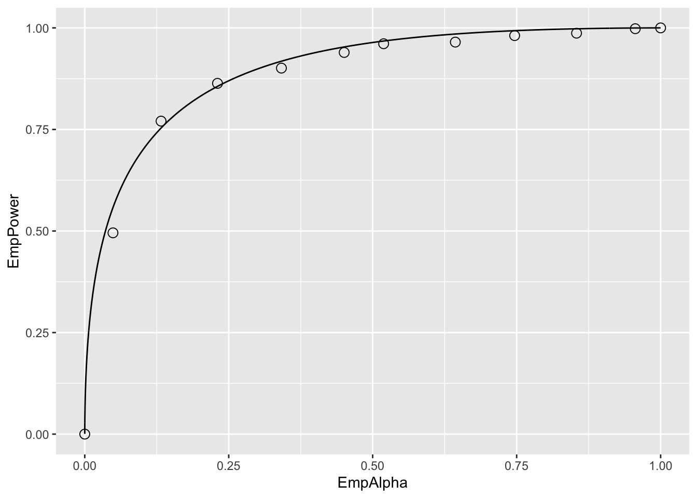

# (PART\*) Significance Testing {-}


# Hypothesis Testing {#hypothesis-testing}


## TBA How much finished {#hypothesis-testing-how-much-finished}
60%


## Introduction {#hypothesis-testing-introduction}
The problem addressed here is how to decide whether an estimate of AUC is consistent with a pre-specified value. One example of this is when a single-reader rates a set of cases in a single-modality, from which one estimates AUC, and the question is whether the estimate is statistically consistent with a pre-specified value. From a clinical point of view, this is generally not a useful exercise, but its simplicity is conducive to illustrating the broader concepts involved in this and later chapters. The clinically more useful analysis is when multiple readers interpret the same cases in two or more modalities. [With two modalities, for example, one obtains an estimate AUC for each reader in each modality, averages the AUC values over all readers within each modality, and computes the inter-modality difference in reader-averaged AUC values. The question forming the main subject of this book is whether the observed difference is consistent with zero.]

Each situation outlined above admits a binary (yes/no) answer, which is different from the estimation problem that was dealt with in connection with the maximum likelihood method in (book) Chapter 06, where one computed numerical estimates (and confidence intervals) of the parameters of the fitting model. 

**Hypothesis testing is the process of dichotomizing the possible outcomes of a statistical study and then using probabilistic arguments to choose one option over the other.**

The two options are termed the *null hypothesis* (NH) and the *alternative hypothesis* (AH). The hypothesis testing procedure is analogous to the jury trial system in the US, with 20 instead of 12 jurors, with the NH being the presumption of innocence and the AH being the defendant is guilty. The decision rule is to assume the defendant is innocent unless all 20 jurors agree the defendant is guilty. If even one juror disagrees, the defendant is deemed innocent (equivalent to choosing an $\alpha$ – defined below - of 0.05, or 1/20). 

## Single-modality single-reader ROC study
The binormal model described in Chapter 06 can be used to generate sets of ratings to illustrate the methods being described in this chapter. To recapitulate, the model is described by:

\begin{align*} 
Z_{k_11} &\sim N\left ( 0,1 \right ) \\ 
Z_{k_22} &\sim N\left ( \mu,\sigma^2 \right )
\end{align*} 

The following code chunk encodes the `Wilcoxon` function:


```r
Wilcoxon <- function (zk1, zk2)
{
  K1 = length(zk1)
  K2 = length(zk2)
  W <- 0
  for (k1 in 1:K1) {
    W <- W + sum(zk1[k1] < zk2)
    W <- W + 0.5 * sum(zk1[k1] == zk2)
  }
  W <- W/K1/K2
  return (W)
}
```

In the next code chunk we set $\mu = 1.5$ and $\sigma = 1.3$ and simulate $K_1 = 50$ non-diseased cases and  $K_2 = 52$ diseased cases. The `for`-loop draws 50 samples from the $N(0,1)$ distribution and 52 samples from the $N(\mu,\sigma^2)$ distribution, calculates the empirical AUC using the Wilcoxon, and the process is repeated 10,000 times, the AUC values are saved to a huge array `AUC_c` (the c-subscript is for case sample, where each case sample represents 102 cases). After exit from the `for`-loop we calculate the mean and standard deviation of the `AUC` values. 


```r
seed <- 1;set.seed(seed)
mu <- 1.5;sigma <- 1.3;K1 <- 50;K2 <- 52

# cheat to find the population mean and std. dev.
AUC_c <- array(dim = 10000)
for (c in 1:length(AUC_c)) {
  zk1 <- rnorm(K1);zk2 <- rnorm(K2, mean = mu, sd = sigma)  
  AUC_c[c] <- Wilcoxon(zk1, zk2)
}
meanAUC   <-  mean(AUC_c);sigmaAUC  <-  sd(AUC_c)
cat("pop mean AUC_c = ", meanAUC, 
    ", pop sigma AUC_c = ", sigmaAUC, "\n")
#> pop mean AUC_c =  0.819178 , pop sigma AUC_c =  0.04176683
```

By the simple (if unimaginative) approach of sampling 10,000 times, one has estimates of the *population* mean and standard deviation of empirical AUC, denoted below by $AUC_{pop}$ and $\sigma_{\text{AUC}}$, respectively.

The next code-chunk simulates one more independent ROC study with the same numbers of cases, and the resulting area under the empirical curve is denoted AUC in the code. 


```r
# one more trial, this is the one we want 
# to compare to meanAUC
zk1 <- rnorm(K1);zk2 <- rnorm(K2, mean = mu, sd = sigma) 
AUC <- Wilcoxon(zk1, zk2)
cat("New AUC = ", AUC, "\n")
#> New AUC =  0.8626923

z <- (AUC - meanAUC)/sigmaAUC
cat("z-statistic = ", z, "\n")
#> z-statistic =  1.04184
```

Is the new value, 0.8626923, sufficiently different from the population mean, 0.819178, to reject the null hypothesis $NH: \text{AUC} = \text{AUC}_{pop}$? Note that the answer to this question can be either yes or no: equivocation is not allowed!

The new value is "somewhat close" to the population mean, but how does one decide if "somewhat close" is close enough? Needed is the statistical distribution of the random variable $\text{AUC}$ under the hypothesis that the true mean is $\text{AUC}_{pop}$. In the limit of a large number of cases, the pdf of $\text{AUC}$  under the null hypothesis is a normal distribution  $N\left ( \text{AUC}_{pop}, \sigma_{\text{AUC}}^{2} \right )$:

\begin{equation*} 
\text{pdf}_{\text{AUC}}\left ( \text{AUC}\mid \text{AUC}_{pop}, \sigma_{\text{AUC}} \right )=\frac{1}{\sigma_{\text{AUC}}\sqrt{2\pi}}exp\left ( -\frac{1}{2} \left ( \frac{\text{AUC}-\text{AUC}_{pop}}{\sigma_{\text{AUC}}} \right )^2\right )
\end{equation*} 

The translated and scaled value is distributed as a unit normal distribution, i.e., 

\begin{equation*} 
Z \equiv \frac{\text{AUC}-\text{AUC}_{pop}}{\sigma_{\text{AUC}}}\sim N\left ( 0,1 \right )
\end{equation*} 

[The $Z$ notation here should not be confused with z-sample, decision variable or rating of a case in an ROC study; the latter, when sampled over a set of non-diseased and diseased cases, yield a realization of $\text{AUC}$. The author trusts the distinction will be clear from the context.] The observed magnitude of $z$ is 1.0418397. [Upper-case for random variable, lower-case for realized or observed value.]

**The ubiquitous p-value is the probability that the observed magnitude of $z$, or larger, occurs under the null hypothesis (NH) that the true mean of $Z$ is zero.** Stated somewhat differently, but equivalently, it is the probability that a random sample from $N(0,1)$ exceeds $z$. 

The p-value corresponding to an observed $z$ of 1.0418397 is given by:

\begin{align*} 
\Pr\left ( \lvert Z \rvert \geq \lvert z \rvert \mid Z\sim N\left ( 0,1 \right )\right )&=\Pr\left ( \lvert Z \rvert \geq 1.042 \mid Z\sim N\left ( 0,1 \right )\right )\\
&= 2\Phi\left ( -1.042 \right )\\
&= 0.2975
\end{align*} 

To recapitulate statistical notation, $\Pr\left ( \lvert Z \rvert \geq \lvert z \rvert \mid Z\sim N\left ( 0,1 \right )\right )$ is parsed as  $\Pr\left ( A\mid  B \right )$, that is, the probability $\lvert Z \rvert \geq \lvert z \rvert$  given that $Z\sim N\left ( 0,1 \right )$. The second line in the preceding equation follows from the symmetry of the unit normal distribution, i.e., the area above 1.042 must equal the area below -1.042. 

Since $z$ is a continuous variable, there is zero probability that a sampled value will exactly equal the observed value. Therefore, one must pose the statement as above, namely the probability that $Z$ is at least as extreme as the observed value (by "extreme" I mean further from zero, in either positive or negative directions). If the observed was $z$ = 2.5 then the corresponding p-value would be  $2\Phi(-2.5)$=0.01242, which is smaller than 0.2975. Under the zero-mean null hypothesis, the larger the magnitude of the observed value $z$, the smaller the p-value, and the more unlikely that the data supports the NH. **The p-value can be interpreted as the degree of unlikelihood that the data is consistent with the NH.** 

By convention one adopts a fixed value of the probability, denoted  and usually $\alpha$ = 0.05, which is termed *the significance level* of the test, and the decision rule is to reject the null hypothesis if the observed p-value < $\alpha$. $\alpha$ is also referred to as the *size* of the test. 

\begin{equation*} 
p < \alpha \Rightarrow \text{Reject NH}
\end{equation*} 

If the p-value is exactly 0.05 (unlikely with ROC analysis, but one needs to account for it), then one does not reject the NH. In the 20-juror analogy, of one juror insists the defendant is not guilty, the observed p-value is 0.05, and one does not reject the NH that the defendant is innocent (the double negatives, very common in statistics, can be confusing; in plain English, the defendant goes home).

According to the previous discussion, the critical magnitude of $z$ that determines whether to reject the null hypothesis is given by:

\begin{equation*} 
z_{\alpha / 2}=-\Phi^{-1}\left ( {\alpha/2} \right )
\end{equation*} 

For $\alpha$ = 0.05 this evaluates to 1.95996 (which is sometimes rounded up to two, good enough for "government work" as the saying goes) and the decision rule is to reject the null hypothesis only if the observed magnitude of $z$ is larger than $z_{\alpha/2}$. 

**The decision rule based on comparing the observed z to a critical value is equivalent to a decision rule based on comparing the observed p-value to $\alpha$. It is also equivalent, as will be shown later, to a decision rule based on a $\left ( 1-\alpha \right )$  confidence interval for the observed statistic. One rejects the NH if the closed confidence interval does not include zero.**

## Type-I errors
Just because one rejects the null hypothesis does not mean that the null hypothesis is false. Following the decision rule puts an upper limit on, or "caps", the probability of incorrectly rejecting the null hypothesis at $\alpha$. In other words, by agreeing to reject the NH only if $p \leq \alpha$, one has set an upper limit, namely  $\alpha$, on errors of this type, termed *Type-I* errors. These could be termed false positives in the hypothesis testing sense, not to be confused with false positive occurring on individual case-level decisions. According to the definition of $\alpha$:

\begin{equation*} 
\Pr( \text{Type I error} \mid \text{NH} )=\alpha
\end{equation*} 

To demonstrate the ideas one needs to have a very cooperative reader interpreting new sets of independent cases not just one more time, but 2000 more times (the reason for the 2000 trials will be explained below). The simulation code follows:


```r
seed <- 1;set.seed(seed)
mu <- 1.5;sigma <- 1.3;K1 <- 50;K2 <- 52

nTrials <- 2000
alpha <- 0.05 # size of test
reject = array(0, dim = nTrials)
for (trial in 1:length(reject)) {  
  zk1 <- rnorm(K1);zk2 <- rnorm(K2, mean = mu, sd = sigma)  
  AUC <- Wilcoxon(zk1, zk2)  
  z <- (AUC - meanAUC)/sigmaAUC
  p <- 2*pnorm(-abs(z)) # p value for individual trial
  if (p < alpha) reject[trial] = 1 
}

CI <- c(0,0); width <- -qnorm(alpha/2)
ObsvdTypeIErrRate <- sum(reject)/length(reject)
CI[1] <- ObsvdTypeIErrRate - 
  width*sqrt(ObsvdTypeIErrRate*(1-ObsvdTypeIErrRate)/nTrials)
CI[2] <- ObsvdTypeIErrRate + 
  width*sqrt(ObsvdTypeIErrRate*(1-ObsvdTypeIErrRate)/nTrials)
cat("alpha = ", alpha, "\n")
#> alpha =  0.05
cat("ObsvdTypeIErrRate = ", ObsvdTypeIErrRate, "\n")
#> ObsvdTypeIErrRate =  0.0535
cat("95% confidence interval = ", CI, "\n")
#> 95% confidence interval =  0.04363788 0.06336212
exact <- binom.test(sum(reject),n = 2000,p = alpha)
cat("exact 95% CI = ", as.numeric(exact$conf.int), "\n")
#> exact 95% CI =  0.04404871 0.06428544
```

The population means were calculated in an earlier code chunk. One initializes `NTrials` to 2000 and $\alpha$ to 0.05. The `for-loop` describes our captive reader interpreting independent sets of cases 2000 times. *Each completed interpretation of 102 cases is termed a trial.* For each trial one calculates the observed value of `AUC`, the observed `z` statistic and the the observed p-value. The observed p-value is compared against the fixed value $\alpha$ and one sets the corresponding `reject[trial]` flag to unity if $p < \alpha$. In other words, if the trial-specific p-value is less than $\alpha$ one counts an instance of rejection of the null hypothesis. The process is repeated 2000 times.

Upon exit from the for-loop, one calculates the observed Type-I error rate, denoted `ObsvdTypeIErrRate` by summing the reject array and dividing by 2000. One calculates a 95% confidence interval for `ObsvdTypeIErrRate` based on the binomial distribution, as in (book) Chapter 03. 

The observed Type-I error rate is a realization of a random variable, as is the estimated 95% confidence interval. The fact that the confidence interval includes $\alpha$ = 0.05 is no coincidence - it shows that the hypothesis testing procedure is working as expected. To distinguish between the selected $\alpha$ (a fixed value) and that observed in a simulation study (a realization of a random variable), the term *empirical $\alpha$* is sometimes used to denote the observed rejection rate.

It is a mistake to state that one wishes to minimize the Type-I error probability. The minimum value of $\alpha$ (a probability) is zero. Run the software with this value of $\alpha$: one finds that the NH is never rejected. The downside of minimizing the expected Type-I error rate is that the NH will never be rejected, even when the NH is patently false. The aim of a valid method of analyzing the data is not minimizing the Type-I error rate, rather, the observed Type-I error rate should equal the specified value of $\alpha$ (0.05 in our example), allowance being made for the inherent variability in it’s estimate. This is the reason 2000 trials were chosen for testing the validity of the NH testing procedure. With this choice, the 95% confidence interval, assuming that observed value is close to 0.05, is roughly ±0.01 as explained next. 

Following analogous reasoning to (book) Chapter 03, Eqn. (3.10.10), and defining $f$ as the observed rejection fraction over $T$ trials, and as usual, $F$ is a random variable and $f$ a realized value, 

\begin{equation*} 
\sigma_f = \sqrt{f(1-f)/T} \\
F \sim N\left ( f,\sigma_{f}^{2} \right )
\end{equation*} 

An approximate $(1-\alpha)100$ percent CI for $f$  is:

\begin{equation*} 
{CI}_f = \left [ f-z_{\alpha/2}\sigma_f, f+z_{\alpha/2}\sigma_f \right ]
\end{equation*} 

If $f$ is close to 0.05, then for 2000 trials, the 95% CI for $f$ is $f \pm 0.01$, i.e.,  `qnorm(alpha/2) * sqrt(.05*(.95)/2000)` = 0.009551683 ~ 0.01.

The only way to reduce the width of the CI, and thereby run a more stringent test of the validity of the analysis, is to increase the number of trials $T$. Since the width of the CI depends on the inverse square root of the number of trials, one soon reaches a point of diminishing returns. Usually $T = 2000$ trials are enough for most statisticians and me, but studies using more simulations have been published.

## One vs. two sided tests
The test described above is termed 2-tailed. Here, briefly, is the distinction between 2-tailed vs. 1-tailed p-values:


```r
alpha  <- 0.05
# Example 1
# p value for two-sided AH
p2tailed <- pnorm(-abs(z)) + (1-pnorm(abs(z))) 
cat("pvalue 2-tailed, AH: z ne 0 = ", p2tailed, "\n")
#> pvalue 2-tailed, AH: z ne 0 =  0.2943993

# Example 2
# p value for one-sided AH gt 0
p1tailedGT <- 1-pnorm(z) 
cat("pvalue 1-tailed, AH: z gt 0 = ", p1tailedGT, "\n")
#> pvalue 1-tailed, AH: z gt 0 =  0.8528004

# Example 2
# p value for one-sided AH lt 0 
p1tailedLT <- pnorm(z)
cat("pvalue 1-tailed, AH: z lt 0 = ", p1tailedGT, "\n")
#> pvalue 1-tailed, AH: z lt 0 =  0.8528004

df <- data.frame(p2tailed = p2tailed,
                 p1tailedGT = p1tailedGT,
                 p1tailedGT = p1tailedGT)
print(df)
#>    p2tailed p1tailedGT p1tailedGT.1
#> 1 0.2943993  0.8528004    0.8528004
```

The only difference between these tests is in how the alternative hypotheses is stated. 

* For a two-tailed test the alternative hypothesis is $\text{AUC} \ne \text{AUC}_{pop}$. Large deviations, in either direction, cause rejection of the NH.
* For the first one-tailed test the alternative hypothesis is $\text{AUC} > \text{AUC}_{pop}$. Large positive observed values of $z$ result in rejection of the NH. Large negative values do not.
* For the second one-tailed test the alternative hypothesis is $\text{AUC} < \text{AUC}_{pop}$. Large negative observed values of $z$ result in rejection of the NH. Large positive values do not.
* The last two statements are illustrated below with the following code-fragments:


```r
# p1tailedGT
1-pnorm(1) # do not reject
#> [1] 0.1586553
1-pnorm(2) # reject
#> [1] 0.02275013
1-pnorm(-2) # do not reject
#> [1] 0.9772499

# p1tailedGT
pnorm(-1) # do not reject
#> [1] 0.1586553
pnorm(-2) # reject
#> [1] 0.02275013
pnorm(2) # do not reject
#> [1] 0.9772499
```

Note that the p-value of the 1-tailed tests are half that of the 2-tailed test. Further discussion of the difference between 2-tailed and 1-tailed tests, and when the latter might be appropriate, is given below.

If the null hypothesis is rejected anytime the magnitude of the observed value of $z$ exceeded the critical value $-\Phi^{-1}\left ( {\alpha/2} \right)$. This is a statement of the alternative hypothesis (AH) $\text{AUC}\neq \text{AUC}_{pop}$, in other words too high or too low values of $z$ *both* result in rejection of the null hypothesis. This is referred to as a two-sided AH and the resulting p-value is termed a *two-sided* p-value. This is the most common one used in the literature.

Suppose the additional trial performed by the radiologist was performed after an intervention following which the radiologist’s performance is expected to increase. To make matters clearer, assume the interpretations in the 10,000 trials used to estimate $\text{AUC}_{pop}$ were performed with the radiologist wearing an old pair of eye-glasses, possibly out of proper strength, and the additional trial is performed after the radiologist gets a new set of prescription eye-glasses. Because the radiologist’s eyesight has improved, the expectation is that performance should increase. In this situation, it is appropriate to use the one-sided alternative hypothesis $\text{AUC} > \text{AUC}_{pop}$. Now, large positive values of $z$ result in rejection of the null hypothesis, but large negative  values do not. The critical value of $z$ is defined by $z_\alpha = \Phi\left ( 1-\alpha \right )$, which for $\alpha$ = 0.05 is 1.645 (i.e., `qnorm(1-alpha) = 1.644854`). Compare 1.64 to the critical value  $-\Phi^{-1}\left ( {\alpha/2} \right)$ = 1.96 for a two-sided test. If the change is in the expected direction, it is more likely that one will reject the NH with a one-sided than with a two-sided test. The p-value for a one-sided test is given by: 

\begin{equation*} 
\Pr\left ( Z \geq 1.042 \mid \text{NH} \right ) = \Phi \left (-1.042  \right ) = 0.1487
\end{equation*} 

Notice that this is half the corresponding two-sided test p-value; this is because one is only interested in the area under the unit normal that is above the observed value of $z$. If the intent is to obtain a significant finding, it is tempting to use one-sided tests. The down side of a one-sided test is that even with a large excursion of the observed $z$ in the other direction one cannot reject the null hypothesis. So if the new eye-glasses are so bad as to render the radiologist practically blind (think of a botched cataract surgery) the observed $z$ would be large and negative, but one cannot reject the null hypothesis $\text{AUC}=\text{AUC}_{pop}$.

The one-sided test could be run the other way, with the alternative hypothesis being stated as $\text{AUC}<\text{AUC}_{pop}$. Now, large negative excursions of the observed value of AUC cause rejection of the null hypothesis, but large positive excursions do not. The critical value is defined by  $z_\alpha = \Phi^{-1}\left (\alpha  \right )$, which for $\alpha$ = 0.05  is -1.645. The p-value is given by (note the reversed sign compared to the previous one-sided test:

\begin{equation*} 
\Pr\left ( Z \leq 1.042 \mid \text{NH}  \right ) = \Phi(1.042) = 1 - 0.1487 = 0.8513
\end{equation*} 

This is the complement of the value for a one-sided test with the alternative hypothesis going the other way: obviously the probability that $Z$ is smaller than the observed value (1.042) plus the probability that $Z$ is larger than the same value must equal one. 

## Statistical power
So far, focus has been on the null hypothesis. The Type-I error probability was introduced, defined as the probability of incorrectly rejecting the null hypothesis, the control, or "cap" on which is  $\alpha$, usually set to 0.05. What if the null hypothesis is actually false and the study fails to reject it? This is termed a Type-II error, the control on which is denoted  $\beta$, the probability of a Type-II error. **The complement of $\beta$  is called statistical power.** 

The following table summarizes the two types of errors and the two correct decisions that can occur in hypothesis testing. In the context of hypothesis testing, a Type-II error could be termed a false negative, not to be confused with false negatives occurring on individual case-level decisions. 

Truth           Fail to reject NH        Reject NH
---------       ------------------       ----------------
NH is True        1 - $\alpha$             $\alpha$ (FPF)
NH is False       $\beta$ (FNF)            Power = 1 - $\beta$


This resembles the 2 x 2 table encountered in (book) Chapter 02, which led to the concepts of $FPF$, $TPF$ and the ROC curve. Indeed, it is possible think of an analogous plot of empirical (i.e., observed) power vs. empirical $\alpha$, which looks like an ROC plot, with empirical $\alpha$  playing the role of $FPF$ and empirical power playing the role of $TPF$, see below. If  $\alpha$ = 0, then power = 0; i.e., if Type-I errors are minimized all the way to zero, then power is zero and one makes Type-II errors all the time. On the other hand, if $\alpha$  = 1 then Power = 1, and one makes Type-I errors all the time. 

A little history is due at this point. The author's first FROC study, which led to his entry into this field [@Chakraborty1986DigitalVsConv], was published in Radiology in 1986 after a lot of help from a reviewer, who we (correctly) guessed was the late Prof. Charles E. Metz. Prof. Gary T. Barnes (my mentor at that time at the University of Alabama at Birmingham) and I visited Prof. Charles Metz in Chicago for a day ca. 1986, to figuratively “pick Charlie’s brain”. Prof. Metz referred to the concept outlined in the previous paragraph, as an *ROC within an ROC*. 

This curve does not summarize the result of a single ROC study. Rather it summarizes the probabilistic behavior of the two types of errors that occur when one conducts thousands of such studies, under both NH and AH conditions, each time with different values of $\alpha$, with each trial ending in a decision to reject or not reject the null hypothesis. The long sentence is best explained with an example. 


```r
seed <- 1;set.seed(seed)
muNH <- 1.5;muAH <- 2.1;sigma <- 1.3;K1 <- 50;K2 <- 52# Line 6

# cheat to find the population mean and std. dev.
AUC <- array(dim = 10000) # line 8
for (i in 1:length(AUC)) {
  zk1 <- rnorm(K1);zk2 <- rnorm(K2, mean = muNH, sd = sigma)  
  AUC[i] <- Wilcoxon(zk1, zk2)
}
sigmaAUC <- sqrt(var(AUC));meanAUC <- mean(AUC) # Line 14

T <- 2000  # Line 16
mu <- c(muNH,muAH) # Line 17
alphaArr <- seq(0.05, 0.95, length.out = 10)
EmpAlpha <- array(dim = length(alphaArr))
EmpPower <- array(dim = length(alphaArr))
for (a in 1:length(alphaArr)) { # Line 20
  alpha <- alphaArr[a] 
  reject <- array(0, dim = c(2, T))
  for (h in 1:2) {  
    for (t in 1:length(reject[h,])) {  
      zk1 <- rnorm(K1);zk2 <- rnorm(K2, mean = mu[h], sd = sigma)  
      AUC <- Wilcoxon(zk1, zk2)  
      obsvdZ <- (AUC - meanAUC)/sigmaAUC
      p <- 2*pnorm(-abs(obsvdZ)) # p value for individual t
      if (p < alpha) reject[h,t] = 1 
    }
  }
  EmpAlpha[a] <- sum(reject[1,])/length(reject[1,])
  EmpPower[a] <- sum(reject[2,])/length(reject[2,])
}
EmpAlpha <- c(0,EmpAlpha,1); EmpPower <- c(0,EmpPower,1) # Line 19

pointData <- data.frame(EmpAlpha = EmpAlpha, EmpPower = EmpPower)
zetas <- seq(-5, 5, by = 0.01)
muRoc <- 1.8
curveData <- data.frame(EmpAlpha = pnorm(-zetas),
  EmpPower = pnorm(muRoc - zetas))
alphaPowerPlot <- ggplot(mapping = aes(x = EmpAlpha, y = EmpPower)) + 
  geom_point(data = pointData, shape = 1, size = 3) + 
  geom_line(data = curveData)
print(alphaPowerPlot)
```



Relevant line numbers are shown above as comments. Line 6 creates two variables, `muNH` = 1.5 (the binormal model separation parameter under the NH) and `muAH` = 2.1 (the separation parameter under the AH). Under either hypotheses, the same diseased case standard deviation `sigma` = 1.3 and 50 non-diseased and 52 diseased cases are assumed. As before, lines 8 – 14 use the "brute force" technique to determine population AUC and standard deviation of AUC under the NH condition. Line 16 defines the number of trials `T` = 2000. Line 17 creates a vector `mu` containing the NH and AH values defined at line 6. Line 18 creates `alphaArr`, a sequence of 10 equally spaced values in the range 0.05 to 0.95, which represent 10 values for $\alpha$. Line 19 creates two arrays of length 10 each, named `EmpAlpha` and `EmpPower`, to hold the values of the observed Type-I error rate, i.e., empirical $\alpha$, and the empirical power, respectively. The program will run `T` = 2000 NH and `T` = 2000 AH trials using as $\alpha$ each successive value in `alphaArr` and save the observed Type-I error rates and observed powers to the arrays `EmpAlpha` and `EmpPower`, respectively. 

Line 20 begins a for-loop in `a`, an index into `alphaArr.` Line 21 selects the appropriate value for `alpha` (0.05 on the first pass, 0.15 on the next pass, etc.). Line 22 initializes `reject[2,2000]` with zeroes, to hold the result of each trial; the first index corresponds to hypothesis `h` and the second to trial `t`. Line 23 begins a for-loop in `h`, with `h` = 1 corresponding to the NH and `h` = 2 to the AH. Line 24 begins a for-loop in `t`, the trial index. The code within this block is similar to previous examples. It simulates ratings, computes AUC, calculates the p-value, and saves a rejection of the NH as a one at the appropriate array location `reject[h,t]`. Lines 32 – 33 calculate the empirical $\alpha$ and empirical power for each value of $\alpha$  in `alphaArr`. After padding the ends with zero and ones (the trivial points), the remaining lines plot the "ROC within an ROC".

Each of the circles in the figure corresponds to a specific value of $\alpha$. For example the lowest non-trivial corresponds to  $\alpha$ = 0.05, for which the empirical $\alpha$ is 0.049 and the corresponding empirical Power is 0.4955. True $\alpha$ increases as the operating point moves up the plot, with empirical $\alpha$ and empirical power increasing correspondingly. The $\text{AUC}$ under this curve is determined by the effect size, defined as the difference between the AH and NH values of the separation parameter. If the effect size is zero, then the circles will scatter around the chance diagonal; the scatter will be consistent with the 2000 trials used to generate each coordinate of a point. As the effect size increases, the plot approaches the perfect "ROC", i.e., approaching the top-left corner. One could use AUC under this "ROC" as a measure of the incremental performance, the advantage being that it would be totally independent of $\alpha$, but this would not be practical as it requires replication of the study under NH and AH conditions about 2000 times each and the entire process has to be repeated for several values of $\alpha$. The purpose of this demonstration was to illustrate the concept behind Metz's profound remark. 
	
It is time to move on to factors affecting statistical power in a single study.


### Factors affecting statistical power
* Effect size: effect size is defined as the difference in $\text{AUC}_{pop}$  values between the alternative hypothesis condition and the null hypothesis condition. Recall that  $\text{AUC}_{pop}$ is defined as the true or population value of the empirical ROC-AUC for the relevant hypothesis. One can use the "cheat method" to estimate it under the alternative hypothesis. The formalism is easier if one assumes it is equal to the asymptotic binormal model predicted value. The binormal model yields an estimate of the parameters, which only approach the population values in the asymptotic limit of a large number of cases. In the following, it is assumed that the parameters on the right hand side are the population values)
It follows that effect size (ES) is given by (all quantities on the right hand side of Eqn. (8.13) are population values):

\begin{equation*} 
\text{AUC} = \Phi\left ( \frac{ \mu }{\sqrt{ 1 + \sigma^2}} \right )
\end{equation*} 

It follows that effect size (ES) is given by (all quantities on the right hand side of above equation are population values):

\begin{equation*} 
ES = \Phi\left ( \frac{\mu_{AH}}{\sqrt{1+\sigma^2}} \right ) - \Phi\left ( \frac{\mu_{NH}}{\sqrt{1+\sigma^2}} \right )
\end{equation*} 


```r
EffectSize <- function (muNH, sigmaNH, muAH, sigmaAH)
{
  ES <- pnorm(muAH/sqrt(1+sigmaAH^2)) - pnorm(muNH/sqrt(1+sigmaNH^2))
  return (ES)
}

seed <- 1;set.seed(seed)
muAH <- 2.1 # NH value, defined previously, was mu = 1.5

T <- 2000
alpha <- 0.05 # size of test
reject = array(0, dim = T)
for (t in 1:length(reject)) {  
  zk1 <- rnorm(K1);zk2 <- rnorm(K2, mean = muAH, sd = sigma)  
  AUC <- Wilcoxon(zk1, zk2)  
  obsvdZ <- (AUC - meanAUC)/sigmaAUC
  p <- 2*pnorm(-abs(obsvdZ)) # p value for individual t
  if (p < alpha) reject[t] = 1 
}

ObsvdTypeIErrRate <- sum(reject)/length(reject)
CI <- c(0,0);width <- -qnorm(alpha/2)
CI[1] <- ObsvdTypeIErrRate - 
  width*sqrt(ObsvdTypeIErrRate*(1-ObsvdTypeIErrRate)/T)
CI[2] <- ObsvdTypeIErrRate + 
  width*sqrt(ObsvdTypeIErrRate*(1-ObsvdTypeIErrRate)/T)
cat("obsvdPower = ", ObsvdTypeIErrRate, "\n")
#> obsvdPower =  0.489
cat("95% confidence interval = ", CI, "\n")
#> 95% confidence interval =  0.4670922 0.5109078
cat("Effect Size = ", EffectSize(mu, sigma, muAH, sigma), "\n")
#> Effect Size =  0.08000617 0
```

The ES for the code above is 0.08 (in AUC units). It should be obvious that if effect size is zero, then power equals $\alpha$. This is because then there is no distinction between the null and alternative hypotheses conditions. Conversely, as effect size increases, statistical power increases, the limiting value being unity, when every trial results in rejection of the null hypothesis. The reader should experiment with different values of `muAH` to be convinced of the truth of these statements.

* Sample size: increase the number of cases by a factor of two, and run the above code chunk. 


```
#> pop NH mean AUC =  0.8594882 , pop NH sigma AUC =  0.02568252
#> num. non-diseased images =  100 num. diseased images =  104
#> obsvdPower =  0.313
#> 95% confidence interval =  0.2926772 0.3333228
#> Effect Size =  0.08000617 0
```

So doubling the numbers of cases (both non-diseased and diseased) results in statistical power increasing from 0.509 to 0.844. Increasing the numbers of cases decreases  $\sigma_{\text{AUC}}$, the standard deviation of the empirical AUC. The new value of $\sigma_{\text{AUC}}$ is 0.02947, which should be compared to the value 0.04177 for K1 = 50, K2 = 52. Recall that $\sigma_{\text{AUC}}$ enters the denominator of the Z-statistic, so decreasing it will increase the probability of rejecting the null hypothesis. 

* Alpha: Statistical power depends on $alpha$. The results below are for two runs of the code, the first with the original value $\alpha$ = 0.05, the second with $\alpha$ = 0.01:


```
#> alpha =  0.05 obsvdPower =  0.1545 
#> alpha =  0.01 obsvdPower =  0.0265
```

Decreasing  $\alpha$ results in decreased statistical power. 

## Comments {#hypothesis-testingComments}
The Wilcoxon statistic was used to estimate the area under the ROC curve. One could have used the binormal model, introduced in Chapter 06, to obtain maximum likelihood estimates of the area under the binormal model fitted ROC curve. The reasons for choosing the simpler empirical area are as follows. (1) With continuous ratings and 102 operating points, the area under the empirical ROC curve is expected to be a close approximation to the fitted area. (2) With maximum likelihood estimation, the code would be more complex – in addition to the fitting routine one would require a binning routine and that would introduce yet another variable in the analysis, namely the number of bins and how the bin boundaries were chosen. (3) The maximum likelihood fitting code can sometimes fail to converge, while the Wilcoxon method is always guaranteed to yield a result. The non-convergence issue is overcome by modern methods of curve fitting described in later chapters. (4) The aim was to provide an understanding of null hypothesis testing and statistical power without being bogged down in the details of curve fitting.

## Why alpha is chosen as 5%
One might ask why $\alpha$ is traditionally chosen to be 5%. It is not a magical number, rather the result of a cost benefit tradeoff. Choosing too small a value of $\alpha$ would result in greater probability $(1-\alpha)$ of the NH not being rejected, even when it is false. Sometimes it is important to detect a true difference between the measured AUC and the postulated value. For example, a new eye-laser surgery procedure is invented and the number of patients is necessarily small as one does not wish to subject a large number of patients to an untried procedure. One seeks some leeway on the Type-I error probability, possibly increasing it to $\alpha$ = 0.1, in order to have a reasonable chance of success in detecting an improvement in performance due to better eyesight after the surgery. If the NH is rejected and the change is in the right direction, then that is good news for the researcher. One might then consider a larger clinical trial and set $\alpha$ at the traditional 0.05, making up the lost statistical power by increasing the number of patients on which the surgery is tried. 

If a whole branch of science hinges on the results of a study, such as discovering the Higg's Boson in particle physics, statistical significance is often expressed in multiples of the standard deviation ($\sigma$) of the normal distribution, with the significance threshold set at a much stricter level (e.g. $5\sigma$). This corresponds to $\alpha$ ~ 1 in 3.5 million (`1/pnorm(-5)` =  3.5 x 10^6, a one-sided test of significance). There is an article in Scientific American (https://blogs.scientificamerican.com/observations/five-sigmawhats-that/) on the use of $n\sigma$, where `n` is an integer, e.g. 5, to denote the significance level of a study, and some interesting anecdotes on why such high significance levels (ie., small $\alpha$) are used in some fields of research. 

Similar concerns apply to manufacturing where the cost of a mistake could be the very expensive recall of an entire product line. For background on Six Sigma Performance, see http://www.six-sigma-material.com/Six-Sigma.html. An article downloaded 3/30/17 from https://en.wikipedia.org/wiki/Six_Sigma is included as supplemental material to this chapter (Six Sigma.pdf). It has an explanation of why $6\sigma$ translates to one defect per 3.4 million opportunities (it has to do with short-term and long-term drifts in a process). In my opinion, looking at other fields offers a deeper understanding of this material than simply stating that by tradition one adopts alpha = 5%.

Most observer performance studies, while important in the search for better imaging methods, are not of such "earth-shattering" importance, and it is somewhat important to detect true differences at a reasonable alpha, so alpha = 5% and beta = 20% represent a good compromise. If one adopted a $5\sigma$ criterion, the NH would never be rejected, and progress in image quality optimization would come to a grinding halt. That is not to say that a $5\sigma$ criterion cannot be used; rather if used, the number of patients needed to detect a reasonable difference (effect size) with 80% probability would be astronomically large. Truth-proven cases are a precious commodity in observer performance studies. Particle physicists working on discovering the Higg's Boson can get away with $5\sigma$ criterion because the number of independent observations and/or effect size is much larger than corresponding numbers in observer performance research.

## Discussion {#hypothesis-testingDiscussion}
In most statistics books, the subject of hypothesis testing is demonstrated in different (i.e., non-ROC) contexts. That is to be expected since the ROC-analysis field is a small sub-specialty of statistics (Prof. Howard E. Rockette, private communication, ca. 2002). Since this book is about ROC analysis, I decided to use a demonstration using ROC analysis. Using a data simulator, one can "cheat" by conducting a very large number of simulations to estimate the population $\text{AUC}$ under the null hypothesis. This permitted us to explore the related concepts of Type-I and Type-II errors within the context of ROC analysis. Ideally, both errors should be zero, but the nature of statistics leads one to two compromises. Usually one accepts a Type-I error capped at 5% and a Type-II error capped at 20%. These translate to $\alpha$ = 0.05 and desired statistical power = 80%. The dependence of statistical power on $\alpha$, the numbers of cases and the effect size was explored. 

In TBA Chapter 11 sample-size calculations are described that allow one to estimate the numbers of readers and cases needed to detect a specified difference in inter-modality AUCs with expected statistical power = $1-\beta$. The word "detect" in the preceding sentence is shorthand for "reject the NH with incorrect rejection probability capped at $\alpha$". 

This chapter also gives the first example of validation of a hypothesis testing method. Statisticians sometimes refer to this as showing a proposed test is a "5% test". What is meant is that one needs to be assured that when the NH is true the probability of NH rejection is consistent with the expected value. Since the observed NH rejection rate over 2000 simulations is a random variable, one does not expect the NH rejection rate to exactly equal 5%, rather the constructed 95% confidence interval (also a random interval variable) should include the NH value with probability  1 - $\alpha$. 

Comparing a single reader's performance to a specified value is not a clinically interesting problem. The next few chapters describe methods for significance testing of multiple-reader multiple-case (MRMC) ROC datasets, consisting of interpretations by a group of readers of a common set of cases in typically two modalities. It turns out that the analyses yield variability estimates that permit sample size calculation. After all, sample size calculation is all about estimation of variability, the denominator of the z-statistic. The formulae will look more complex, as interest is not in determining the standard deviation of AUC, but in the standard deviation of the inter-modality reader-averaged AUC difference. However, the basic concepts remain the same. 


## References {#hypothesis-testing-references}

