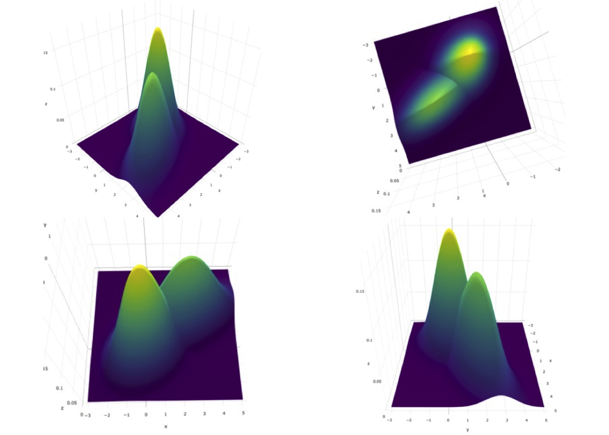

# Bivariate binormal model {#bivariate-binormal-model}


## How much finished 30% {#bivariate-binormal-model-how-much-finished}


## Introduction {#bivariate-binormal-model-introduction}

Until now the focus has been on the single rating per case scenario where a reader interprets a set of cases in a single modality. Of greater clinical interest is a study where a group of readers interprets a common set of cases in multiple modalities as such a study yields results that generalize to the populations of readers and cases from which the study readers and cases were sampled. Before one can handle MRMC a good place to start is two readers interpreting a common set of cases. Because of the paired interpretation the two ratings per case are correlated.


In [@chakraborty2017observer] Chapter 21 was devoted to the CORROC2 algorithm and usage of the software was described in considerable detail. At that time [@zhai2017bivariate] was in press - this paper describes an alternate algorithm (termed the correlated contaminated binormal model or CORCBM) that has several advantages over CORROC2. Therefore, I have reconsidered the focus of this chapter: it outlines the correlated binormal model fitting procedure but does not detail how to use it. ^[Much of the detail of using CORROC2 is platform dependent while the alternate procedure described here is platform independent.]. The chapter now includes detailed explanation of the work presented in [@zhai2017bivariate] and how to use the CORCBM software implementing it.


In this chapter the bivariate extension of the univariate binormal model is described. Bivariate sampling is described at a relatively simple level. Interactive visualization of the probability density functions is demonstrated. Estimation of parameters of the bivariate binormal model from ratings data is addressed. The usage of software implementing this procedure is described. The data format used by CORROC2 is described in some detail as well as how to interpret the program output. ^[Since this software runs on Windows, material is provided to allow the user to run it on a MAC (most of this necessary digression, since the author is using OS X, is in TBA Online Appendix 21.D). This digression is not needed in one is using a Windows platform.] Finally, the application of the software to clinical datasets is described. A recent advance that solves degeneracy problems associated with CORROC2 is described, namely CORCBM (for correlated contaminated binormal model), for correlated CBM. We conclude with a discussion of the applications of CORROC2 or CORCBM.


## The bivariate normal density function {#bivariate-binormal-model-density}

Sampling from the multivariate normal distribution $N_p$ is as follows:


\begin{equation}
\overrightarrow{x} \sim  N_p\left( \overrightarrow{\mu}, \Sigma \right)
(\#eq:multivariate-sampling-model)
\end{equation} 


Here $\overrightarrow{x}$ is a length $p$ vector of the observed z-samples for each case, $\overrightarrow{\mu}$ is a length $p$ vector containing the means of the multivariate distribution and $\Sigma$ is the covariance matrix describing the variances, and correlations between the observed samples. 

The multivariate normal probability density function $f_p\left( \overrightarrow{x} ~~ \bigg \rvert ~~\overrightarrow{\mu}, ~~ \Sigma \right)$ is defined by:


\begin{equation} 
f_p\left( \overrightarrow{x} ~~ \bigg \rvert ~~\overrightarrow{\mu}, ~~ \Sigma \right)
= \frac{1}{\left( 2 \pi \right)^{p/2}|\Sigma|^{1/2}}\exp\left( -\frac{\left( \overrightarrow{x}-\overrightarrow{\mu} \right)^T \Sigma^{-1} \left( \overrightarrow{x}-\overrightarrow{\mu} \right)}{2} \right)
(\#eq:bivariate-binormal-model-density-function-multivariate)
\end{equation}


Here $|\Sigma|$ is the determinant of the matrix and $T$ is the transpose operator. 

For the special case of a bivariate normal distribution $p = 2$ and suppressing the $p$ subscript this is^[In the univariate case, $p = 1$, $\Sigma$ is replaced by $\sigma^2$, and the above expression reduces to the pdf of the normal distribution $N(\mu, \sigma^2)$.]:


\begin{equation} 
f\left( x_1,x_2 ~~ \bigg \rvert ~~ \mu_1, \mu_2,  \sigma_1, \sigma_2, \rho \right)
= \frac{1}{2 \pi \sigma_1 \sigma_2 \sqrt{1-\rho^2}}\exp\left( -\frac{t}{2\left( 1-\rho^2 \right)} \right)
(\#eq:bivariate-binormal-model-density-function)
\end{equation} 


where


\begin{equation} 
t=\frac{\left( x_1-\mu_1 \right)^2}{\sigma_1^2}-\frac{2\rho\left( x_1-\mu_1 \right)\left( x_2-\mu_2 \right)}{\sigma_1 \sigma_2}
+\frac{\left( x_2-\mu_2 \right)^2}{\sigma_2^2}
(\#eq:bivariate-binormal-model-density-function2)
\end{equation} 


For a bivariate distribution the covariance matrix is: 


\begin{equation} 
\Sigma=
\left( \begin{matrix}
\sigma_1^2 & \rho \sigma_1 \sigma_2 \\
\rho \sigma_1 \sigma_2 & 
\sigma_2^2
\end{matrix}
 \right)(\#eq:bivariate-binormal-model-covariance-matrix)
\end{equation} 


In these equations $\mu_1$ and $\sigma_1^2$ is the mean and variance for modality 1, $\mu_2$ and $\sigma_2^2$ is the mean and variance for modality 2 and $\rho$ is the correlation between the two modalities.

The `R` function to evaluate Eqn. \@ref(eq:bivariate-binormal-model-density-function-multivariate) is `dmvnorm()`, for “density of multivariate normal distribution” available via `R` package `mvtnorm` [@R-mvtnorm]. Its usage is illustrated next for the following parameter values:


\begin{equation} 
\left.\begin{aligned}
\overrightarrow{
\mu}&=
\left( \begin{matrix}
\mu_1 \\
\mu_2
\end{matrix}
\right)
=\left( \begin{matrix}
1.5 \\
2.0
\end{matrix}
\right) \\
\sigma_1 &= 1.1 \\
\sigma_2 &= 1.5 \\
\rho &= 0.6 \\
\Sigma&=
\left( 
\begin{matrix}
\sigma_1^2 & \rho \sigma_1 \sigma_2 \\
\rho \sigma_1 \sigma_2  & \sigma_2^2
\end{matrix}\right)
=
\left( 
\begin{matrix}
1.1^2 & 0.6 \times 1.1 \times 1.5 \\
0.6 \times 1.1 \times 1.5  & 1.5^2
\end{matrix}\right)\end{aligned}\right\}
(\#eq:bivariate-binormal-model-parameters)
\end{equation} 

In the following code the call to get the pdf occurs at line 15.


```{.r .numberLines}
mu1 <- 1.5 # mean modality 1
mu2 <- 2.0 # mean modality 2
var1 <- 1.1^2  # variance modality 1
var2 <- 1.5^2 # variance modality 2
rho <- 0.6 # correlation between modalities 1 and 2
#
# construct covariance matrix Sigma
# 
Sigma <- matrix(c(var1, rho*sqrt(var1*var2), 
                  rho*sqrt(var1*var2), var2),2)
#
# pdf 
# 
x <- c(0.1,0.2) # the x-vector at which to evaluate pdf
pdf  <- dmvnorm(x, mean = c(mu1,mu2), sigma = Sigma)
#
# print results
# 
cat("density at x1 = 0.1 and x2 = 0.2 = ", pdf, "\n")
#> density at x1 = 0.1 and x2 = 0.2 =  0.04622722
```


The parameters describing the bivariate normal distribution are $\overrightarrow{\mu}$ and $\Sigma$. The total number of parameters is five: two means, two variances and a correlation coefficient. 


## The bivariate binormal model {#bivariate-binormal-model-formulae}

So far we have described bivariate sampling for a single truth state. The bivariate binormal model is an extension of the bivariate model just described, to *two truth-states*: non-diseased and diseased each modeled separately as a bivariate normal distribution. This could potentially result in a doubling of the number of parameters but by appropriate shifting and scaling transformations one can ensure that the two means of the bivariate distribution for non-diseased cases are zeroes and the corresponding variances are unity. This reduces the total number of parameters to the following: $\mu_1$, $\mu_2$, $\sigma_1$, $\sigma_2$, $\rho_1$, $\rho_2$ where $\mu_1$, $\mu_2$ are the means for diseased cases for modality 1 and modality 2, respectively, $\sigma_1^2$, $\sigma_2^2$ are the variances for diseased cases for modality 1 and modality 2, respectively and $\rho_1$, $\rho_2$ are the correlations between the two modalities for non-diseased cases and diseased cases, respectively. 


The bivariate binormal parameters are:


\begin{equation} 
\left.\begin{aligned}
\overrightarrow{
\mu_1}&=
\left( \begin{matrix}
0 \\
0
\end{matrix}
\right)\\
\overrightarrow{
\mu_2}&=
\left( \begin{matrix}
\mu_1 \\
\mu_2
\end{matrix}
\right)\\
\Sigma_1&=
\left( 
\begin{matrix}
1 & \rho_1 \\
\rho_1  & 1
\end{matrix}
\right) \\
\Sigma_2 &= \left( 
\begin{matrix}
\sigma_1^2 & \rho_2 \sigma_1 \sigma_2 \\
\rho_2 \sigma_1 \sigma_2  & \sigma_2^2
\end{matrix}
\right)
\end{aligned}\right\}
(\#eq:bivariate-binormal-model-all-parameters)
\end{equation} 


On the left hand side the subscripts refer to modalities. 


The decision variable is $z_{ik_tt}$ where the $i$ subscript corresponds to the two modalities and the $t$ subscript corresponds to the two truth states. The correlated ratings pairs $\left( z_{1k_11},z_{2k_11} \right)$ and  $\left( z_{1k_22},z_{2k_22} \right)$, corresponding to z-samples from non-diseased and diseased cases, respectively, are abbreviated, using vector notation, to $\overrightarrow{z_{1k_tt}}$ (the vectorization always "condense" the two modalities):
 
 
\begin{equation} 
\overrightarrow{z_{k_tt}}=
\left( \begin{matrix}
z_{1k_tt}  \\
z_{2k_tt}
\end{matrix} \right)
(\#eq:bivariate-binormal-model-notation)
\end{equation} 


The sampling for each modality is as follows:


\begin{equation}
\left.\begin{aligned}
z_{k_11} &\sim  N\left( 0, 1 \right) \\
z_{k_22} &\sim  N\left( \mu, \sigma^2 \right)
\end{aligned}\right\}
(\#eq:univariate-binormal-model-sampling)
\end{equation} 


where the parameters $\mu$ and $\sigma$ are of course modality dependent. 

In other words $\overrightarrow{z_{k_tt}}$ is sampled from $N_2\left( \overrightarrow{\mu_t}, \Sigma_t \right)$, the bivariate normal distribution with mean $\overrightarrow{\mu_t}$ and covariance matrix $\Sigma_t$:


\begin{equation}
\overrightarrow{z_{k_tt}} \sim  N_2\left( \overrightarrow{\mu_t}, \Sigma_t \right)
(\#eq:bivariate-binormal-model-sampling)
\end{equation} 


The parameters $\overrightarrow{\mu_t}, \Sigma_t$ are truth-state dependent as described in Eqn. \@ref(eq:bivariate-binormal-model-all-parameters). 

In Eqn. \@ref(eq:bivariate-binormal-model-sampling), the symbol $\sim  N_2\left( \overrightarrow{\mu_t}, \Sigma_t \right)$ denotes a vector sample of length two from the bivariate normal distribution with mean $\overrightarrow{\mu_t}$ and covariance matrix $\Sigma_t$. Each case yields two samples corresponding to the two modalities. The subscript 2 on $N$ distinguishes the bivariate distribution from the corresponding univariate distribution $N$ (which has an implicit 1 subscript). For non-diseased cases the correlation coefficient of the paired samples is $\rho_1$ and the corresponding value for diseased cases is $\rho_2$. The ones along the diagonal of $\Sigma_1$ confirm that the variances of the two samples for non-diseased cases are individually equal to unity. The corresponding variances for diseased cases are $\sigma_1^2$ and $\sigma_2^2$. 


One needs to include threshold parameters and a decision rule. 


For an R-rating single modality ROC task with allowed ratings $r = 1, 2, ..., \text{R}$, one needs $\text{R}-1$ thresholds $\zeta_1,\zeta_2,...,\zeta_{\text{R}-1}$. Defining $\zeta_0 = -\infty$ and $\zeta_{\text{R}} = +\infty$ the decision rule is to label a case with rating $r$ if the realized z-sample satisfies $\zeta_{r-1} < z \le \zeta_r$. 


In the two-modality task the decision variable and the thresholds are modality dependent: i.e., $z_{ik_tt}$ and $z_{i'k_tt}$, where $i \ne i'$ and two sets of thresholds $\zeta_{i1},\zeta_{i2},...,\zeta_{i (\text{R}-1)}$ and $\zeta_{i'1},\zeta_{i'2},...,\zeta_{i' (\text{R}-1)}$. As before $\zeta_{i0} = -\infty$ and $\zeta_{i'0} = -\infty$ and $\zeta_{i\text{R}} = +\infty$ and $\zeta_{i'\text{R}} = +\infty$. The decision rule is to rate a case in modality $i$ with rating $r_i$ if $\zeta_{i(r-1)} < z_i \le \zeta_{ir}$, and the same case in modality $i'$ is rated $r_{i'}$ if $\zeta_{i'(r-1)} < z_{i'} \le \zeta_{i'r}$.
 	
 	
The sampling model Eqn. \@ref(eq:bivariate-binormal-model-sampling) is a natural extension to two modalities of the single modality univariate binormal model described in Chapter \@ref(binormal-model): 

>The univariate model yields one z-sample per case: samples for non-diseased cases have mean zero and unit variance; samples for diseased cases have mean $\mu$ and variance $\sigma^2$. In contrast the bivariate model yields two z-samples per case. For non-diseased cases the samples have zero mean and unit variance and correlation $\rho_1$. For diseased cases, the samples for the first modality have mean $\mu_1$ and variance $\sigma_1^2$, for the second modality they have mean $\mu_2$ and variance $\sigma_2^2$ and their correlation is $\rho_2$. 


## Visualizing the bivariate density function {#bivariate-binormal-model-multivariate-density-visualization}

It is helpful to visualize the pdfs. Since one is dealing with a vector $\overrightarrow{x}$ of length 2, one needs two axes to depict $x_1$ and $x_2$ and a third axis to depict the pdf. The R-package `plotly` [@R-plotly] provides a visualization technique. It is interactive: by dragging the cursor over the plot one can visualize it from different angles. Shown in Fig. \@ref(fig:bivariate-binormal-model-pdf-plots) are four views of the bivariate distribution density function for $\mu_1 = 1.5$, $\mu_2 = 2.0$, $\sigma_1 = 1.0$, $\sigma_2 = 1.5$, $\rho_1 = 0.3$ and $\rho_2 = 0.6$.


<!-- ```{r, echo=FALSE} -->
<!-- mu1 <- 1.5 # diseased mean modality 1 -->
<!-- mu2 <- 2.0 # diseased mean modality 2 -->
<!-- var1 <- 1  # diseased variance modality 1 -->
<!-- var2 <- (1.5)^2 # diseased variance modality 2 -->
<!-- rho1 <- 0.3 # non-diseased correlation -->
<!-- rho2 <- 0.6 # diseased correlation -->

<!-- # -->
<!-- # construction the covariance matrix Sigma1 for non-diseased -->
<!-- #  -->
<!-- Sigma1 <- matrix(c(1, rho1, rho1, var2),2) -->

<!-- x <- c(0.1,0.2) # the x-vector at which to evaluate pdf -->

<!-- # -->
<!-- # pdf for non-diseased -->
<!-- #  -->
<!-- # following defaults to zero mean for each modality -->
<!-- pdf1  <- dmvnorm(x, sigma = Sigma1)  -->

<!-- # -->
<!-- # construction the covariance matrix Sigma2 for diseased -->
<!-- #  -->
<!-- Sigma2 <- matrix(c(var1, rho2*sqrt(var1*var2), rho2*sqrt(var1*var2), var2),2) -->

<!-- # -->
<!-- # pdf for diseased -->
<!-- #  -->
<!-- pdf2  <- dmvnorm(x, mean = c(mu1,mu2), sigma = Sigma2) -->

<!-- # -->
<!-- # print results -->
<!-- #  -->
<!-- cat("mu1 =", mu1, ", mu2 =", mu2, "\n") -->
<!-- cat("var1 =", var1, ", var2 =", var2, "\n") -->
<!-- cat("rho1 =", rho1, ", rho2 =", rho2, "\n") -->
<!-- cat("non-diseased density at x1 = 0.1 and x2 = 0.2 = ", pdf1, "\n") -->
<!-- cat("diseased density at x1 = 0.1 and x2 = 0.2 = ", pdf2, "\n") -->
<!-- ``` -->


<div class="figure">

<p class="caption">(\#fig:bivariate-binormal-model-pdf-plots)Bivariate pdf plots for the bivariate distribution density function for $\mu_1 = 1.5$, $\mu_2 = 2.0$, $\sigma_1 = 1.0$, $\sigma_2 = 1.5$, $\rho_1 = 0.3$ and $\rho_2 = 0.6$.. Top-left is the default view. Top-right is the 'birds eye' view: the lower-left blob is the diseased distribution. Bottom-left is the view looking along the y-axis: the left distribution is non-diseased. Bottom-right is the view looking along the x-axis: the higher peak distribution is non-diseased.</p>
</div>


## Estimating bivariate binormal model parameters {#bivariate-binormal-model-multivariate-density-estimation}

In Chapter \@ref(binormal-model) a method for estimating the parameters of the univariate binormal model was described. The method involved maximizing the likelihood function, i.e., the probability of the observed data as a function of the model parameters. For a 5-rating study the likelihood was a function of six variables: the separation of the two normal distributions and the standard deviation of the diseased distribution relative to the non-diseased distribution plus four thresholds. The likelihood function was maximized with respect to these parameters. The values of the parameters yielding at the maximum are the maximum-likelihood estimates (MLEs).

With a bivariate model one is dealing with six non-threshold parameters $\overrightarrow{\mu_t}, \Sigma_t$ plus threshold parameters corresponding to each modality. The estimation procedure is not fundamentally different but the presence of the second dimension does complicate the notation. Again, the starting point is the likelihood function, i.e., the probability of the observed data as a function of the parameter values. Since there is a possibility of confusion between the truth index $t$ and the modality index $i$, each of which ranges from 1 to 2, the non-diseased counts in bin $r$ of the first modality and bin $s$ of the second modality is denoted by $K_{rs1}$ (the bin indices occur before the truth index). The corresponding diseased counts are denoted  $K_{rs2}$. One needs two indices $rs$ because each case yields two integer ratings, $r$ and $s$.  Each rating is in the range 1, 2,..., R, where R is the number of ROC bins, assumed equal for both modalities^[This is not an essential limitation; the method is readily extended, and has been, for unequal numbers of bins in the two modalities.]. To construct the matrix $K_{rs1}$ starting with a zero-initialized R x R matrix one increments the cell at row $r$ and column $s$ by unity for each non-diseased case that received a $r$ rating in the first modality and an $s$ rating in the second modality. The procedure is repeated for the diseased cases yielding $K_{rs2}$.

For non-diseased cases, the probability of a z-sample in bin r of the first modality and bin s of the second modality is determined by the “volume” under the bivariate distribution $N_2(\overrightarrow {\mu_1}, \Sigma_1)$ between modality-1 thresholds $\zeta_{1(r-1)}$ and $\zeta_{1r}$, and between modality-2 thresholds $\zeta_{2(s-1)}$ and $\zeta_{2s}$. For diseased cases the corresponding probability is the volume under the bivariate distribution $N_2(\overrightarrow {\mu_2}, \Sigma_2)$ between the same thresholds. The probabilities can be calculated using the `pmvnorm()` function, with appropriate parameters, in R package [@R-mvtnorm].    


## Examples of bivariate normal probability integrals {#bivariate-binormal-model-multivariate-density-examples}

Needed is the bivariate extension of the univariate cumulative distribution function   defined in Eqn. (3.7). Specifically, one needs a way of calculating the integral:

  	.	(21.13)

Online Appendix 21.C shows how to do this in R. The code file mainBivariateIntegrals.R implements the "equation":

  	.	(21.14)

Here `pmvnorm()` is the integral of the bivariate normal distribution with specified mean and covariance matrix sigma between limits   and  . The limits are specified by two length-two arrays that are supplied as the first two arguments to this function. The first argument to the function is the concatenated lower thresholds in the two modalities. The second argument is the concatenated upper thresholds in the two modalities. These are followed by the separation parameter vector and the covariance matrix. The function is not limited to two dimensional covariance matrices. With a p x p covariance matrix, the lower and upper limits would each be length p vectors. Here is a bivariate example (p = 2) in mainBivariateIntegrals.R:


### Code listing {#bivariate-binormal-model-multivariate-density-estimation-code}


```r
# 
# mu1 <- 1.5 # mean dis. modality 1
# mu2 <- 2.0 # mean dis. modality 2
# var1 <- 1.1^2  # variance dis. modality 1
# var2 <- 1.5^2 # variance dis. modality 2
# rho <- 0.6 # correlation between modalities 1 and 2
# mu <- c(mu1, mu2)
# ret <- pmvnorm(c(-Inf, -Inf), c(Inf, Inf),mean = mu, sigma = Sigma2)
# cat("Over the entire space = ", ret, "\n")
# ret <- pmvnorm(c(-Inf, -Inf), c(Inf, 0),mean=mu, sigma = COV)
# cat("Over the full space in one dimension and the -ve half space in the other dimension = ", ret, "\n")
# ret <- pmvnorm(c(.3, .4), c(.4, .5),mean=mu, sigma = COV)
# cat("Between specified ctff. values = ", ret, "\n")
# 
```

In the last two lines,   and  . Sourcing the code yields:

### Examples of bivariate normal probability integrals {#bivariate-binormal-model-examples-integrals}

The facts that the integral over the entire space yields unity   and   and that over each half space yields 0.5,   and  , should make intuitive sense. 

## Likelihood function {#bivariate-binormal-model-likelihood}

The probability of observing $K_{rs1}$ non-diseased and $K_{rs2}$ diseased counts in bin $r$ in the first modality and bin $s$ in the second modality is:
 

\begin{equation} 
\prod_{t=1}^{2}\left ( p_{rst} \right )^{K_{rst}}
\end{equation} 


Including all bins the logarithm of the likelihood function is given by (neglecting a combinatorial factor that does not depend on the parameters):

\begin{equation} 
LL\left ( \overrightarrow{\mu_2},\overrightarrow{\Sigma_1},\overrightarrow{\Sigma_2},\overrightarrow{\zeta_1},\overrightarrow{\zeta_2} \right ) = \sum_{t=1}^{2}\sum_{s=1}^{R}\sum_{r=1}^{R} \log(p_{rst})
\end{equation} 


The maximum likelihood estimates of the parameters are obtained by maximizing the LL function. This was solved [@metz1980statistical, @metz1984new] more than three decades ago and implemented in CORROC2 software. This software is particularly useful as it measures correlations at the underlying z-sample level. Much as I have emphasized that ratings are not "hard" numbers the CORROC2 estimated correlations are valid, because CORROC2 models the ratings as continuous variables and estimates the correlation based on the bivariate binormal model.


## CORROC2 software {#bivariate-binormal-model-corroc2}

Around 1980 Prof. Charles E. Metz and Helen B. Kronman developed software implementing maximum likelihood estimation of the parameters of the bivariate normal model outlined above from data corresponding to two correlated ROC ratings per case. The software is called CORROC2, for “correlated ROC". Subsequent revisions to the program were made by Pu-Lan Wang and Jong-Her Shen and more recently by Ben Herman4-7. CORROC2 is used to analyze paired ratings that result when a common set of cases is interpreted under two conditions. The pairing can be simple, as when a single reader interprets a common set of cases in two modalities, or more general as when two different readers interpret a common set of cases in one modality, or when two different readers interpret a common set of cases in two different modalities. The generality makes the method quite useful in a way that, in the judgment of the author, has not been fully exploited to date . 

CORROC2 software allows selection of three methods of testing for differences between two conditions. 
1.	Testing for simultaneous differences between the (a, b) parameters corresponding to two ROC curves. 
2.	Testing the difference between the binormal-fitted AUCs under two correlated ROCs. 
3.	Testing the difference between TPFs on two ROC curves at a specified FPF. 

To understand the difference between (1) and (2) consider that is that it is possible to have two ROC curves with different shapes but the same fitted AUCs. If the difference in shapes is large enough, method (1) would declare the two conditions different, but method (2) would not. In the examples below, we use method (2). 

### Details of CORROC2 software {#bivariate-binormal-model-corroc2-details}

This section is one of the few in this book that uses Windows code. If using OS X, one needs to download "virtual machine" software as described in Online Appendix 21.D. If using a Windows machine, one does not need to do anything extra. Therefore, in following this chapter it is important that one has either a Windows computer or a Mac computer with a virtual machine installed.


The Windows executable code is named CORROC2.exe. The author downloaded the software, including the Fortran source code, many years ago, ca. 1997, from the University of Chicago website, but it is currently unavailable and unsupported on that site. The author is fortunate that he held onto the downloaded code. The reason is that the FORTRAN source code, with appropriate modifications, can be interfaced to the R code. The currently distributed equivalent code named ROC-kit cannot be run in command-line mode (i.e., without having to use the mouse to select the input file, specify the output file, etc.) The author has confirmed with Mr. Ben Herman, who is familiar with the code, that by design it cannot be used in command-line mode. The ability to run in command-line mode is needed if one is to call a program from R.

For simplicity, it is assumed that the number of allowed ROC ratings bins, R, is the same in each modality (the software can handle different numbers of ratings in the two modalities). For two modalities, the total number of parameters to be estimated is 6+2(R-1). The six comes from the two means and two variances of the diseased distributions, plus the two correlations (one per truth state) and 2(R-1) from the two sets of thresholds, each with R-1 values. In addition to providing estimates of all parameters of the model, the algorithm provides estimates of the covariance matrix of the parameters. This, not to be confused with  , is needed for the same reason it was needed in the univariate case, see Chapter 06: i.e., to estimate variances of the 6-estimates and variances of functions of estimates, e.g., AUC. 

### CORROC2 data input {#bivariate-binormal-model-corroc2-data-input}

Here is a partial example of how the paired ratings data is input to the program (the read-only data file is DataFileInp.txt in the software distribution under software/corrocii/Debug). 

TYPICAL EXAMPLE OF 5-CATEGORY DATA --X
5
5
TYPICAL EXAMPLE OF 5-CATEGORY DATA --Y
5
5
4 4
3 5
5 3
1 1
1 1
1 3
1 5

The first line, whose content is immaterial to the analysis, is a description of the data in the first modality. The second line (5), is the total number of ratings bins in the first modality. The third line (5) is the rating with the highest evidence of disease in the first modality (5 in the current example). The fourth line is a description of data in the second modality, again its content is immaterial. The next two fives are the number of bins in the second modality, and the bin number denoting highest evidence of disease in the second modality. 

The actual ratings data starts on line 7, which states that the first non-diseased case was rated ROC: 4 in the first modality and ROC: 4 in the second modality. The two ratings for each case, separated by spaces, are input on the same line. Line eight states that the second non-diseased case was rated ROC: 3 in the first modality and ROC: 5 in the second modality, and so on. An asterisk after the last non-diseased case signals the end of the non-diseased cases.  The next line has the two ratings corresponding to the first diseased case. Here is a partial example:

4 4
*
4 5
5 5

This says that the first diseased case was rated ROC: 4 in the first modality and ROC: 5 in the second modality, the second diseased case was rated ROC: 5 in both modalities, and so on. The last diseased case is followed by another asterisk, and the last line is the word “area”: 

5 5
2 5
*
area

Other choices are available for the last line, but the author will stick to area, which means one wishes to use the area under the binormal-fitted ROC curve   as the figure of merit. 

### CORROC2 output {#bivariate-binormal-model-corroc2-output}

The CORROC2 output associated with this software for the above dataset, 347 lines in all, is in the read-only file DataFileOut.txt, Fig. 21.2 (use RStudio to go down the directory structure and click on the appropriate file; it is displayed, see below, with line numbers):  

 

Fig. 21.2: Lines of CORROC2 output in DataFileOut.txt that are associated with the dataset in DataFileInp.txt.

Condition X and Condition Y denote modalities 1 and 2, respectively . Line 10 of the output  summarizes the statistical test to be employed “AREA (A SUB Z) TEST”. This is because we concluded, line 101, the reader data file DataFileInp.txt with area. Line 13-22 summarizes the dataset, how many ratings, which rating represents greatest evidence of disease, etc. Lines 26 – 37 summarize the observed ratings matrix for non-diseased cases (labeled ACTUALLY NEGATIVE), i.e., the matrix  . For example, there were three cases that were rated s = 3 in CONDITION X and r = 5 in CONDITION Y (the matrix is labeled by its row index, followed by its column index and last with the truth index. The output lists the 5 rating bin as the first row, the 4 rating bin as the second row, etc.). Likewise, lines 40-51 summarize the ratings matrix   for diseased cases. Lines 53 – 59 list the observed operating points in the two modalities, followed by the initial and final estimates of the parameters. The program lists the parameters using the (a,b) notation, not the   notation, but one knows how to transform between them: Chapter 06, Eqn. (6.16), and see exercise on conversion below. Here is the output showing the final parameter values (14 values in all):

                FINAL ESTIMATES OF THE PARAMETERS:
      AX= 1.3006     BX= 0.4919     AY= 1.6049     BY= 0.8704
      R(NEGATIVE CASES)= 0.2599     R(POSITIVE CASES)= 0.4544
      T(I)-0.281  0.221  0.687  1.941
      U(J)-0.791 -0.417  0.175  0.990

Here X refers to condition X and Y to condition Y. AX is the   parameter in condition X (what the author calls  ). BX is the b parameter in condition X (our  ). AY is the   parameter in condition Y (i.e.,  ). BY is the b parameter in condition Y (i.e.,  ). R(NEGATIVE CASES) is the correlation coefficient for the non-diseased cases (i.e.,  ). R(POSITIVE CASES) is the correlation coefficient for the diseased cases (i.e.,  ). Finally, T(I) and U(J) are the thresholds in the two condition, corresponding to   and  in our notation. Since there are five ratings bins, there are four thresholds in each modality. 

Converting the above parameter values to $\mu, \sigma$ notation

Using the transformations Eqn. (6.16),  = 1.3006/0.4919 = 2.644,  = 1.844,  = 1/.4919 = 2.033,  = 1.149,  = 0.2599 and  = 0.4544 (the correlations are unaffected by linear transformations). Regarding the thresholds, for modality 1,  = -0.281/.4919 = -0.571,  = 0.221/.4919 = 0.449, etc. Similarly, the thresholds for modality 2 are  = -0.791/.8704 = -0.909,  = -0.417/.8704 = -0.479, etc. Question for the reader: why were the thresholds divided by the corresponding b-values? 

### Covariance matrix {#bivariate-binormal-model-corroc2-covariance-matrix}

For convenience of the yet-to-be-described R-program that does all this automatically, the FORTRAN source code was modified to print the elements of the covariance matrix sequentially, i.e., one-per-line. The output corresponding to lines 83 - 280 in file DataFileOut.txt is (shown is a partial listing):

   VARIANCE-COVARIANCE MATRIX
        14
  0.621003E-01
  0.205564E-01
  0.171881E-01
  0.294564E-02
  0.104652E-03
 -0.684784E-02
  0.144067E-01
  0.135140E-01
  0.127711E-01
  0.393710E-02
  0.285687E-02
  0.285592E-02
  0.285248E-02
  0.284967E-02
  0.205564E-01

The "14" is the dimension of each "edge" of the 2D covariance matrix, i.e., there are 142 (196) elements in all. The "14" comes from the six basic parameters plus the four thresholds in the two conditions. The elements are listed in row-major order, i.e., all the elements of the first row, followed by all elements of the second row, etc. One can anticipate some difficulty displaying it, so only the upper-left 6 x 6 corner of the full matrix is shown below, Table 21.1, i.e. any covariance involving a threshold is not shown. For convenience, the numbers have been rounded to fit and since the matrix is symmetric, there is no need to show numbers below the diagonal: 

Table 21.1: This table displays the covariance matrix of the parameters for the dataset in datafileinp.txt. Since the matrix is symmetric, values below the diagonal are not shown. Also not shown are covariance-elements associated with threshold parameters.
	 
 
 
 
 
 

 
.062	.021	.017	.003	.000	-.007
 
	.022	.002	.002	.001	-.004
 
		.089	.045	.000	-.010
 
			.078	.003	-.008
 
				.026	.000
 
					.035

The diagonal elements, which represent variances, are all positive. 

### Rest of CORROC2 output {#bivariate-binormal-model-corroc2-output-restof}

Line 286-320 allows one to plot the ROC curves for the two modalities, but one does not need them, as one knows by now how to generate binormal model predicted curves. Lines 325-327 lists the areas under the respective fitted ROC curves, and their correlation (the is the AUC level correlation, which could be estimated by methods described in Chapter 06):

            AREA(X)=  0.8784     AREA(Y)=  0.8870
            STD DEV OF AREA(X)=  0.0392     STD DEV OF AREA(Y)=  0.0376
            CORRELATION OF AREA(X) AND AREA(Y) = 0.2569

The remaining lines, 333-341 lists the p-value. 

             STATISTICAL SIGNIFICANCE OF THE DIFFERENCE
      BETWEEN THE TWO CORRELATED ROC CURVES ACCORDING TO THE SELECTED TEST:

  *****************************************************************************


    THE COMPUTED CORRELATED 'AREA TEST' STATISTIC VALUE IS   -0.1829
    WITH A CORRESPONDING TWO-TAILED P-LEVEL OF 0.8549
    AND ONE-TAILED P-LEVEL OF 0.4274.

The famed p-value is 0.8549 (it is customary to quote the two-tailed value, see Chapter 08 for details on this). This means that the difference in areas (0.8784 – 0.8870 = -0.0086) is not statistically significant at Type-I error probability   = 0.05. The calculation of the test statistic is described in code mainDiffAzTestStatistic.R. It uses methods described in Chapter 06 to calculate the standard deviation of the difference of two AUCs:

 	.	(21.17)

The test – statistic for determining the significance of the AUC difference is:

 	.	(21.18)
 	
 	
## Application to a real dataset {#bivariate-binormal-model-corroc2-application}

Assuming one has set up the connection between the Mac side and the Windows side properly, as described in Online Appendix 21.D, one can apply CORROC2 to real ROC datasets. Open the R file “mainCorroc2.R” in the software folder corresponding to this chapter, described in detail in Online Appendix 21.E. Source the file, yielding: 

### Code Output {#bivariate-binormal-model-corroc2-application-code-output}

> source('~/book2/A ROC analysis/A8 Bivariate binormal model/software/mainCorroc2.R')
...

The 6 parameters are  1.72 0.55 1.87 0.527 0.332 0.798 
The 2 sided pValue is  0.482 
The covariance matrix is:
          [,1]     [,2]      [,3]     [,4]     [,5]      [,6]
[1,]  0.120075  0.05096  0.050939  0.01054 6.58e-04 -1.05e-02
[2,]  0.050956  0.03667  0.013392  0.00550 2.01e-03 -4.87e-03
[3,]  0.050939  0.01339  0.111921  0.04078 2.28e-04 -1.16e-02
[4,]  0.010545  0.00550  0.040777  0.02908 1.51e-03 -4.56e-03
[5,]  0.000658  0.00201  0.000228  0.00151 2.09e-02  3.11e-06
[6,] -0.010453 -0.00487 -0.011566 -0.00456 3.11e-06  8.67e-03

What the R code does is detailed in Online Appendix 21.D. It reads the file containing the data, the Van Dyke data in the above example, extract the ratings for reader 1 in both modalities, writes the data in the appropriate format for CORROC2, runs the latter program in a Windows environment, reads the resulting output and prints out model parameters and the covariance matrix.

Like most ROC software, the output uses the (a,b) convention, Chapter 06. Recall that in this convention the diseased distribution has unit standard deviation, the non-diseased distribution has standard deviation b, and the separation of the two means is a. Since there are two modalities, there are two a parameters and two b parameters. In the CORROC2 output, the two modalities are referred to as X (1 in our notation) and Y (2 in our notation), respectively, and the ordering of the six parameters is  . The ordering also determines the ordering of the covariance matrix. We start with the meanings of the header row and first column of the matrix shown above. The notation [,1] means the first column of the matrix, likewise [,2] is the second column and so on. Likewise, [1,] means the first row of the matrix, [2,] means the second row of the matrix, and so on. For example, the above table tells us that the second row and third column of the covariance matrix is 0.013392. This is the covariance between  . The diagonal elements of the matrix are the variances. For example, the variance of   is 2.09e-02, whose square root is the standard deviation, equal to 0.145. 

In the Files panel find the folder named corrocii and open it (you need to click on the name, not the picture of the folder; watch how the folder name is underlined when the cursor is above it, which is RStudio’s way of telling you “yes, it is OK to click here, something will happen”). You should see a number of files with the .FOR extension (these are FORTRAN source code files) and a folder named Debug; click on Debug. Fig. 21.4 is a screen-shot showing the contents of the Debug window. Table 21.2 summarizes the meanings of the files listed in this figure. 
 
### Contents of the Debug window, as viewed from the Mac side {#bivariate-binormal-model-corroc2-application-debug-window}


Table 21.2: This table summarizes the meanings of the files listed in this Fig. 21.4.
File name	Meaning	Comment
DataFileInp.txt	Input Ratings data in CORROC2 format	Read-only file used to illustrate data input format
DataFileOut.txt	Output file corresponding to DataFileInp.txt	Read-only file used to illustrate the output 
1R2MData.txt	Ratings data in CORROC2 format	Created by RunCorrocOnPairedData.R, line 25
CORROC2.bat	Batch file that runs CORROC2.exe	See below
CORROC2.exe	The actual CORROC2 program	
CorrocIIinput.txt	Input file to the batch file	
CorrocIIoutput.txt	Output file created by batch file	

The Windows software is located in software/CORROC2/Debug, Fig. 21.4. CORROC2.bat is a batch file, whose listing follows:
21.7.2: Contents of CORROC2.bat
cd CORROCII
cd Debug
del CorrocIIoutput.txt
CORROC2.exe < CorrocIIinput.txt > CorrocIIoutput.txt
cd ..
cd .. 

The batch file runs on the Windows side. The first two lines change the current directory to corrocii/Debug. The next line deletes the output file, CorrocIIoutput.txt, if it exists. The next line "pipes" the contents of CorrocIIinput.txt to the executable file CORROC2.exe and "pipes" the output to CorrocIIoutput.txt. The last two lines restore the starting directory. The contents of CorrocIIinput.txt are:


### Contents of CorrocIIinput.txt {#bivariate-binormal-model-corroc2-application-corrocii-input}

y
1R2MData.txt
N
Q 
	
These answer the four questions asked by CORROC2. Try running CORROC2 from the Windows side, Fig. 21.5.

 
Fig. 21.5: Result of running CORROC2 at the windows 8 command prompt. 

The first line of this file is the answer (yes) to the first question asked by CORROC2.exe (you can check these out by clicking on CORROC2.exe in your physical Windows machine or virtual Windows machine): “Do you want to use data from a previously created input file for the next run?” The second line is the name of the input file, the third line is the answer (no) to the next question: “Do you want to save an output file for plotting the ROC curve?” The reason for the "no" is that we are more interested in the screen output, which contains all the estimates, including the covariance matrix, rather than plotting ROC curves. The last line is the answer ("Q") to the next question asked by CORROC2.exe: “Do you want to use data from a previously created input file for the next run?(Y/N, or Q for quit)”. Now, in a Windows environment, click on the batch file CORROC2.bat. The latest version of the file CorrocIIoutput.txt should appear in your Explorer window, with the correct date and time stamps. Open this file. The data file is named 1R2MData.txt and if you open it, you will recognize that it is similar to the file used in the section illustrating the data input format for CORROC2. It was created by the R-code.


## Discussion / Summary {#bivariate-binormal-model-corroc2-discussion}

CORROC2 is one of the relatively under-utilized tools developed by Prof. Charles E. Metz. There are only four publications describing it4-6,8 and two of them are difficult to find5,8, nor has the software been maintained on a level comparable to ROCFIT. For example, a method for assessing the goodness of the fit is currently not implemented. With R2 cells, it is almost impossible to maintain greater than five counts per cell, so an alternate method of combining bins has to be implemented. 

One reason for the relative under-utilization of CORROC2 could be that it is not designed to analyze multiple readers interpreting a common set of cases in two or more modalities i.e., MRMC datasets. For example, in a study in which CORROC2 was used9, four readers interpreted cases in four modalities. With four modalities, there are six possible combinations (4x3/2), so a conservative Bonferroni type correction for the p-value would be to divide 0.05 by 6. For each reader CORROC2 yields a p-value for the difference between the chosen pairs of modalities. If all readers agree, then there is an unambiguous answer, but the method does not allow for correlations between different readers, which undoubtedly leads to loss of power. More fundamentally, it does not address the question of interest: when averaged over all four readers, are the figures of merit in the four modalities different. 

It is possible to analyze multiple reader multiple modality MRMC-ROC datasets without actually using CORROC2. In chapters Chapter 09 and Chapter 10, it was shown how one analyzes such datasets using the empirical AUCs. Alternatively, one could estimate AUC using the univariate binormal model software (e.g., ROCFIT, or more modern software). The correlations in the resulting AUC values – i.e., FOM  correlations as distinct from ratings correlations - are explicitly accounted for in the DBMH / ORH analyses, i.e., it is not concerned with ratings correlations. One possible use of CORROC2 would be if one had to compare two CAD algorithms applied to a common dataset, but even here, it is of limited utility since, as a ROC study, location is ignored. 

 

CORROC2 was developed ca. 1980 by Metz, Wang and Kronman 5,10. Subsequent revisions to the program were made by Jong-Her Shen and more recently by Benjamin Herman6,7. Its impact cannot be overstated. There are well in excess of 116 citations to this software. One reason is that, at that time, it was the only software allowing analysis of paired datasets. However, no advances have been made in the intervening 3 decades, which would allow fitting, for example, proper ROC curves to paired - and possibly degenerate - datasets. Part of the reason for this neglect is the shift in emphasis to empirical AUC based analysis, which does not require parametric modeling or curve fitting – one simply calculates the trapezoidal AUC. However, empirical AUC based analysis has its own limitations, and pursuing an improvement over the parametric approach that removes the current limitations of CORROC2 would, in the author's judgment, quite apart from the specific interest in developing realistic simulators, be of scientific interest.

As a final note, at the time of writing, 4/30/17, an extension of CORROC2 has been published1 [@zhai2017bivariate]. It is called CORCBM, for correlated CBM. Details are in a document CORCBM.pdf in the online supplementary material directory corresponding to this chapter. The title of the publication is: "A bivariate contaminated binormal model for robust fitting of proper ROC curves to a pair of correlated, possibly degenerate, ROC datasets". It replaces the bivariate binormal model with the bivariate contaminated binormal model; hence its name CORCBM, for correlated CBM. Since CBM was designed to fit practically any single dataset, including degenerate ones, CORCBM is likewise able to fit practically any paired dataset. An application of CORCBM to calibrating a simulator to a data set containing single-modality multiple-reader ratings is described in Chapter 23.
