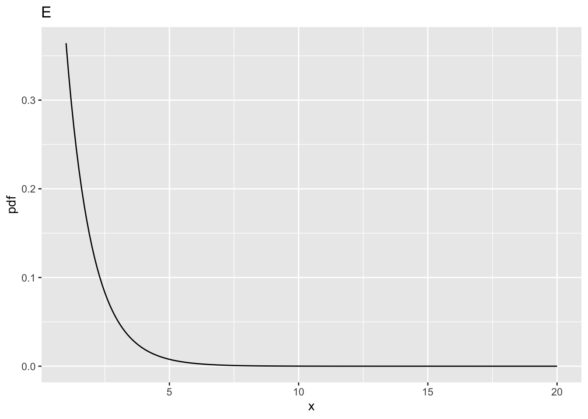
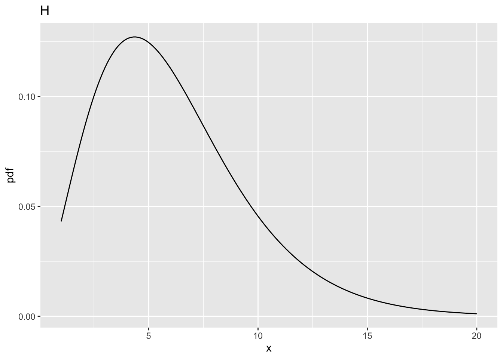

# (PART\*) RJafroc Vignettes {-}

# F-distribution {#background-f-distribution}


## TBA How much finished {#background-f-distribution-how-much-finished}

10%


## Introduction

Since it plays an important role in sample size estimation, it is helpful to examine the behavior of the F-distribution. In the following `ndf` = numerator degrees of freedom, `ddf` = denominator degrees of freedom and `ncp` = non-centrality parameter (i.e., the $\Delta$ appearing in Eqn. (11.6) of [@chakraborty2017observer]). 

The use of three `R` functions is demonstrated. 

* `qf(p,ndf,ddf)` is the *quantile* function of the F-distribution for specified values of `p`, `ndf` and `ddf`, i.e., the value `x` such that fraction `p` of the area under the F-distribution lies to the right of `x`. Since `ncp` is not included as a parameter, the default value, i.e., zero, is used. This is called the *central* F-distribution. 

* `df(x,ndf,ddf,ncp)` is the probability density function (*pdf*) of the F-distribution, as a function of `x`, for specified values of `ndf`, `ddf` and `ncp`. 

* `pf(x,ndf,ddf,ncp)` is the probability (or cumulative) distribution function of the F-distribution for specified values of `ndf`, `ddf` and `ncp`.


## Effect of `ncp` for `ndf` = 2 and `ddf` = 10

* Four values of `ncp` are considered  (0, 2, 5, 10) for `ddf` = 10. 
* `fCrit` is the critical value of the F distribution, i.e., that value such that fraction $\alpha$ of the area is to the right of the critical value, i.e., `fCrit` is identical in statistical notation to  ${{F}_{1-\alpha ,ndf,ddf}}$.


```r
ndf <- 2;ddf <- 10;ncp <- c(0,2,5,10)
alpha <- 0.05
fCrit <- qf(1-alpha, ndf,ddf)
x <- seq(1, 20, 0.1)
myLabel <- c("A", "B", "C", "D")
myLabelIndx <- 1
pFgtFCrit <- NULL
for (i in 1:length(ncp))
{
  y <- df(x,ndf,ddf,ncp=ncp[i])
  pFgtFCrit <- c(pFgtFCrit, 1-pf(fCrit, ndf, ddf, ncp = ncp[i]))
}  
for (i in 1:length(ncp))
{
  y <- df(x,ndf,ddf,ncp=ncp[i])
  curveData <- data.frame(x = x, pdf = y)
  curvePlot <- ggplot(data = curveData, mapping = aes(x = x, y = pdf)) + 
    geom_line() +
    ggtitle(myLabel[myLabelIndx]);myLabelIndx <- myLabelIndx + 1
  print(curvePlot)
}
fCrit_2_10 <- fCrit # convention fCrit_ndf_ddf
```


<table class="table table-striped" style="width: auto !important; ">
 <thead>
  <tr>
   <th style="text-align:left;">   </th>
   <th style="text-align:right;"> ndf </th>
   <th style="text-align:right;"> ddf </th>
   <th style="text-align:right;"> fCrit </th>
   <th style="text-align:right;"> ncp </th>
   <th style="text-align:right;"> pFgtFCrit </th>
  </tr>
 </thead>
<tbody>
  <tr>
   <td style="text-align:left;"> A </td>
   <td style="text-align:right;"> 2 </td>
   <td style="text-align:right;"> 10 </td>
   <td style="text-align:right;"> 4.102821 </td>
   <td style="text-align:right;"> 0 </td>
   <td style="text-align:right;"> 0.0500000 </td>
  </tr>
  <tr>
   <td style="text-align:left;"> B </td>
   <td style="text-align:right;"> 2 </td>
   <td style="text-align:right;"> 10 </td>
   <td style="text-align:right;"> 4.102821 </td>
   <td style="text-align:right;"> 2 </td>
   <td style="text-align:right;"> 0.1775840 </td>
  </tr>
  <tr>
   <td style="text-align:left;"> C </td>
   <td style="text-align:right;"> 2 </td>
   <td style="text-align:right;"> 10 </td>
   <td style="text-align:right;"> 4.102821 </td>
   <td style="text-align:right;"> 5 </td>
   <td style="text-align:right;"> 0.3876841 </td>
  </tr>
  <tr>
   <td style="text-align:left;"> D </td>
   <td style="text-align:right;"> 2 </td>
   <td style="text-align:right;"> 10 </td>
   <td style="text-align:right;"> 4.102821 </td>
   <td style="text-align:right;"> 10 </td>
   <td style="text-align:right;"> 0.6769776 </td>
  </tr>
</tbody>
</table>

## Comments

### Fig. A 
* This corresponds to `ncp = 0`, i.e., the *central* F-distribution. 
* The integral under this distribution is unity (this is also true for all plots in this vignette). 
* The critical value, `fCrit` in the above code block, is the value of `x` such that the probability of exceeding `x` is $\alpha$. The corresponding parameter `alpha` is defined above as 0.05.
* In the current example `fCrit` = 4.102821. Notice the use of the quantile function `qf()` to determine this value, and the default value of `ncp`, namely zero, is used; specifically, one does not pass a 4th argument to `qf()`. 
* **The decision rule for rejecting the NH uses the NH distribution of the F-statistic**, i.e., reject the NH if F >= `fCrit`. As expected, `prob > fCrit` = 0.05 because this is how `fCrit` was defined.   

### Fig. B 
* This corresponds to `ncp = 2`, `ndf` = 2 and `ddf` = 10. 
* The distribution is slightly shifted to the right as compared to Fig. A, thereby making it more likely that the observed value of the F-statistic will exceed the critical value determined for the NH distribution. 
* In fact, `prob > fCrit` = 0.177584, i.e., the *statistical power* (compare this to Fig. A where `prob > fCrit`  was 0.05).  

### Fig. C 
* This corresponds to `ncp = 5`, `ndf` = 2 and `ddf` = 10.
* Now `prob > fCrit` = 0.3876841. 
* Power has increased compared to Fig. B.

### Fig. D 
* This corresponds to `ncp = 10`, `ndf` = 2 and `ddf` = 10.
* Now `prob > fCrit` is  0.6769776. 
* Power has increased compared to Fig. C.
* The effect of the shift is most obvious in Fig. C and Fig. D. 
* Considering a vertical line at `x ` = 4.102821, fraction 0.6769776 of the probability distribution in Fig. D lies to the right of this line
* Therefore the NH is likely to be rejected with probability 0.6769776. 

### Summary 
The larger that non-centrality parameter, the greater the shift to the right of the F-distribution, and the greater the statistical power.

## Effect of `ncp` for `ndf` = 2 and `ddf` = 100




<table class="table table-striped" style="width: auto !important; ">
 <thead>
  <tr>
   <th style="text-align:left;">   </th>
   <th style="text-align:right;"> ndf </th>
   <th style="text-align:right;"> ddf </th>
   <th style="text-align:right;"> fCrit </th>
   <th style="text-align:right;"> ncp </th>
   <th style="text-align:right;"> pFgtFCrit </th>
  </tr>
 </thead>
<tbody>
  <tr>
   <td style="text-align:left;"> A </td>
   <td style="text-align:right;"> 2 </td>
   <td style="text-align:right;"> 10 </td>
   <td style="text-align:right;"> 4.102821 </td>
   <td style="text-align:right;"> 0 </td>
   <td style="text-align:right;"> 0.0500000 </td>
  </tr>
  <tr>
   <td style="text-align:left;"> B </td>
   <td style="text-align:right;"> 2 </td>
   <td style="text-align:right;"> 10 </td>
   <td style="text-align:right;"> 4.102821 </td>
   <td style="text-align:right;"> 2 </td>
   <td style="text-align:right;"> 0.1775840 </td>
  </tr>
  <tr>
   <td style="text-align:left;"> C </td>
   <td style="text-align:right;"> 2 </td>
   <td style="text-align:right;"> 10 </td>
   <td style="text-align:right;"> 4.102821 </td>
   <td style="text-align:right;"> 5 </td>
   <td style="text-align:right;"> 0.3876841 </td>
  </tr>
  <tr>
   <td style="text-align:left;"> D </td>
   <td style="text-align:right;"> 2 </td>
   <td style="text-align:right;"> 10 </td>
   <td style="text-align:right;"> 4.102821 </td>
   <td style="text-align:right;"> 10 </td>
   <td style="text-align:right;"> 0.6769776 </td>
  </tr>
  <tr>
   <td style="text-align:left;"> E </td>
   <td style="text-align:right;"> 2 </td>
   <td style="text-align:right;"> 100 </td>
   <td style="text-align:right;"> 3.087296 </td>
   <td style="text-align:right;"> 0 </td>
   <td style="text-align:right;"> 0.0500000 </td>
  </tr>
  <tr>
   <td style="text-align:left;"> F </td>
   <td style="text-align:right;"> 2 </td>
   <td style="text-align:right;"> 100 </td>
   <td style="text-align:right;"> 3.087296 </td>
   <td style="text-align:right;"> 2 </td>
   <td style="text-align:right;"> 0.2199264 </td>
  </tr>
  <tr>
   <td style="text-align:left;"> G </td>
   <td style="text-align:right;"> 2 </td>
   <td style="text-align:right;"> 100 </td>
   <td style="text-align:right;"> 3.087296 </td>
   <td style="text-align:right;"> 5 </td>
   <td style="text-align:right;"> 0.4910802 </td>
  </tr>
  <tr>
   <td style="text-align:left;"> H </td>
   <td style="text-align:right;"> 2 </td>
   <td style="text-align:right;"> 100 </td>
   <td style="text-align:right;"> 3.087296 </td>
   <td style="text-align:right;"> 10 </td>
   <td style="text-align:right;"> 0.8029764 </td>
  </tr>
</tbody>
</table>

## Comments

* All comparisons in this sections are at the same values of `ncp` defined above. 
* And between `ddf` = 100 and `ddf` = 10. 

### Fig. E 
* This corresponds to `ncp` = 0, `ndf` = 2 and `ddf` = 100. 
* The critical value is `fCrit_2_100` = 3.0872959. Notice the decrease compared to the previous value for `ncp` = 0, i.e., 4.102821, for `ddf` = 10. 
* One expects that increasing `ddf` will make it more likely that the NH will be rejected, and this is confirmed below.
* All else equal, statistical power increases with increasing `ddf`.

### Fig. F 
* This corresponds to `ncp` = 2, `ndf` = 2 and `ddf` = 100. 
* The probability of exceeding the critical value is  `prob > fCrit_2_100` = 0.2199264, greater than the previous value, i.e., 0.177584 for `ddf` = 10.

### Fig. G 
* This corresponds to `ncp = 5`, `ndf` = 2 and `ddf` = 100.
* The probability of exceeding the critical value is `prob > fCrit_2_100` = 0.4910802.
* This is greater than the previous value, i.e., 0.3876841 for `ddf` = 10. 

### Fig. H 
* This corresponds to `ncp = 10`, `ndf` = 2 and `ddf` = 100. 
* The probability of exceeding the critical value is `prob > fCrit_2_100` is  0.8029764. 
* This is greater than the previous value, i.e., 0.6769776 for `ddf` = 10. 

## Effect of `ncp` for `ndf` = 1, `ddf` = 100


<table class="table table-striped" style="width: auto !important; ">
 <thead>
  <tr>
   <th style="text-align:left;">   </th>
   <th style="text-align:right;"> ndf </th>
   <th style="text-align:right;"> ddf </th>
   <th style="text-align:right;"> fCrit </th>
   <th style="text-align:right;"> ncp </th>
   <th style="text-align:right;"> pFgtFCrit </th>
  </tr>
 </thead>
<tbody>
  <tr>
   <td style="text-align:left;"> A </td>
   <td style="text-align:right;"> 2 </td>
   <td style="text-align:right;"> 10 </td>
   <td style="text-align:right;"> 4.102821 </td>
   <td style="text-align:right;"> 0 </td>
   <td style="text-align:right;"> 0.0500000 </td>
  </tr>
  <tr>
   <td style="text-align:left;"> B </td>
   <td style="text-align:right;"> 2 </td>
   <td style="text-align:right;"> 10 </td>
   <td style="text-align:right;"> 4.102821 </td>
   <td style="text-align:right;"> 2 </td>
   <td style="text-align:right;"> 0.1775840 </td>
  </tr>
  <tr>
   <td style="text-align:left;"> C </td>
   <td style="text-align:right;"> 2 </td>
   <td style="text-align:right;"> 10 </td>
   <td style="text-align:right;"> 4.102821 </td>
   <td style="text-align:right;"> 5 </td>
   <td style="text-align:right;"> 0.3876841 </td>
  </tr>
  <tr>
   <td style="text-align:left;"> D </td>
   <td style="text-align:right;"> 2 </td>
   <td style="text-align:right;"> 10 </td>
   <td style="text-align:right;"> 4.102821 </td>
   <td style="text-align:right;"> 10 </td>
   <td style="text-align:right;"> 0.6769776 </td>
  </tr>
  <tr>
   <td style="text-align:left;"> E </td>
   <td style="text-align:right;"> 2 </td>
   <td style="text-align:right;"> 100 </td>
   <td style="text-align:right;"> 3.087296 </td>
   <td style="text-align:right;"> 0 </td>
   <td style="text-align:right;"> 0.0500000 </td>
  </tr>
  <tr>
   <td style="text-align:left;"> F </td>
   <td style="text-align:right;"> 2 </td>
   <td style="text-align:right;"> 100 </td>
   <td style="text-align:right;"> 3.087296 </td>
   <td style="text-align:right;"> 2 </td>
   <td style="text-align:right;"> 0.2199264 </td>
  </tr>
  <tr>
   <td style="text-align:left;"> G </td>
   <td style="text-align:right;"> 2 </td>
   <td style="text-align:right;"> 100 </td>
   <td style="text-align:right;"> 3.087296 </td>
   <td style="text-align:right;"> 5 </td>
   <td style="text-align:right;"> 0.4910802 </td>
  </tr>
  <tr>
   <td style="text-align:left;"> H </td>
   <td style="text-align:right;"> 2 </td>
   <td style="text-align:right;"> 100 </td>
   <td style="text-align:right;"> 3.087296 </td>
   <td style="text-align:right;"> 10 </td>
   <td style="text-align:right;"> 0.8029764 </td>
  </tr>
  <tr>
   <td style="text-align:left;"> I </td>
   <td style="text-align:right;"> 1 </td>
   <td style="text-align:right;"> 100 </td>
   <td style="text-align:right;"> 3.936143 </td>
   <td style="text-align:right;"> 0 </td>
   <td style="text-align:right;"> 0.0500000 </td>
  </tr>
  <tr>
   <td style="text-align:left;"> J </td>
   <td style="text-align:right;"> 1 </td>
   <td style="text-align:right;"> 100 </td>
   <td style="text-align:right;"> 3.936143 </td>
   <td style="text-align:right;"> 2 </td>
   <td style="text-align:right;"> 0.2883607 </td>
  </tr>
  <tr>
   <td style="text-align:left;"> K </td>
   <td style="text-align:right;"> 1 </td>
   <td style="text-align:right;"> 100 </td>
   <td style="text-align:right;"> 3.936143 </td>
   <td style="text-align:right;"> 5 </td>
   <td style="text-align:right;"> 0.6004962 </td>
  </tr>
  <tr>
   <td style="text-align:left;"> L </td>
   <td style="text-align:right;"> 1 </td>
   <td style="text-align:right;"> 100 </td>
   <td style="text-align:right;"> 3.936143 </td>
   <td style="text-align:right;"> 10 </td>
   <td style="text-align:right;"> 0.8793619 </td>
  </tr>
</tbody>
</table>


## Comments

* All comparisons in this sections are at the same values of `ncp` defined above and at `ddf` = 100.
* And between `ndf` = 1 and `ndf` = 2. 

### Fig. I 
* This corresponds to `ncp` = 0, `ndf` = 1 and `ddf` = 100. 
* The critical value is `fCrit_1_100` = 3.936143. 
* Notice the increase in the critical value as compared to the corresponding value for `ndf = 2`, i.e., 3.0872959.
* One expects power to decrease: the following code demonstrates that as `ndf` increases, the critical value `fCrit` decreases.
* In significance testing generally `ndf` = I -1. 
* It more likely that the NH will be rejected with increasing numbers of treatments.

<table class="table table-striped" style="width: auto !important; ">
 <thead>
  <tr>
   <th style="text-align:right;"> ndf </th>
   <th style="text-align:right;"> ddf </th>
   <th style="text-align:right;"> fCrit </th>
  </tr>
 </thead>
<tbody>
  <tr>
   <td style="text-align:right;"> 1 </td>
   <td style="text-align:right;"> 100 </td>
   <td style="text-align:right;"> 3.936143 </td>
  </tr>
  <tr>
   <td style="text-align:right;"> 2 </td>
   <td style="text-align:right;"> 100 </td>
   <td style="text-align:right;"> 3.087296 </td>
  </tr>
  <tr>
   <td style="text-align:right;"> 5 </td>
   <td style="text-align:right;"> 100 </td>
   <td style="text-align:right;"> 2.305318 </td>
  </tr>
  <tr>
   <td style="text-align:right;"> 10 </td>
   <td style="text-align:right;"> 100 </td>
   <td style="text-align:right;"> 1.926692 </td>
  </tr>
  <tr>
   <td style="text-align:right;"> 12 </td>
   <td style="text-align:right;"> 100 </td>
   <td style="text-align:right;"> 1.850255 </td>
  </tr>
  <tr>
   <td style="text-align:right;"> 15 </td>
   <td style="text-align:right;"> 100 </td>
   <td style="text-align:right;"> 1.767530 </td>
  </tr>
  <tr>
   <td style="text-align:right;"> 20 </td>
   <td style="text-align:right;"> 100 </td>
   <td style="text-align:right;"> 1.676434 </td>
  </tr>
</tbody>
</table>


### Fig. J 
* This corresponds to `ncp` = 2, `ndf` = 1 and `ddf` = 100.
* Now `prob > fCrit_1_100` = 0.2883607, 0.1351602, 0.0168844, 8.9992114\times 10^{-4}, 3.2584757\times 10^{-4}, 8.1619807\times 10^{-5}, 1.1084132\times 10^{-5}, larger than the previous value 0.2199264.
* The power has actually increased.

### Fig. K 
* This corresponds to `ncp` = 5, `ndf` = 1 and `ddf` = 100`', 
* Now `prob > fCrit_1_100` = 0.6004962, 0.3632847, 0.0699798, 0.0048836, 0.0018367, 4.6889533\times 10^{-4}, 6.2058692\times 10^{-5}, larger than the previous value 0.4910802. 
* Again, the power has actually increased.

### Fig. L 
* This corresponds to `ncp` = 10, `ndf` = 1 and `ddf` = 100
* Now `prob > fCrit_1_100` is  0.8793619, 0.7000168, 0.2459501, 0.0290856, 0.0123033, 0.0035298, 5.1213398\times 10^{-4}, larger than the previous value 0.8029764. 
* The power has actually increased.

## Summary

* Power increases with increasing `ddf` and `ncp`. 
* The effect of increasing `ncp` is quite dramatic. This is because power depends on the square of `ncp`. 
* As `ndf` increases, `fCrit` decreases, which makes it more likely that the NH will be rejected. 
* With increasing numbers of treatments the probability is greater that the F-statistic will be large enough to exceed the critical value.

