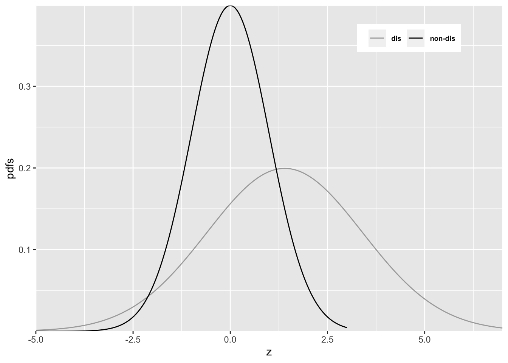

# Improper ROC curves {#improper-rocs}


## How much finished 10% {#improper-rocs-how-much-finished}


  
## The binormal model

The binormal model has two parameters, $a$ and $b$. The $a$ parameter is the separation of the two distributions. The diseased case distribution has unit standard deviation. The non-diseased case distribution has standard deviation $b$. 

  
## Improper ROCs

Binormal model fits invariably lead to ROC curves that inappropriately cross the chance diagonal, leading to a prediction of a region of the ROC curve where performance is worse than chance (even for expert observers). Such curves are termed *improper*. This type of curve occurs whenever $b < 1$. 


The following code illustrates improper curves predicted by the binormal model.
  
  

```r
  aArray <- c(0.7, 0.7, 1.5, 2)
  bArray <- c(0.5, 1.5, 0.5, 0.5)
  chance_diag <- data.frame(x = c(0,1), y = c(0,1))
  p <- PlotBinormalFit(aArray, bArray) +
    scale_x_continuous(expand = c(0, 0)) + 
    scale_y_continuous(expand = c(0, 0)) +
    theme(legend.position = c(0.85, 0.2))
p <- p + geom_line(data = chance_diag, aes(x = x, y = y), linetype="dotted")
```


The red plot is the clearest example of an improper ROC. The chance line crossing near the upper right corner, around (0.919,0.919) and the fact that the ROC curve must eventually reach (1, 1) implies that the curve must turn upwards as one approaches (1, 1), thereby displaying a "hook". Whenever $b \ne 1$ the hook is there regardless of whether it is easily visible or not. If $b < 1$ the hook is near the upper right corner. If $b > 1$ the hook is near the origin (see green line, corresponding to $a = 0.7, b = 1.5$). With increasing $a$ the hook is less prominent (see blue line corresponding to $a = 1.5, b = 0.5$ and purple line corresponding to $a = 2, b = 0.5$. But it is there. 


## Reason for improper ROCs 

The reason for the "hook" becomes apparent upon examination of the pdfs. 


<div class="figure">

<p class="caption">(\#fig:improper-roc-reason)Reason for improper ROC</p>
</div>


In Figure \@ref(fig:improper-roc-reason) $a = 0.7$ and $b = 0.5$. Since $b < 1$ the diseased *pdf* is broader and has a lower peak (since the integral under each distribution is unity) than the non-diseased pdf. Starting from the extreme right and then sliding an imaginary threshold to the left one sees that initially, just below $z = 7$, the diseased distribution starts contributing while the non-diseased distribution is not contributing, causing the ROC to start with infinite slope near the origin (because TPF is increasing while FPF is not). Around $z = 2.5$ the non-diseased distribution starts contributing, causing the ROC slope to decrease. Around $z = -3$ almost all of the non-diseased distribution has contributed which means FPF is near unity, but since not all of the broader diseased distribution has contributed TPF is less than unity. Here is a region where $TPF < FPF$, meaning that the operating point is below the chance diagonal. As the threshold is lowered further, TPF continues to increase, as the rest of the diseased distribution contributes while FPF stays almost constant at unity. In this region, the ROC curve is approaching the upper right corner with almost infinite slope (because TPF is increasing but FPF is not).


