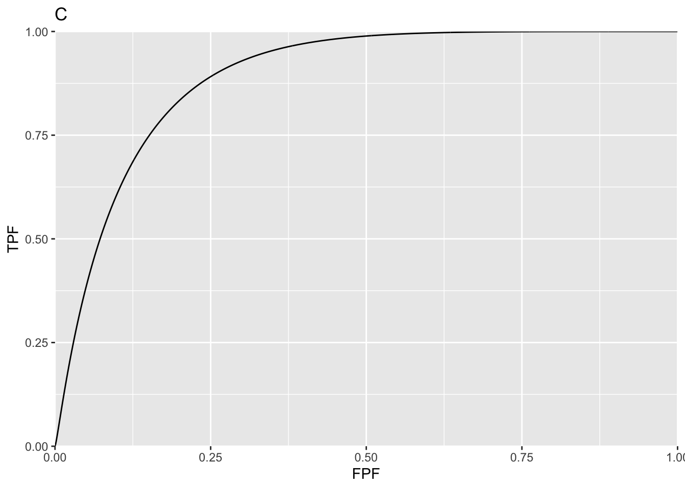

# PROPROC ROC curves {#proproc-rocs}


## Helper functions


## Definitions of PROPROC parameters in terms of binormal model parameters
  
\[c=\frac{b-1}{b+1};{{d}_{a}}=\frac{\sqrt{2}a}{\sqrt{1+{{b}^{2}}}}\] 

## Main code and output
  

```r
c1Arr <-   c(-0.1322804, 0.2225588); daArr  <-  c(1.197239, 1.740157)
myLabel <- c("A", "B", "C", "D")
myLabelIndx <- 1
for (i in 1:2)
{
  c1 <- c1Arr[i]
  da <- daArr[i]
  ret <- Transform2ab(da, c1)
  a <- ret$a;b <- ret$b
  if (i == 1) z <- seq(-3, 0, by = 0.01) # may need to adjust limits to view detail of slope plot
  if (i == 2) z <- seq(-3, 5, by = 0.01) # may need to adjust limits to view detail of slope plot
  
  FPF <- seq(0.0, 1, 0.001)
  TPF <- rocY(FPF, a, b)
  
  rocPlot <- data.frame(FPF = FPF, TPF = TPF)
  plotRoc <- ggplot(rocPlot, aes(x = FPF, y = TPF)) + 
    geom_line()  + 
   scale_x_continuous(expand = c(0, 0)) + 
    scale_y_continuous(expand = c(0, 0))   +
    ggtitle(myLabel[myLabelIndx]);myLabelIndx <- myLabelIndx + 1

  slope <-b*dnorm(a-b*z)/dnorm(-z) # same as likelihood ratio
  
  slopePlot <- data.frame(z = z, slope = slope)
  p <- ggplot(slopePlot, aes(x = z, y = slope)) + 
    geom_line()  + 
    scale_x_continuous(expand = c(0, 0)) + 
    scale_y_continuous(expand = c(0, 0))  +
    ggtitle(myLabel[myLabelIndx]);myLabelIndx <- myLabelIndx + 1
  print(plotRoc);print(p)
}
```




## Discussion

Plot A is for `c1` =  -0.1322804, `da` = 1.197239 while plot C is for `c1` = 0.2225588, `da` = 1.740157. Plots B and D are the corresponding slope plots as functions of the binormal model z-sample. In plot A, the slope is infinite near the origin and the curve approaches the upper-right corner with finite slope. The situation is reversed in plot C where the slope is finite near the origin and the curve approaches the upper-right corner with zero slope. 

These two readers are from a clinical dataset, `dataset01`. Highest rating inferred ROC data from original FROC data, were analyzed by PROPROC and the resulting parameter values are coded here. They were chosen as they demonstrate key differences in the shapes of proper ROC plots. Plot A corresponds to a negative value of `c1`, which implies `b < 1`. The slope of the proper ROC is infinite near the origin and approaches a positive constant near the upper right corner of the ROC. Plot C is for a positive value of `c1`, i.e., for `b > 1`. Now the slope of the proper ROC is finite near the origin and approaches zero near the upper right corner. 

Considering plot D, as one "cuts" the slope axis horizontally with a sliding threshold, starting with very high values and moving downwards, the slope of the ROC curve starts at the origin with a large but finite value. This corresponds to the peak in plot D. Above the peak, there are no solutions for `z`. The slope decreases monotonically to zero, corresponding to the flattening out of the slope at zero for `z ~  -2`. 

The two values of `z` corresponding to each cut implies, of course, that the binormal model based proper algorithm has to do a lot of bookkeeping, since each horizontal cut splits the decision axis into 3 regions. One can think of shrinking each of plots B & D horizontally to zero width, and all that remains is the slope axis with a thick vertical line superimposed on it, corresponding to the horizontally collapsed curves. In plot B the vertical line extends from positive infinity down to about 0.1, and represents the range of decision variable samples encountered by the observer on the likelihood ratio scale. In plot D the vertical line extends from a finite value (~9.4) to zero. For the stated binormal model parameters values outside of these ranges are not possible.

